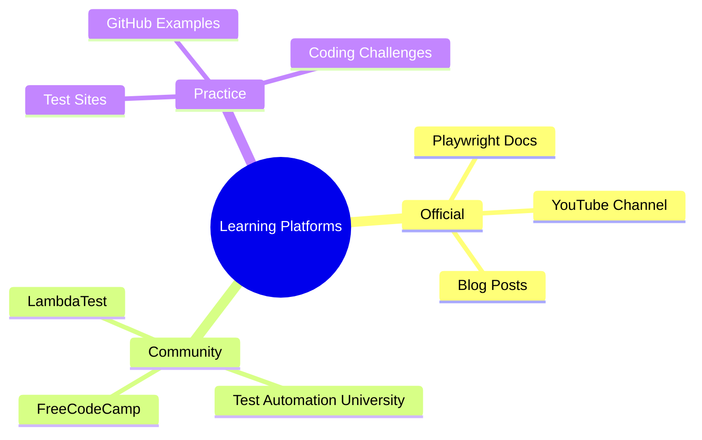
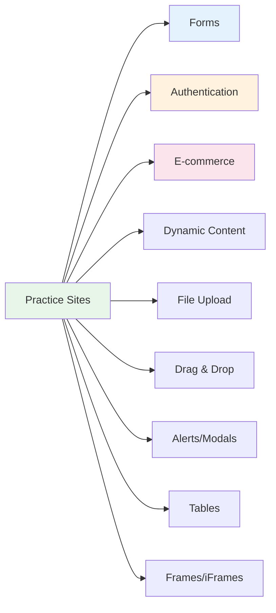
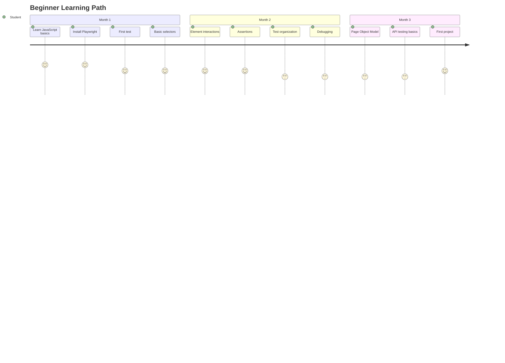

# 📚 Learning Resources - Tài Nguyên Học Tập
## Comprehensive Guide to Playwright Learning Materials

> Tổng hợp tất cả tài liệu, công cụ, và tài nguyên hữu ích cho học Playwright

---

## 📖 Official Documentation - Tài Liệu Chính Thức

### Playwright Documentation

| Resource | Link | Description |
|----------|------|-------------|
| **Official Docs** | [playwright.dev](https://playwright.dev) | Tài liệu chính thức đầy đủ nhất |
| **Getting Started** | [playwright.dev/docs/intro](https://playwright.dev/docs/intro) | Hướng dẫn bắt đầu |
| **API Reference** | [playwright.dev/docs/api](https://playwright.dev/docs/api/class-playwright) | API documentation chi tiết |
| **Best Practices** | [playwright.dev/docs/best-practices](https://playwright.dev/docs/best-practices) | Best practices chính thức |
| **Release Notes** | [github.com/microsoft/playwright/releases](https://github.com/microsoft/playwright/releases) | Các tính năng mới |

### Language-Specific Docs

- **TypeScript**: [playwright.dev/docs/test-typescript](https://playwright.dev/docs/test-typescript)
- **JavaScript**: [playwright.dev/docs/intro](https://playwright.dev/docs/intro)
- **Python**: [playwright.dev/python/docs/intro](https://playwright.dev/python/docs/intro)
- **Java**: [playwright.dev/java/docs/intro](https://playwright.dev/java/docs/intro)
- **C#**: [playwright.dev/dotnet/docs/intro](https://playwright.dev/dotnet/docs/intro)

---

## 🎓 Learning Platforms - Nền Tảng Học Tập

### Free Courses & Tutorials



#### 1. **LambdaTest Learning Hub**
- 🔗 [Playwright JavaScript Guide](https://www.lambdatest.com/learning-hub/playwright-javascript)
- 🔗 [Playwright Projects](https://www.lambdatest.com/learning-hub/playwright-projects)
- 🔗 [Playwright API Testing](https://www.lambdatest.com/learning-hub/playwright-api-testing)
- 🔗 [Playwright Tutorial](https://www.lambdatest.com/learning-hub/playwright-tutorial)
- **Nội dung**: Comprehensive tutorials, examples, best practices
- **Miễn phí**: ✅ Yes

#### 2. **Test Automation University**
- 🔗 [testautomationu.applitools.com](https://testautomationu.applitools.com/)
- **Courses**:
  - Introduction to Playwright
  - Advanced Playwright Testing
  - Visual Testing with Playwright
- **Miễn phí**: ✅ Yes
- **Certificate**: ✅ Yes

#### 3. **YouTube Channels**

| Channel | Link | Content Type |
|---------|------|--------------|
| **Playwright Official** | [YouTube](https://www.youtube.com/@Playwrightdev) | Official tutorials, updates |
| **Automation Step by Step** | [YouTube](https://www.youtube.com/@RaghavPal) | Beginner-friendly tutorials |
| **The Testing Academy** | [YouTube](https://www.youtube.com/@TheTestingAcademy) | Comprehensive Playwright course |
| **ExecuteAutomation** | [YouTube](https://www.youtube.com/@executeautomation) | Advanced topics |
| **Naveen AutomationLabs** | [YouTube](https://www.youtube.com/@naveenautomationlabs) | Practical examples |

#### 4. **Udemy Courses** (Paid)
- "Playwright: Web Automation Testing From Zero to Hero"
- "Complete Playwright with TypeScript & JavaScript"
- "Playwright Test Automation"
- **Giá**: $10-$100 (thường có sale)

#### 5. **FreeCodeCamp**
- 🔗 [freecodecamp.org](https://www.freecodecamp.org/)
- Search: "Playwright Tutorial"
- **Miễn phí**: ✅ Yes

---

## 🌐 Practice Websites - Trang Web Thực Hành

### UI Testing Practice Sites

#### ⭐ Recommended for Beginners

| Site | URL | Features | Difficulty |
|------|-----|----------|------------|
| **Expand Testing** | [practice.expandtesting.com](https://practice.expandtesting.com) | Forms, tables, dynamic content, authentication | ⭐ Easy |
| **Sauce Demo** | [saucedemo.com](https://www.saucedemo.com) | E-commerce flow, login, cart, checkout | ⭐ Easy |
| **TodoMVC** | [demo.playwright.dev/todomvc](https://demo.playwright.dev/todomvc) | Simple CRUD app | ⭐ Easy |
| **The Internet** | [the-internet.herokuapp.com](https://the-internet.herokuapp.com/) | Various test scenarios | ⭐⭐ Medium |
| **Automation Exercise** | [automationexercise.com](https://www.automationexercise.com/) | Full e-commerce site | ⭐⭐ Medium |
| **Demo QA** | [demoqa.com](https://demoqa.com/) | Forms, widgets, interactions | ⭐⭐ Medium |

#### Advanced Practice Sites

- **OrangeHRM Demo**: [opensource-demo.orangehrmlive.com](https://opensource-demo.orangehrmlive.com/)
- **Petstore**: [petstore.octoperf.com](https://petstore.octoperf.com/)
- **BookCart**: [bookcart.azurewebsites.net](https://bookcart.azurewebsites.net/)
- **Swag Labs**: [saucedemo.com](https://www.saucedemo.com/)

### Test Scenarios Available



---

## 🔌 API Testing Endpoints

### Free Public APIs for Practice

#### REST APIs

| API | Base URL | Auth Required | Features |
|-----|----------|---------------|----------|
| **JSONPlaceholder** | `jsonplaceholder.typicode.com` | ❌ No | Posts, Comments, Users, Photos |
| **ReqRes** | `reqres.in` | ❌ No | User CRUD, Registration, Login |
| **DummyJSON** | `dummyjson.com` | ❌ No | Products, Carts, Users, realistic data |
| **Restful Booker** | `restful-booker.herokuapp.com` | ✅ Yes | Booking system with auth |
| **Fake Store API** | `fakestoreapi.com` | ❌ No | Products, Cart, User |
| **Dog API** | `dog.ceo/api` | ❌ No | Random dog images |
| **Rick and Morty API** | `rickandmortyapi.com` | ❌ No | Characters, Episodes |

#### API Examples

```typescript
// JSONPlaceholder - GET
const response = await request.get('https://jsonplaceholder.typicode.com/users');

// ReqRes - POST
const response = await request.post('https://reqres.in/api/users', {
  data: { name: 'John', job: 'Developer' }
});

// DummyJSON - GET with params
const response = await request.get('https://dummyjson.com/products/search?q=phone');

// Restful Booker - Authentication
const authResponse = await request.post('https://restful-booker.herokuapp.com/auth', {
  data: { username: 'admin', password: 'password123' }
});
```

### GraphQL APIs

- **GitHub GraphQL API**: [docs.github.com/graphql](https://docs.github.com/en/graphql)
- **SpaceX API**: [spacex-api.fly.dev/graphql](https://spacex-api.fly.dev/graphql)
- **Countries GraphQL**: [countries.trevorblades.com](https://countries.trevorblades.com/)

---

## 🛠️ Tools & Extensions

### VS Code Extensions

| Extension | Publisher | Purpose |
|-----------|-----------|---------|
| **Playwright Test for VSCode** | Microsoft | Run/debug tests in VS Code |
| **Playwright Snippets** | nitayneeman | Code snippets |
| **Error Lens** | Alexander | Inline error messages |
| **GitLens** | GitKraken | Git integration |
| **Prettier** | Prettier | Code formatting |
| **ESLint** | Microsoft | Linting |

### Browser DevTools Extensions

- **Playwright Inspector**: Built-in (`npx playwright open`)
- **Selector Hub**: Chrome extension for selectors
- **ChroPath**: XPath helper

### Online Tools

#### Selector Generators
- 🔗 [Selector Hub](https://selectorshub.com/) - Generate CSS/XPath selectors
- 🔗 [CSS Selector Tester](https://www.w3schools.com/cssref/trysel.asp)

#### Regex Testers
- 🔗 [Regex101](https://regex101.com/) - Test regular expressions
- 🔗 [RegExr](https://regexr.com/) - Learn and test regex

#### JSON Tools
- 🔗 [JSON Formatter](https://jsonformatter.org/)
- 🔗 [JSON Schema Validator](https://www.jsonschemavalidator.net/)

---

## 📖 Books - Sách

### Recommended Books

1. **"Playwright Test Automation"** by Dmitriy Klimenko
   - Comprehensive guide
   - Best practices
   - Real-world examples

2. **"End-to-End Web Testing with Playwright"** by Koushik Chatterjee
   - Beginner-friendly
   - Step-by-step approach

3. **"Web Automation with Playwright"** (eBook)
   - Available on Amazon Kindle
   - Modern testing practices

### Vietnamese Resources

- **Blogs**:
  - [Viblo.asia](https://viblo.asia/search?q=playwright) - Vietnamese tech community
  - [Techtalk.vn](https://techtalk.vn/) - Vietnamese tech articles

---

## 💬 Community & Support

### Official Communities

```mermaid
graph TD
    A[Playwright Community] --> B[Discord]
    A --> C[GitHub Discussions]
    A --> D[Stack Overflow]
    A --> E[Twitter]

    B --> F[Real-time chat]
    C --> G[Q&A Forum]
    D --> H[Technical questions]
    E --> I[Updates & News]

    style A fill:#E8F5E9
    style B fill:#5865F2
    style C fill:#181717
    style D fill:#F48024
    style E fill:#1DA1F2
```



| Platform | Link | Purpose |
|----------|------|---------|
| **Discord** | [discord.gg/playwright](https://discord.gg/playwright) | Real-time support, community chat |
| **GitHub Discussions** | [github.com/microsoft/playwright/discussions](https://github.com/microsoft/playwright/discussions) | Q&A, feature requests |
| **Stack Overflow** | [stackoverflow.com/questions/tagged/playwright](https://stackoverflow.com/questions/tagged/playwright) | Technical questions |
| **Twitter** | [@playwrightweb](https://twitter.com/playwrightweb) | News, updates |
| **LinkedIn** | Search "Playwright" groups | Professional networking |

### Vietnamese Communities

- **Facebook Groups**:
  - "Automation Testing Vietnam"
  - "QA/QC Vietnam"
  - "Test Automation VN"

- **Viblo.asia**: Vietnamese dev community
- **Slack Channels**: Vietnamese tech workspaces

---

## 🎯 Learning Paths - Lộ Trình Học

### Beginner (0-3 months)



**Resources**:
1. JavaScript fundamentals
2. This learning roadmap (Week 1-4)
3. Official Playwright docs
4. Practice on simple sites
5. Complete 3 small projects

### Intermediate (3-6 months)

**Focus**:
- Advanced selectors
- Custom fixtures
- Data-driven testing
- Visual regression
- Performance testing
- CI/CD integration

**Resources**:
- This roadmap (Week 5-8)
- Test Automation University courses
- Real project practice
- Code reviews

### Advanced (6+ months)

**Focus**:
- Framework design
- Scalable architecture
- Advanced patterns
- Custom reporters
- Plugin development
- Team mentoring

**Resources**:
- Open source contributions
- Conference talks
- Blog writing
- Teaching others

---

## 📝 Blogs & Articles

### Must-Read Blogs

| Blog | URL | Focus |
|------|-----|-------|
| **Playwright Blog** | [playwright.dev/blog](https://playwright.dev/blog) | Official updates |
| **LambdaTest Blog** | [lambdatest.com/blog](https://www.lambdatest.com/blog/category/playwright/) | Tutorials, tips |
| **Applitools Blog** | [applitools.com/blog](https://applitools.com/blog/) | Visual testing |
| **Dev.to Playwright** | [dev.to/t/playwright](https://dev.to/t/playwright) | Community articles |
| **Medium Playwright** | Search "Playwright" on Medium | Various topics |

### Article Series

- **"Getting Started with Playwright"** - LambdaTest
- **"Playwright Best Practices"** - Playwright.dev
- **"Testing with Playwright"** - Dev.to

---

## 🎥 Video Courses & Webinars

### Free Video Series

1. **Playwright Official YouTube Channel**
   - Getting started series
   - Feature demos
   - Best practices

2. **Test Automation University**
   - Full courses with certificates

3. **Conference Talks**
   - Selenium Conf
   - TestJS Summit
   - Automation Guild

### Paid Platforms

- **Udemy**: $10-$100 (sales thường xuyên)
- **Pluralsight**: Subscription-based
- **LinkedIn Learning**: With premium

---

## 🔬 Advanced Topics

### Specialized Resources

| Topic | Resource | Link |
|-------|----------|------|
| **Visual Regression** | Percy Docs | [docs.percy.io/docs/playwright](https://docs.percy.io/docs/playwright) |
| **Accessibility Testing** | axe-core | [github.com/dequelabs/axe-core](https://github.com/dequelabs/axe-core) |
| **Performance Testing** | Web Vitals | [web.dev/vitals](https://web.dev/vitals/) |
| **Mobile Testing** | BrowserStack | [browserstack.com/playwright](https://www.browserstack.com/docs/automate/playwright) |
| **CI/CD** | GitHub Actions | [docs.github.com/actions](https://docs.github.com/en/actions) |

---

## 📊 Comparison & Alternatives

### When to Use What?

| Tool | Best For | Not Good For |
|------|----------|--------------|
| **Playwright** | Modern web apps, multi-browser, API testing | Legacy apps, IE11 |
| **Selenium** | Legacy support, many languages | Modern web apps, speed |
| **Cypress** | Frontend-only, Chrome-focused | Cross-browser, API testing |
| **Puppeteer** | Chrome automation, scraping | Cross-browser testing |

---

## 🆘 Getting Help

### Where to Ask Questions?

```mermaid
flowchart TD
    A[I have a question] --> B{Type of question?}
    B -->|Quick question| C[Discord]
    B -->|Technical issue| D[Stack Overflow]
    B -->|Bug report| E[GitHub Issues]
    B -->|Feature request| F[GitHub Discussions]
    B -->|General discussion| G[Discord/Reddit]

    style A fill:#E8F5E9
    style C fill:#5865F2
    style D fill:#F48024
    style E fill:#181717
    style F fill:#181717
    style G fill:#FF4500
```



### How to Ask Good Questions?

1. **Search first**: Google, Stack Overflow, GitHub Issues
2. **Provide context**:
   - Playwright version
   - Node version
   - OS
   - Browser
3. **Minimal reproduction**: Simplest code that reproduces issue
4. **Error messages**: Full stack trace
5. **What you tried**: Show your debugging attempts

---

## 📌 Quick Reference Cards

### Command Cheatsheet

```bash
# Installation
yarn create playwright
npx playwright install

# Run tests
npx playwright test                    # All tests
npx playwright test --ui               # UI mode
npx playwright test --headed           # See browser
npx playwright test --debug            # Debug mode
npx playwright test --project=chromium # Specific browser

# Generate
npx playwright codegen example.com     # Record test
npx playwright show-report             # View report

# Update
yarn add -D @playwright/test@latest    # Update Playwright
npx playwright install --force         # Re-install browsers
```

### Selector Cheatsheet

```typescript
// CSS Selectors
page.locator('#id')                    // By ID
page.locator('.class')                 // By class
page.locator('[data-testid=value]')    // By attribute
page.locator('button.submit')          // Combined

// Playwright Selectors
page.getByRole('button', { name: 'Submit' })
page.getByLabel('Email')
page.getByPlaceholder('Enter email')
page.getByText('Welcome')
page.getByTestId('submit-btn')

// Filtering
page.locator('button').filter({ hasText: 'Submit' })
page.locator('div').nth(2)             // 3rd element
page.locator('li').first()             // First
page.locator('li').last()              // Last
```

---

## 🎓 Certifications

While no official Playwright certification exists yet, you can:

1. **LinkedIn Certifications**: Add Playwright skills
2. **Portfolio Projects**: Build showcase projects
3. **Open Source Contributions**: Contribute to Playwright
4. **Blog/YouTube**: Share knowledge
5. **Test Automation University**: Get certificates

---

## 🔄 Stay Updated

### Follow These for Latest Updates:

- **Twitter**: [@playwrightweb](https://twitter.com/playwrightweb)
- **GitHub**: Watch [microsoft/playwright](https://github.com/microsoft/playwright)
- **Discord**: Join announcements channel
- **Newsletter**: Playwright monthly digest
- **Release Notes**: Check quarterly releases

---

## ✨ Bonus Resources

### Code Repositories

- **Awesome Playwright**: [github.com/mxschmitt/awesome-playwright](https://github.com/mxschmitt/awesome-playwright)
- **Playwright Examples**: [github.com/microsoft/playwright/tree/main/examples](https://github.com/microsoft/playwright/tree/main/examples)
- **Community Examples**: Search GitHub for "playwright-examples"

### Interactive Playgrounds

- **Playwright REPL**: Try online
- **CodeSandbox**: Playwright templates
- **StackBlitz**: Quick prototyping

---

## 📞 Contact & Contribute

Nếu bạn tìm thấy tài nguyên hữu ích khác:
- Tạo Pull Request để thêm vào list
- Share trong community
- Help người khác học tập

---

**Happy Learning! Chúc bạn học tốt! 🎉**

> "The best way to learn is by doing" - Practice daily!
