# 🔧 Troubleshooting Guide - Hướng Dẫn Xử Lý Lỗi
## Giải Quyết Các Vấn Đề Thường Gặp Khi Dùng Playwright

> Tài liệu này tổng hợp các lỗi thường gặp và cách khắc phục khi làm việc với Playwright

---

## 📋 Mục Lục

1. [Installation Issues - Lỗi Cài Đặt](#installation-issues)
2. [Browser Issues - Lỗi Browser](#browser-issues)
3. [Test Execution Issues - Lỗi Chạy Test](#test-execution-issues)
4. [Selector Issues - Lỗi Selector](#selector-issues)
5. [Timeout Issues - Lỗi Timeout](#timeout-issues)
6. [Network Issues - Lỗi Network](#network-issues)
7. [CI/CD Issues - Lỗi CI/CD](#cicd-issues)
8. [Performance Issues - Vấn Đề Performance](#performance-issues)

---

## 🔴 Installation Issues - Lỗi Cài Đặt

### Error 1: "Cannot find module '@playwright/test'"

```mermaid
flowchart TD
    A[Error: Cannot find module] --> B{node_modules exists?}
    B -->|No| C[Run: yarn install]
    B -->|Yes| D{@playwright/test in package.json?}
    D -->|No| E[Run: yarn add -D @playwright/test]
    D -->|Yes| F[Delete node_modules]
    F --> G[Run: yarn install --force]

    C --> H[✅ Fixed]
    E --> H
    G --> H

    style A fill:#FFB6C1
    style H fill:#90EE90
```

**Nguyên nhân**: Dependencies chưa được cài đặt

**Giải pháp**:
```bash
# Solution 1: Install dependencies
yarn install

# Solution 2: Clean install
rm -rf node_modules yarn.lock
yarn install

# Solution 3: Verify installation
yarn list @playwright/test
```

---

### Error 2: "Executable doesn't exist at ..."

**Message đầy đủ**:
```
browserType.launch: Executable doesn't exist at /path/to/chromium
```

**Nguyên nhân**: Browsers chưa được download

**Giải pháp**:
```bash
# Install all browsers
npx playwright install

# Install specific browser
npx playwright install chromium
npx playwright install firefox
npx playwright install webkit

# Install with dependencies (Linux)
npx playwright install-deps
npx playwright install
```

**Verify**:
```bash
# Check browsers installed
npx playwright install --dry-run
```

---

### Error 3: "EACCES: permission denied" (Linux/Mac)

**Nguyên nhân**: Không có quyền write vào thư mục

**Giải pháp**:
```bash
# Fix ownership
sudo chown -R $(whoami) ~/.cache/ms-playwright

# Or install for user only
npx playwright install --user

# Check permissions
ls -la ~/.cache/ms-playwright
```

---

### Error 4: "ENOSPC: System limit for number of file watchers reached" (Linux)

**Nguyên nhân**: Linux file watcher limit quá thấp

**Giải pháp**:
```bash
# Increase limit temporarily
sudo sysctl -w fs.inotify.max_user_watches=524288

# Permanent fix
echo "fs.inotify.max_user_watches=524288" | sudo tee -a /etc/sysctl.conf
sudo sysctl -p

# Verify
cat /proc/sys/fs/inotify/max_user_watches
```

---

## 🌐 Browser Issues - Lỗi Browser

### Error 5: "Browser closed" / "Target closed"

```mermaid
sequenceDiagram
    participant T as Test
    participant B as Browser
    participant P as Page

    T->>B: Launch browser
    B->>P: Create page
    P--xB: Browser crashes!
    T->>P: Try action
    P-->>T: Error: Target closed

    Note over T,P: Browser đã đóng trước khi test xong
```



**Nguyên nhân**:
- Browser crash
- Headless mode issues
- Memory issues
- Timeout quá ngắn

**Giải pháp**:
```typescript
// 1. Run headed để xem gì xảy ra
npx playwright test --headed

// 2. Increase timeout
test.setTimeout(60000); // 60 seconds

// 3. Add more logs
test('debug test', async ({ page }) => {
  console.log('Before goto');
  await page.goto('https://example.com');
  console.log('After goto');
});

// 4. Handle browser events
browser.on('disconnected', () => {
  console.log('Browser disconnected!');
});
```

---

### Error 6: "Browser crashes immediately on Linux"

**Nguyên nhân**: Thiếu system dependencies

**Giải pháp**:
```bash
# Ubuntu/Debian
npx playwright install-deps

# Manual install
sudo apt-get update
sudo apt-get install -y \
  libglib2.0-0 \
  libnss3 \
  libnspr4 \
  libatk1.0-0 \
  libatk-bridge2.0-0 \
  libcups2 \
  libdrm2 \
  libdbus-1-3 \
  libxkbcommon0 \
  libxcomposite1 \
  libxdamage1 \
  libxfixes3 \
  libxrandr2 \
  libgbm1 \
  libpango-1.0-0 \
  libcairo2 \
  libasound2
```

---

### Error 7: "WebKit browser not supported on Windows 7"

**Nguyên nhân**: WebKit không hỗ trợ Windows 7

**Giải pháp**:
```typescript
// Skip WebKit on unsupported OS
import { test } from '@playwright/test';
import * as os from 'os';

test.skip(
  os.platform() === 'win32' && os.release().startsWith('6.1'),
  'WebKit not supported on Windows 7'
);
```

---

## ⚡ Test Execution Issues - Lỗi Chạy Test

### Error 8: "Test timeout of 30000ms exceeded"

```mermaid
gantt
    title Test Timeout Scenario
    dateFormat X
    axisFormat %S

    section Normal Test
    Navigate        :0, 2s
    Wait Element    :2s, 1s
    Click           :3s, 1s
    Verify          :4s, 1s

    section Timeout Test
    Navigate        :0, 15s
    Wait (stuck)    :15s, 30s
    TIMEOUT!        :crit, 30s, 1s
```

**Nguyên nhân**:
- Page load chậm
- Element không bao giờ xuất hiện
- Network chậm
- Selector sai

**Giải pháp**:
```typescript
// 1. Increase timeout globally
// playwright.config.ts
export default defineConfig({
  timeout: 60000, // 60s
  expect: {
    timeout: 10000 // 10s for assertions
  }
});

// 2. Increase per test
test('slow test', async ({ page }) => {
  test.setTimeout(120000); // 2 minutes
  await page.goto('https://very-slow-site.com');
});

// 3. Increase for specific action
await page.goto('https://example.com', {
  timeout: 60000
});

await page.waitForSelector('.element', {
  timeout: 30000
});

// 4. Debug: Find what's slow
console.time('navigation');
await page.goto('https://example.com');
console.timeEnd('navigation');
```

---

### Error 9: "Test failed but I don't know why"

**Giải pháp**: Enable debugging tools

```bash
# 1. Run with UI mode
npx playwright test --ui

# 2. Run with debug mode
npx playwright test --debug

# 3. Run headed để xem
npx playwright test --headed

# 4. Enable trace
npx playwright test --trace on

# 5. View trace
npx playwright show-trace trace.zip
```

**In code**:
```typescript
test('debug test', async ({ page }) => {
  // Pause execution
  await page.pause();

  // Take screenshot
  await page.screenshot({ path: 'debug.png' });

  // Log current URL
  console.log('Current URL:', page.url());

  // Log page title
  console.log('Title:', await page.title());

  // Log element count
  const count = await page.locator('.item').count();
  console.log('Items:', count);
});
```

---

### Error 10: "Tests pass locally but fail on CI"

```mermaid
graph LR
    A[Local Environment] -->|✅ Pass| B[Tests]
    C[CI Environment] -->|❌ Fail| B

    A --> D[Different OS]
    A --> E[Different Browser Version]
    A --> F[Different Network]
    A --> G[Different Timezone]

    style C fill:#FFB6C1
    style A fill:#90EE90
```



**Nguyên nhân**:
- Different OS/browser versions
- Timing issues (race conditions)
- Network differences
- Environment variables missing

**Giải pháp**:
```typescript
// 1. Use CI-specific settings
// playwright.config.ts
export default defineConfig({
  retries: process.env.CI ? 2 : 0,
  workers: process.env.CI ? 1 : undefined,

  use: {
    // CI-specific settings
    video: process.env.CI ? 'on' : 'off',
    trace: process.env.CI ? 'on-first-retry' : 'off',
  }
});

// 2. Add waits for flaky elements
await page.waitForLoadState('networkidle');
await page.waitForTimeout(1000); // Last resort

// 3. Make selectors more resilient
// Bad: Fragile
await page.click('div > div > button');

// Good: Semantic
await page.getByRole('button', { name: 'Submit' }).click();

// 4. Check environment
test('env test', async () => {
  console.log('Platform:', process.platform);
  console.log('CI:', process.env.CI);
  console.log('Node version:', process.version);
});
```

---

## 🎯 Selector Issues - Lỗi Selector

### Error 11: "Selector resolved to hidden element"

**Message**:
```
Error: element is not visible
```

**Nguyên nhân**: Element tồn tại nhưng hidden (CSS: display:none, visibility:hidden)

**Giải pháp**:
```typescript
// 1. Wait for visible
await page.waitForSelector('.element', { state: 'visible' });

// 2. Force click (không khuyến khích)
await page.click('.element', { force: true });

// 3. Check visibility first
const isVisible = await page.locator('.element').isVisible();
if (!isVisible) {
  console.log('Element is hidden!');
}

// 4. Debug: Get element state
const element = page.locator('.element');
console.log('Visible:', await element.isVisible());
console.log('Enabled:', await element.isEnabled());
console.log('Count:', await element.count());
```

---

### Error 12: "Selector matched multiple elements"

**Nguyên nhân**: Selector không unique, match nhiều elements

**Giải pháp**:
```typescript
// 1. Make selector more specific
// Bad
await page.click('button');

// Better
await page.click('button.submit');

// Best
await page.getByRole('button', { name: 'Submit' }).click();

// 2. Use nth() for specific element
await page.locator('button').nth(0).click(); // First
await page.locator('button').nth(2).click(); // Third

// 3. Use first() or last()
await page.locator('button').first().click();
await page.locator('button').last().click();

// 4. Use filter
await page.locator('button').filter({ hasText: 'Submit' }).click();

// 5. Debug: Count elements
const count = await page.locator('button').count();
console.log(`Found ${count} buttons`);
```

---

### Error 13: "Selector not found" / "No element found"

**Debug flowchart**:


**Giải pháp**:
```typescript
// 1. Verify selector in browser DevTools
// Mở Chrome DevTools → Console:
// $$('your-selector') // Should return elements

// 2. Use Playwright Inspector
npx playwright test --debug

// 3. Try different selectors
await page.click('#id');              // By ID
await page.click('.class');           // By class
await page.click('[data-testid=btn]'); // By attribute
await page.getByText('Submit').click(); // By text
await page.getByRole('button').click(); // By role

// 4. Wait for element
await page.waitForSelector('.element', { timeout: 10000 });
await page.click('.element');

// 5. Check iframe
const frame = page.frameLocator('iframe');
await frame.locator('.element').click();

// 6. Debug: Log page content
console.log(await page.content());
```

---

## ⏱️ Timeout Issues - Lỗi Timeout

### Error 14: "Navigation timeout exceeded"

**Giải pháp**:
```typescript
// 1. Increase navigation timeout
await page.goto('https://slow-site.com', {
  timeout: 60000,
  waitUntil: 'domcontentloaded' // Faster than 'load'
});

// 2. Don't wait for navigation
await page.goto('https://example.com', {
  waitUntil: 'commit' // Fastest
});

// 3. Handle slow resources
await page.route('**/*.{png,jpg,jpeg,gif,svg,css}', route => {
  route.abort(); // Block images/css for speed
});

// 4. Set global timeout
// playwright.config.ts
export default defineConfig({
  use: {
    navigationTimeout: 60000,
    actionTimeout: 30000
  }
});
```

---

### Error 15: "Action timeout: waiting for element to be visible"

**Flowchart giải quyết**:


**Giải pháp**:
```typescript
// 1. Wait explicitly
await page.waitForSelector('.element', {
  state: 'visible',
  timeout: 30000
});

// 2. Wait for network idle
await page.waitForLoadState('networkidle');

// 3. Wait for specific condition
await page.waitForFunction(() => {
  return document.querySelectorAll('.item').length > 0;
});

// 4. Increase action timeout
await page.click('.button', { timeout: 30000 });
```

---

## 🌐 Network Issues - Lỗi Network

### Error 16: "net::ERR_CONNECTION_REFUSED"

**Nguyên nhân**: Server không chạy hoặc wrong URL

**Giải pháp**:
```typescript
// 1. Check server running
// Start your dev server first!

// 2. Use webServer in config
// playwright.config.ts
export default defineConfig({
  webServer: {
    command: 'npm run start',
    url: 'http://localhost:3000',
    reuseExistingServer: !process.env.CI,
    timeout: 120000
  }
});

// 3. Verify URL
test('check url', async ({ page }) => {
  try {
    await page.goto('http://localhost:3000');
  } catch (error) {
    console.log('Server not running!');
    console.log('Run: npm run start');
  }
});
```

---

### Error 17: "Request failed: CORS error"

**Nguyên nhân**: CORS policy blocking requests

**Giải pháp**:
```typescript
// 1. Bypass CORS in tests (not production!)
const context = await browser.newContext({
  bypassCSP: true // Bypass Content Security Policy
});

// 2. Mock API responses
await page.route('**/api/**', route => {
  route.fulfill({
    status: 200,
    contentType: 'application/json',
    body: JSON.stringify({ data: 'mocked' })
  });
});

// 3. Use proxy/tunnel for local development
```

---

## 🚀 CI/CD Issues - Lỗi CI/CD

### Error 18: "GitHub Actions: Browser installation failed"

**Giải pháp**:
```yaml
# .github/workflows/playwright.yml
name: Playwright Tests
on: [push, pull_request]
jobs:
  test:
    timeout-minutes: 60
    runs-on: ubuntu-latest
    steps:
      - uses: actions/checkout@v4

      - uses: actions/setup-node@v4
        with:
          node-version: 18

      - name: Install dependencies
        run: yarn install --frozen-lockfile

      - name: Install Playwright Browsers
        run: npx playwright install --with-deps

      - name: Run tests
        run: yarn test

      - uses: actions/upload-artifact@v4
        if: always()
        with:
          name: playwright-report
          path: playwright-report/
          retention-days: 30
```

---

### Error 19: "Out of memory in CI"

**Giải pháp**:
```typescript
// playwright.config.ts
export default defineConfig({
  workers: process.env.CI ? 1 : undefined, // Reduce workers

  use: {
    video: process.env.CI ? 'retain-on-failure' : 'off',
    trace: process.env.CI ? 'retain-on-failure' : 'off',
  }
});
```

---

## 📈 Performance Issues

### Error 20: "Tests running very slow"

**Optimization checklist**:


**Solutions**:
```typescript
// 1. Run tests in parallel
// playwright.config.ts
export default defineConfig({
  workers: 4, // 4 parallel workers
  fullyParallel: true
});

// 2. Block unnecessary resources
await page.route('**/*.{png,jpg,jpeg,gif,svg}', route => {
  route.abort();
});

await page.route('**/analytics.js', route => {
  route.abort();
});

// 3. Use storage state (login once)
await context.storageState({ path: 'auth.json' });

const newContext = await browser.newContext({
  storageState: 'auth.json' // Reuse auth
});

// 4. Avoid unnecessary waits
// Bad
await page.waitForTimeout(5000);

// Good
await page.waitForSelector('.element');

// 5. Use fast selectors
// Slow: XPath
await page.locator('//div[@class="container"]//button').click();

// Fast: CSS
await page.locator('.container button').click();

// Fastest: Role
await page.getByRole('button', { name: 'Submit' }).click();
```

---

## 📞 Getting Help - Tìm Trợ Giúp

### Khi tất cả cách trên không work:

1. **Search GitHub Issues**:
   - https://github.com/microsoft/playwright/issues
   - Có thể ai đó gặp vấn đề tương tự

2. **Stack Overflow**:
   - Tag: `playwright`
   - https://stackoverflow.com/questions/tagged/playwright

3. **Discord Community**:
   - https://discord.gg/playwright
   - Active community

4. **Create Issue**:
   ```bash
   # Include this info:
   - Playwright version: npx playwright --version
   - Node version: node --version
   - OS: Windows/Mac/Linux
   - Browser: Chromium/Firefox/WebKit
   - Minimal reproduction code
   - Error message (full stack trace)
   - Screenshots/videos if possible
   ```

---

## ✅ Debug Checklist

Khi gặp lỗi, check list này theo thứ tự:

- [ ] Đọc error message kỹ
- [ ] Search error message trên Google
- [ ] Chạy với `--headed` để xem browser
- [ ] Chạy với `--debug` để step through
- [ ] Check selector trong DevTools
- [ ] Add console.log để trace
- [ ] Take screenshot tại điểm lỗi
- [ ] Verify test data và environment
- [ ] Check network tab (DevTools)
- [ ] Try trên browser khác
- [ ] Clear cache và restart
- [ ] Update Playwright version
- [ ] Check GitHub issues
- [ ] Ask community

---

## 🎯 Prevention Tips - Phòng Tránh Lỗi

**Best Practices để tránh lỗi**:

```typescript
// 1. Use semantic selectors
await page.getByRole('button', { name: 'Submit' }).click();

// 2. Always use auto-wait (built-in)
await page.click('.button'); // Auto-waits

// 3. Avoid hard-coded waits
// Bad
await page.waitForTimeout(3000);

// Good
await page.waitForSelector('.element');

// 4. Make tests independent
test('test 1', async ({ page }) => {
  // Fresh page, không depend on test khác
});

// 5. Use proper assertions
await expect(page).toHaveURL(/dashboard/);
await expect(element).toBeVisible();

// 6. Handle errors gracefully
try {
  await page.click('.optional-element');
} catch (error) {
  console.log('Optional element not found');
}

// 7. Clean up resources
test.afterEach(async ({ context }) => {
  await context.close();
});
```

---

**Chúc bạn debug thành công! 🎉**

Nếu vẫn gặp vấn đề, hãy tạo issue với thông tin chi tiết trong repository này.
