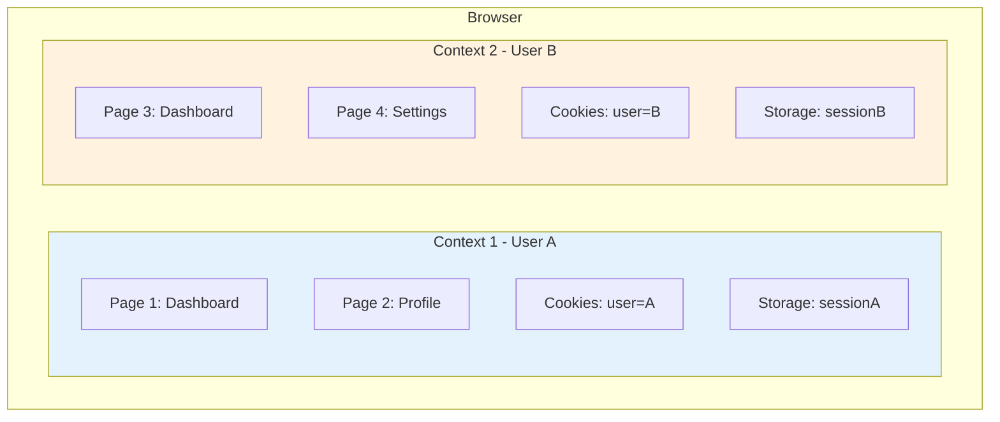
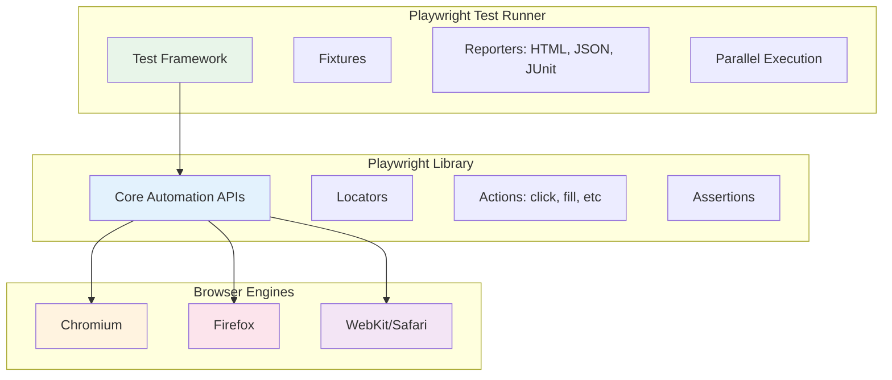

# 🎭 Giới Thiệu Về Playwright
## Playwright Introduction

> Tài liệu này giới thiệu Playwright - một công cụ automation testing hiện đại và mạnh mẽ do Microsoft phát triển.

---

## 📌 Playwright Là Gì? | What is Playwright?

**Playwright** là một **open-source test automation framework** (framework tự động hóa test mã nguồn mở) được Microsoft phát triển để test các web applications hiện đại.

### Định nghĩa chính thức:
> "Playwright enables reliable end-to-end testing for modern web apps"
>
> "Playwright cho phép thực hiện end-to-end testing đáng tin cậy cho các ứng dụng web hiện đại"

### Đặc điểm nổi bật:
- 🌐 **Cross-browser**: Hỗ trợ Chromium, Firefox, WebKit (Safari)
- 🚀 **Fast & Reliable**: Nhanh và ổn định nhờ kiến trúc hiện đại
- 🔧 **Auto-wait**: Tự động chờ elements sẵn sàng
- 📱 **Mobile Support**: Test trên mobile browsers emulation
- 🎯 **Multiple Languages**: JavaScript, TypeScript, Python, Java, C#

---

## 🏗️ Kiến Trúc Playwright | Playwright Architecture

### So sánh với Selenium (WebDriver Protocol)


#### Selenium WebDriver:
```
Test Code → HTTP Request → WebDriver → Browser
(Stateless, mỗi command là 1 request riêng)
```

#### Playwright:
```
Test Code → WebSocket (persistent connection) → Browser
(Stateful, kết nối liên tục, nhanh hơn)
```

### Tại sao Playwright nhanh hơn?

1. **WebSocket Connection** thay vì HTTP requests
   - Kết nối liên tục (persistent)
   - Ít overhead hơn
   - Giao tiếp hai chiều (bidirectional)

2. **Browser Context Isolation**
   - Mỗi test có môi trường riêng
   - Không cần xóa cookies/localStorage mỗi lần
   - Chạy parallel tests dễ dàng

3. **Auto-wait Mechanism**
   - Không cần `sleep()` hoặc explicit waits
   - Tự động chờ elements "actionable"
   - Giảm flaky tests

---

## 🆚 So Sánh Với Các Tools Khác

### Playwright vs Selenium vs Cypress

| Tiêu chí | Playwright | Selenium | Cypress |
|----------|-----------|----------|---------|
| **Browsers** | Chromium, Firefox, WebKit | Chrome, Firefox, Safari, Edge | Chrome, Firefox, Edge |
| **Languages** | JS, TS, Python, Java, C# | JS, Python, Java, C#, Ruby | JavaScript only |
| **Auto-wait** | ✅ Built-in | ❌ Manual | ✅ Built-in |
| **Mobile** | ✅ Emulation | ⚠️ Appium needed | ✅ Viewport only |
| **Network Mocking** | ✅ Advanced | ❌ Limited | ✅ Good |
| **API Testing** | ✅ Native support | ❌ Cần thư viện khác | ⚠️ Limited |
| **Speed** | ⚡ Rất nhanh | 🐢 Chậm hơn | ⚡ Nhanh |
| **Parallel Tests** | ✅ Easy | ⚠️ Cần config | ❌ Paid plan |
| **Shadow DOM** | ✅ Tự động | ⚠️ Phức tạp | ✅ Tự động |
| **Debugging** | ✅ Inspector, Trace | ⚠️ Cơ bản | ✅ Time-travel |

### 🏆 Khi nào dùng Playwright?

```mermaid
graph TD
    A[Bắt đầu Project Automation] --> B{Project mới hay cũ?}
    B -->|Project mới| C[Playwright ✅]
    B -->|Đã có Selenium lớn| D[Cân nhắc migration cost]

    A --> E{Browsers cần test?}
    E -->|Multi-browser| C
    E -->|Chrome only| F[Cypress hoặc Playwright]
    E -->|IE11| G[Selenium]

    A --> H{Team skills?}
    H -->|JavaScript/TypeScript| C
    H -->|Python/Java/C#| I[Playwright hoặc Selenium]

    A --> J{Loại testing?}
    J -->|UI + API| C
    J -->|Chỉ UI| F

    style C fill:#90EE90
    style G fill:#FFB6C1
    style F fill:#FFD700


---

## ✨ Tính Năng Nổi Bật | Key Features

### 1. 🔄 Auto-wait Mechanism (Cơ chế tự động chờ)

Playwright **tự động chờ** element sẵn sàng trước khi thực hiện action:

```typescript
// ❌ Selenium - phải wait thủ công
await driver.wait(until.elementLocated(By.id('button')), 5000);
const button = await driver.findElement(By.id('button'));
await button.click();

// ✅ Playwright - tự động wait
await page.click('#button');
// Tự động chờ: visible, enabled, stable!
```

**Playwright tự động check**:
- Element có **visible** (hiển thị) không?
- Element có **enabled** (kích hoạt) không?
- Element có **stable** (không di chuyển) không?
- Element có **attached to DOM** không?

### 2. 🎯 Powerful Selectors (Bộ chọn mạnh mẽ)

```typescript
// CSS selectors
await page.click('button.submit');

// Text selectors
await page.click('text=Login');

// Role-based selectors (accessibility)
await page.click('role=button[name="Submit"]');

// XPath
await page.click('xpath=//button[@type="submit"]');

// Combined selectors
await page.click('div.modal >> button:has-text("OK")');
```

### 3. 🌐 Browser Context Isolation



```typescript
// Tạo 2 contexts độc lập
const context1 = await browser.newContext();
const context2 = await browser.newContext();

// Context 1: User A logged in
const page1 = await context1.newPage();
// Login as User A...

// Context 2: User B logged in
const page2 = await context2.newPage();
// Login as User B...

// Chạy song song, không ảnh hưởng nhau!
```

### 4. 📸 Screenshots & Videos

```typescript
// Screenshot một element
await page.locator('.product').screenshot({ path: 'product.png' });

// Screenshot full page
await page.screenshot({ path: 'page.png', fullPage: true });

// Record video (trong config)
use: {
  video: 'on', // hoặc 'retain-on-failure'
}
```

### 5. 🔌 Network Interception (Chặn network requests)

```typescript
// Mock API response
await page.route('**/api/users', route => {
  route.fulfill({
    status: 200,
    body: JSON.stringify([{ id: 1, name: 'Test User' }])
  });
});

// Chờ API call
const response = await page.waitForResponse('**/api/users');
console.log(await response.json());
```

### 6. 📱 Mobile Emulation

```typescript
// iPhone 12 emulation
const iPhone12 = devices['iPhone 12'];
const context = await browser.newContext({
  ...iPhone12,
});

// Custom mobile viewport
const context = await browser.newContext({
  viewport: { width: 375, height: 667 },
  userAgent: 'Mozilla/5.0...',
  isMobile: true,
  hasTouch: true,
});
```

### 7. 🐛 Debugging Tools

- **Playwright Inspector**: Step through tests, inspect selectors
- **Trace Viewer**: Time-travel debugging với snapshots
- **VS Code Extension**: Run/debug tests trực tiếp trong VS Code
- **Codegen**: Record actions → generate code

---

## 🎯 Use Cases - Trường Hợp Sử Dụng

### 1. E2E Testing (End-to-End Testing)
Test toàn bộ user flow từ đầu đến cuối:
```
Login → Browse products → Add to cart → Checkout → Payment → Confirmation
```

### 2. UI Testing
Test giao diện người dùng:
- Buttons có click được không?
- Forms có validate đúng không?
- Error messages có hiển thị không?

### 3. API Testing
Test REST APIs (từ version 1.16):
```typescript
const response = await request.get('/api/users');
expect(response.status()).toBe(200);
```

### 4. Visual Testing (Regression Testing)
So sánh screenshots:
```typescript
await expect(page).toHaveScreenshot('homepage.png');
```

### 5. Accessibility Testing
Test tính năng truy cập (a11y):
```typescript
const axe = await new AxeBuilder({ page }).analyze();
expect(axe.violations).toEqual([]);
```

### 6. Performance Testing
Đo thời gian load, response time:
```typescript
const [response] = await Promise.all([
  page.waitForResponse('**/api/products'),
  page.goto('/products')
]);
console.log('Load time:', response.timing());
```

---

## 📊 Playwright Ecosystem - Hệ Sinh Thái



### Playwright Test vs Playwright Library

**Playwright Test** (khuyến nghị):
- Test runner có sẵn
- Fixtures, reporters, parallelization
- Easy configuration
- Dùng cho: Testing projects

**Playwright Library**:
- Chỉ automation APIs
- Tự integrate với Jest, Mocha, etc.
- Dùng cho: Scraping, automation scripts

---

## 💡 Tại Sao Nên Học Playwright?

### 1. 📈 Nhu Cầu Thị Trường
- Công cụ mới, đang phát triển nhanh
- Nhiều công ty chuyển từ Selenium sang Playwright
- Ít người biết → Cơ hội tốt cho QC

### 2. 🎓 Dễ Học
- API đơn giản, rõ ràng
- Documentation tốt
- Community support mạnh

### 3. 🚀 Hiệu Quả
- Tests chạy nhanh hơn
- Ít flaky tests hơn
- Dễ maintain hơn

### 4. 🔮 Tương Lai
- Microsoft đầu tư mạnh
- Updates thường xuyên
- Xu hướng tăng trong 2025

---

## 📚 Thuật Ngữ Quan Trọng | Important Terms

| Tiếng Anh | Tiếng Việt | Giải thích |
|-----------|------------|-----------|
| **Browser** | Trình duyệt | Chrome, Firefox, Safari |
| **Context** | Ngữ cảnh | Isolated browser session |
| **Page** | Trang | Tab trong browser |
| **Locator** | Bộ định vị | Cách tìm element (CSS, text, v.v.) |
| **Selector** | Bộ chọn | Query string để tìm element |
| **Action** | Hành động | click, fill, select, v.v. |
| **Assertion** | Xác nhận | Kiểm tra kết quả (expect) |
| **Auto-wait** | Tự động chờ | Chờ element sẵn sàng |
| **Fixture** | Đồ gá test | Setup/teardown utilities |
| **Reporter** | Công cụ báo cáo | HTML, JSON report generators |

---

## ❓ Câu Hỏi Thường Gặp | FAQs

### Q1: Playwright có miễn phí không?
**A**: Có, hoàn toàn miễn phí và open-source (Apache 2.0 license)

### Q2: Có cần biết nhiều về JavaScript không?
**A**: Cần JavaScript cơ bản: variables, functions, async/await, promises

### Q3: Có thể test mobile apps không?
**A**: Playwright test **mobile browsers** (emulation), không test native apps. Dùng Appium cho native apps.

### Q4: Có chạy trên CI/CD không?
**A**: Có, dễ dàng integrate với GitHub Actions, GitLab CI, Jenkins, v.v.

### Q5: Có cần Selenium trước không?
**A**: Không, Playwright độc lập hoàn toàn. Học luôn Playwright OK!

---

## 🎯 Bài Tập Tự Kiểm Tra

Trả lời các câu hỏi sau:

1. ❓ Playwright khác Selenium ở điểm nào quan trọng nhất?
2. ❓ Auto-wait mechanism giải quyết vấn đề gì?
3. ❓ Browser Context khác Browser như thế nào?
4. ❓ Playwright hỗ trợ những browsers nào?
5. ❓ API Testing với Playwright bắt đầu từ version nào?

**Đáp án**:
1. WebSocket thay vì HTTP, auto-wait mechanism
2. Không cần sleep(), giảm flaky tests
3. Context là isolated session, Browser chứa nhiều contexts
4. Chromium, Firefox, WebKit (Safari)
5. Version 1.16

---

## 🔗 Tài Liệu Tham Khảo | References

- [Playwright Official Website](https://playwright.dev)
- [Why Playwright?](https://playwright.dev/docs/why-playwright)
- [LambdaTest Playwright Guide](https://www.lambdatest.com/learning-hub/playwright-javascript)
- [Playwright GitHub](https://github.com/microsoft/playwright)

---

## ➡️ Tiếp Theo | Next Steps

Sau khi hiểu Playwright là gì, tiếp tục với:

👉 **[02-installation-setup-vi.md](02-installation-setup-vi.md)** - Cài đặt và cấu hình Playwright

---

**Chúc mừng bạn đã hoàn thành tài liệu đầu tiên! 🎉**
