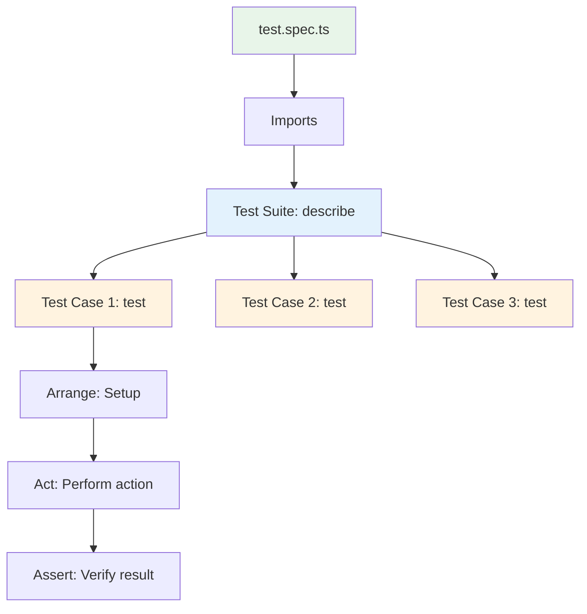
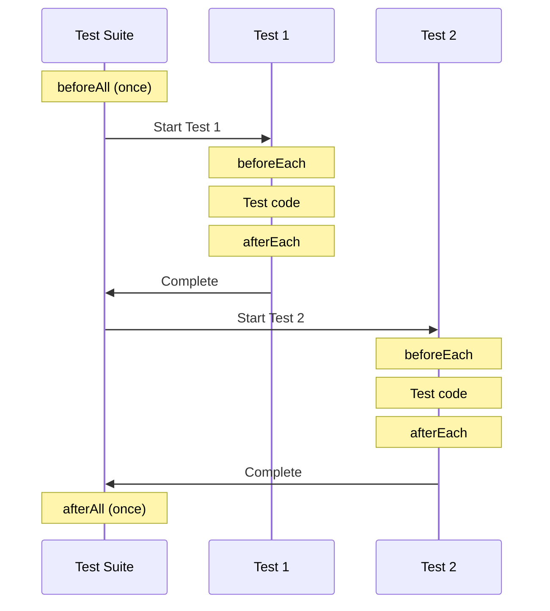
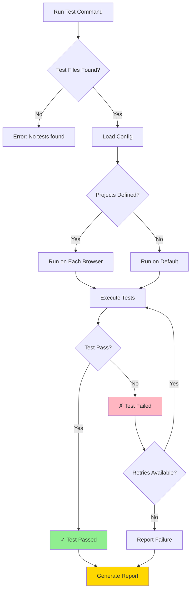
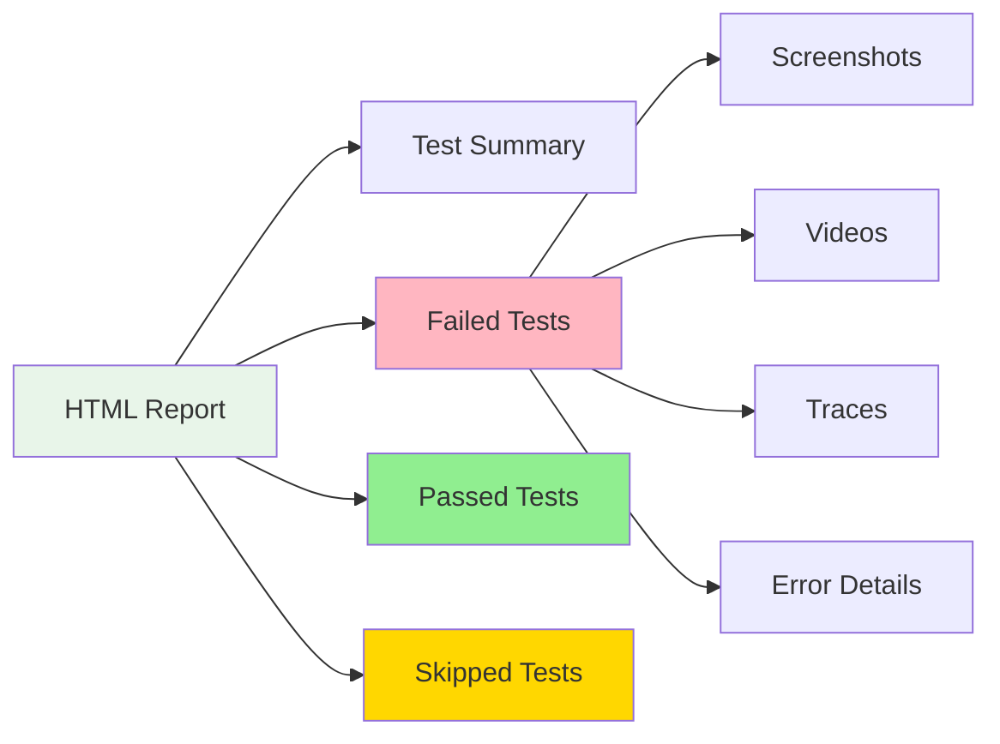

# ✍️ Viết Test Đầu Tiên Với Playwright
## Writing Your First Playwright Test

> Hướng dẫn từng bước viết và chạy test đầu tiên

---

## 🎯 Mục Tiêu | Objectives

Sau bài học này, bạn sẽ:
- ✅ Hiểu cấu trúc một test file
- ✅ Sử dụng `test()`, `describe()`, `expect()`
- ✅ Viết test đơn giản để navigate và verify
- ✅ Chạy tests với các modes khác nhau
- ✅ Đọc và hiểu test results

---

## 📝 Cấu Trúc Test File | Test File Structure

### Anatomy of a Test File



### Basic Test Structure

```typescript
// 1. Imports - Import các thư viện cần thiết
import { test, expect } from '@playwright/test';

// 2. Test Suite - Nhóm các tests liên quan
test.describe('Feature Name', () => {

  // 3. Test Case - Một test cụ thể
  test('should do something', async ({ page }) => {
    // 4. Arrange - Chuẩn bị
    await page.goto('https://example.com');

    // 5. Act - Thực hiện hành động
    await page.click('button#submit');

    // 6. Assert - Kiểm tra kết quả
    await expect(page).toHaveURL(/success/);
  });

});
```

---

## 🚀 Test Đầu Tiên: Navigation Test

### Tạo file test mới

```bash
# Tạo thư mục tests nếu chưa có
mkdir -p tests

# Tạo file test đầu tiên
touch tests/example.spec.ts
```

### Code test đầu tiên:

```typescript
import { test, expect } from '@playwright/test';

test('navigate to Playwright homepage', async ({ page }) => {
  // Bước 1: Mở trang web
  await page.goto('https://playwright.dev');

  // Bước 2: Verify title
  await expect(page).toHaveTitle(/Playwright/);

  // Bước 3: Verify URL
  await expect(page).toHaveURL('https://playwright.dev/');

  // Bước 4: Verify element hiển thị
  const getStartedButton = page.getByRole('link', { name: 'Get started' });
  await expect(getStartedButton).toBeVisible();
});
```

### Giải thích từng dòng:

```typescript
import { test, expect } from '@playwright/test';
// Import 2 functions chính:
// - test: Định nghĩa test case
// - expect: Assertions (xác nhận)

test('navigate to Playwright homepage', async ({ page }) => {
// test(name, testFunction)
// - name: Tên test (mô tả test làm gì)
// - async: Test function là async (vì có await)
// - { page }: Fixture - Playwright tự động cung cấp page object

await page.goto('https://playwright.dev');
// goto(): Navigate đến URL
// await: Chờ navigation hoàn thành

await expect(page).toHaveTitle(/Playwright/);
// expect(page): Tạo assertion cho page
// toHaveTitle(): Matcher kiểm tra title
// /Playwright/: Regular expression (regex)

await expect(page).toHaveURL('https://playwright.dev/');
// Verify URL chính xác

const getStartedButton = page.getByRole('link', { name: 'Get started' });
// getByRole(): Tìm element theo ARIA role
// Lưu vào biến để reuse

await expect(getStartedButton).toBeVisible();
// toBeVisible(): Kiểm tra element có hiển thị không
```

---

## 🎭 Các Thành Phần Quan Trọng | Key Components

### 1. `test()` - Test Case

```typescript
// Basic test
test('test name', async ({ page }) => {
  // test code
});

// Test with timeout
test('slow test', async ({ page }) => {
  test.setTimeout(60000); // 60 seconds
  // test code
});

// Skipped test
test.skip('not ready yet', async ({ page }) => {
  // will not run
});

// Only run this test
test.only('debug this', async ({ page }) => {
  // only this test runs
});
```

### 2. `describe()` - Test Suite (Nhóm tests)

```typescript
test.describe('Login Feature', () => {

  test('successful login', async ({ page }) => {
    // test code
  });

  test('failed login with wrong password', async ({ page }) => {
    // test code
  });

  test('failed login with wrong username', async ({ page }) => {
    // test code
  });

});
```

### 3. Hooks - Setup và Teardown



```typescript
test.describe('Login Tests', () => {

  // Chạy 1 lần TRƯỚC tất cả tests
  test.beforeAll(async ({ browser }) => {
    console.log('Setup: Before all tests');
  });

  // Chạy TRƯỚC mỗi test
  test.beforeEach(async ({ page }) => {
    console.log('Setup: Before each test');
    await page.goto('https://example.com/login');
  });

  // Chạy SAU mỗi test
  test.afterEach(async ({ page }) => {
    console.log('Cleanup: After each test');
    await page.close();
  });

  // Chạy 1 lần SAU tất cả tests
  test.afterAll(async ({ browser }) => {
    console.log('Cleanup: After all tests');
  });

  test('test 1', async ({ page }) => { /* ... */ });
  test('test 2', async ({ page }) => { /* ... */ });

});
```

### 4. `expect()` - Assertions

```typescript
// Page assertions
await expect(page).toHaveTitle('Expected Title');
await expect(page).toHaveURL('https://example.com');
await expect(page).toHaveURL(/regex-pattern/);

// Element assertions
await expect(locator).toBeVisible();
await expect(locator).toBeHidden();
await expect(locator).toBeEnabled();
await expect(locator).toBeDisabled();
await expect(locator).toHaveText('Expected text');
await expect(locator).toContainText('partial text');
await expect(locator).toHaveValue('input value');
await expect(locator).toHaveAttribute('href', '/path');
await expect(locator).toHaveClass('active');

// Count assertions
await expect(locator).toHaveCount(5);

// Negation (phủ định)
await expect(locator).not.toBeVisible();
```

---

## 🏃 Chạy Tests | Running Tests

### Flow Chart: Test Execution



### Command Line Interface (CLI)

```bash
# 1. Chạy tất cả tests
npx playwright test

# 2. Chạy file cụ thể
npx playwright test example.spec.ts

# 3. Chạy tests có pattern trong tên
npx playwright test login

# 4. Chạy với UI Mode (khuyến nghị)
npx playwright test --ui

# 5. Chạy headed mode (xem browser)
npx playwright test --headed

# 6. Chạy debug mode
npx playwright test --debug

# 7. Chạy trên browser cụ thể
npx playwright test --project=chromium
npx playwright test --project=firefox

# 8. Chạy tests có tag/grep
npx playwright test --grep "login"
npx playwright test --grep-invert "slow"
```

### Output Modes

#### 1. Headless Mode (mặc định)
```bash
npx playwright test
# Không mở browser window, chạy nền
# Nhanh nhất, dùng cho CI/CD
```

#### 2. Headed Mode
```bash
npx playwright test --headed
# Mở browser window, thấy được quá trình
# Dùng khi develop/debug
```

#### 3. UI Mode (Interactive)
```bash
npx playwright test --ui
# Mở Playwright UI
# Best cho debugging và exploratory testing
```

#### 4. Debug Mode
```bash
npx playwright test --debug
# Mở Playwright Inspector
# Step through từng action
```

---

## 📊 Test Results | Kết Quả Test

### Console Output

```bash
Running 3 tests using 3 workers

  ✓  [chromium] › example.spec.ts:3:1 › navigate to Playwright homepage (1.2s)
  ✓  [firefox] › example.spec.ts:3:1 › navigate to Playwright homepage (1.5s)
  ✓  [webkit] › example.spec.ts:3:1 › navigate to Playwright homepage (1.1s)

  3 passed (4s)
```

### Symbols Explained:

- ✓ = Passed
- ✗ = Failed
- ○ = Skipped
- ⊘ = Flaky (passed after retry)

### HTML Report

```bash
# Generate và mở HTML report
npx playwright show-report
```

Report structure:


---

## 💡 Best Practices - Cách Viết Test Tốt

### 1. Test Naming Convention

```typescript
// ❌ Bad: Không rõ ràng
test('test1', async ({ page }) => { });

// ✅ Good: Mô tả rõ ràng
test('should display error message when login with invalid credentials', async ({ page }) => { });

// ✅ Good: Follow pattern "should [expected behavior] when [condition]"
test('should redirect to dashboard when login successful', async ({ page }) => { });
```

### 2. AAA Pattern - Arrange, Act, Assert

```typescript
test('add product to cart', async ({ page }) => {
  // Arrange - Chuẩn bị
  await page.goto('https://example.com/products');
  const product = page.locator('.product').first();

  // Act - Thực hiện hành động
  await product.click();
  await page.click('button:text("Add to Cart")');

  // Assert - Kiểm tra kết quả
  const cartCount = page.locator('.cart-count');
  await expect(cartCount).toHaveText('1');
});
```

### 3. Independent Tests (Tests độc lập)

```typescript
// ❌ Bad: Test phụ thuộc nhau
test('login', async ({ page }) => {
  await page.goto('/login');
  await page.fill('#username', 'user1');
  await page.fill('#password', 'pass1');
  await page.click('button[type="submit"]');
});

test('view profile', async ({ page }) => {
  // Assumes user is already logged in from previous test!
  await page.goto('/profile');
  // ...
});

// ✅ Good: Mỗi test độc lập
test('login and view profile', async ({ page }) => {
  // Login
  await page.goto('/login');
  await page.fill('#username', 'user1');
  await page.fill('#password', 'pass1');
  await page.click('button[type="submit"]');

  // View profile
  await page.goto('/profile');
  await expect(page.locator('h1')).toHaveText('Profile');
});
```

### 4. Use Descriptive Selectors

```typescript
// ❌ Bad: Fragile selectors
await page.click('#btn > div > span');
await page.fill('input:nth-child(3)');

// ✅ Good: Semantic selectors
await page.click('button[aria-label="Submit"]');
await page.getByRole('button', { name: 'Submit' }).click();
await page.getByLabel('Email').fill('test@example.com');
```

---

## 🐛 Common Errors - Lỗi Thường Gặp

### Error 1: "Test timeout of 30000ms exceeded"

```typescript
// ❌ Problem
test('slow test', async ({ page }) => {
  await page.goto('https://very-slow-site.com');
  // Timeout after 30s (default)
});

// ✅ Solution 1: Increase timeout
test('slow test', async ({ page }) => {
  test.setTimeout(60000); // 60 seconds
  await page.goto('https://very-slow-site.com');
});

// ✅ Solution 2: Set in config
// playwright.config.ts
export default defineConfig({
  timeout: 60000,
});
```

### Error 2: "Selector not found"

```typescript
// ❌ Problem
await page.click('.button-not-exists');

// ✅ Solution: Wait for element
await page.waitForSelector('.button');
await page.click('.button');

// ✅ Better: Use auto-waiting locators
const button = page.locator('.button');
await button.click(); // Auto-waits!
```

### Error 3: "Element is not visible"

```typescript
// ❌ Problem: Element hidden by modal
await page.click('.hidden-button');

// ✅ Solution: Close modal first
await page.click('.modal-close');
await page.click('.hidden-button');
```

---

## 📚 Test Organization - Tổ Chức Tests

### File Structure Recommendation

```
tests/
├── auth/
│   ├── login.spec.ts
│   ├── logout.spec.ts
│   └── register.spec.ts
├── products/
│   ├── list.spec.ts
│   ├── detail.spec.ts
│   └── search.spec.ts
└── cart/
    ├── add-to-cart.spec.ts
    └── checkout.spec.ts
```

### Grouping with describe()

```typescript
test.describe('Authentication', () => {

  test.describe('Login', () => {
    test('successful login', async ({ page }) => { });
    test('failed login - wrong password', async ({ page }) => { });
  });

  test.describe('Logout', () => {
    test('successful logout', async ({ page }) => { });
  });

});
```

---

## ✅ Checklist

Sau bài học này, bạn đã:

- [ ] Hiểu cấu trúc test file (imports, describe, test)
- [ ] Viết được test đầu tiên
- [ ] Sử dụng `test()`, `describe()`, `expect()`
- [ ] Chạy tests với CLI
- [ ] Xem test results và HTML report
- [ ] Biết AAA pattern
- [ ] Tránh được các lỗi thường gặp

---

## 🎯 Bài Tập Thực Hành

**Exercise**: Viết test case sau:
1. Navigate đến https://practice.expandtesting.com
2. Click vào link "Test Login Page"
3. Verify URL chứa `/login`
4. Verify page title

**Solution**: Xem trong `/exercises/exercise-03-basic-interaction.spec.ts`

---

## ➡️ Tiếp Theo | Next Steps

Sau khi viết được test đầu tiên, tiếp tục với:

👉 **[04-browser-context-vi.md](04-browser-context-vi.md)** - Hiểu về Browser Context

---

**Chúc mừng! Bạn đã viết được test đầu tiên! 🎉**
