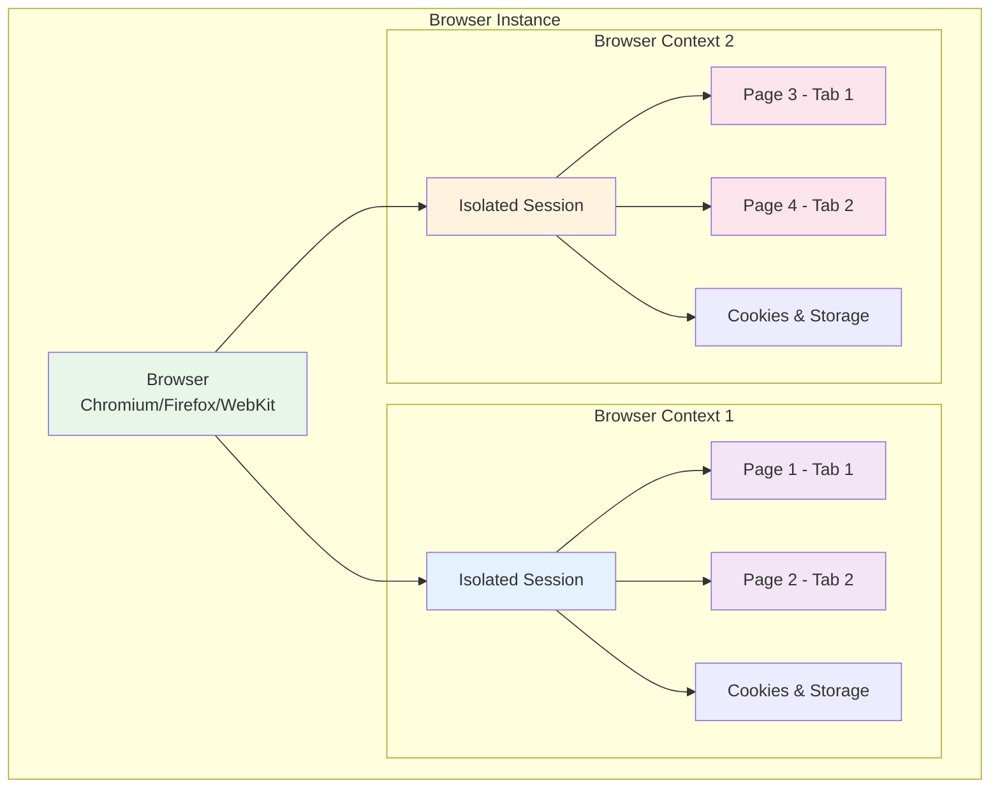
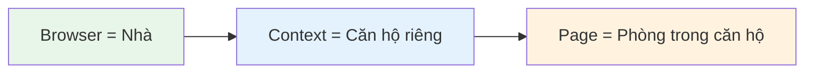
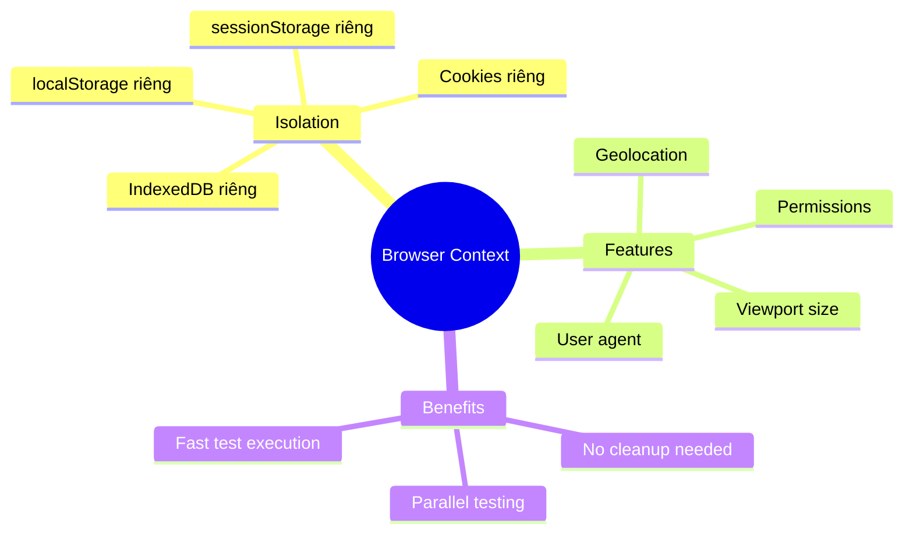
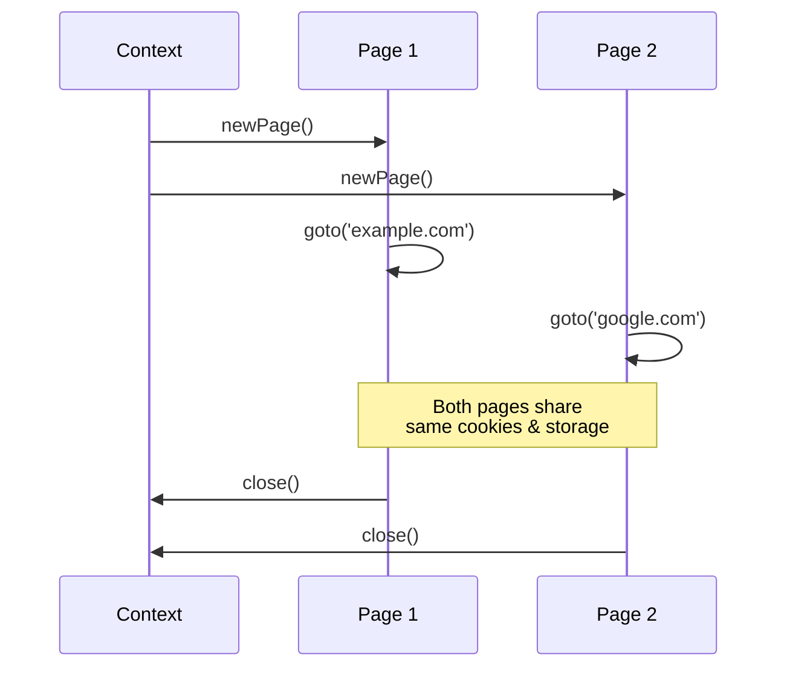
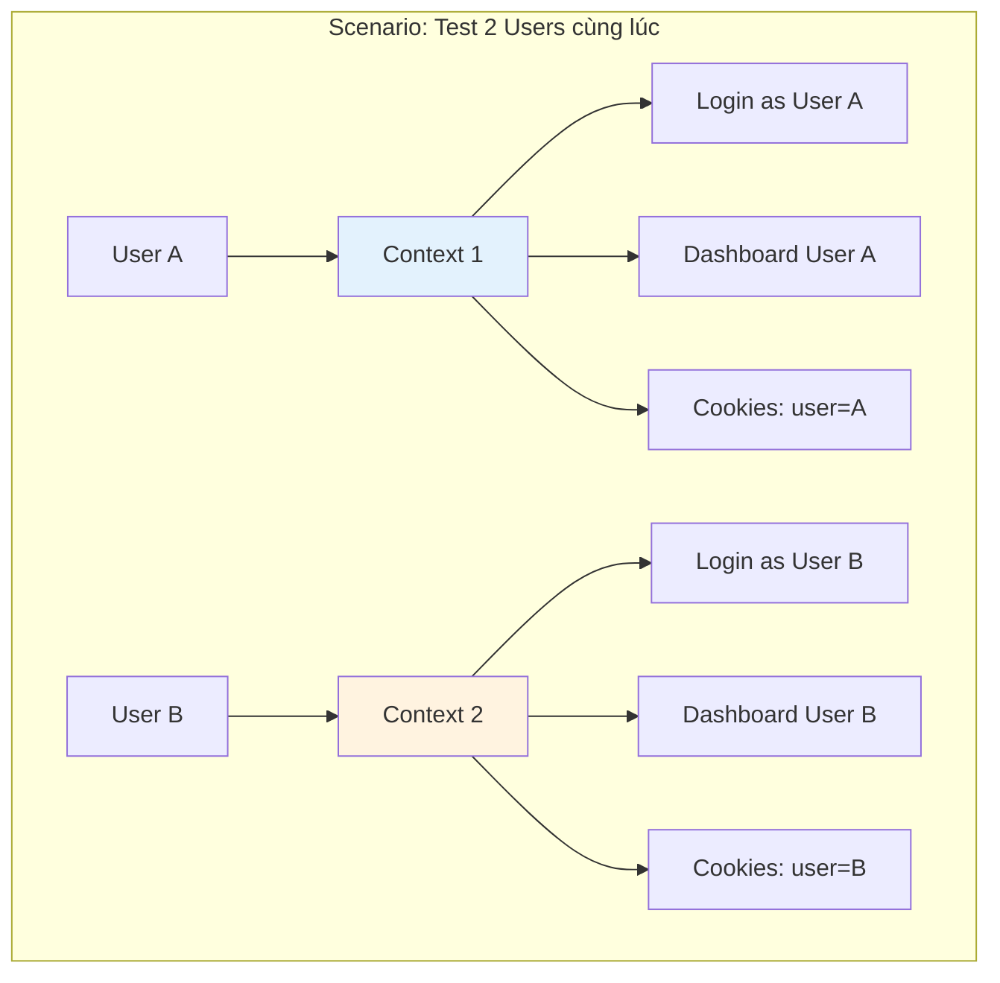
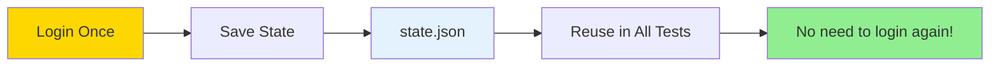
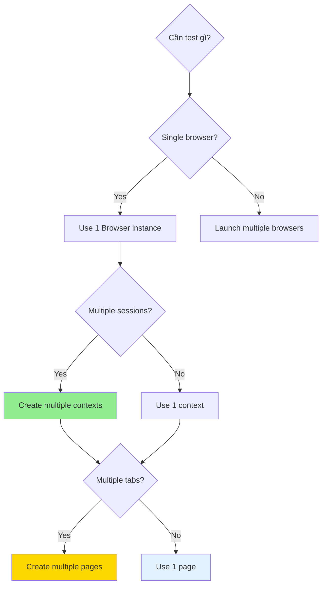
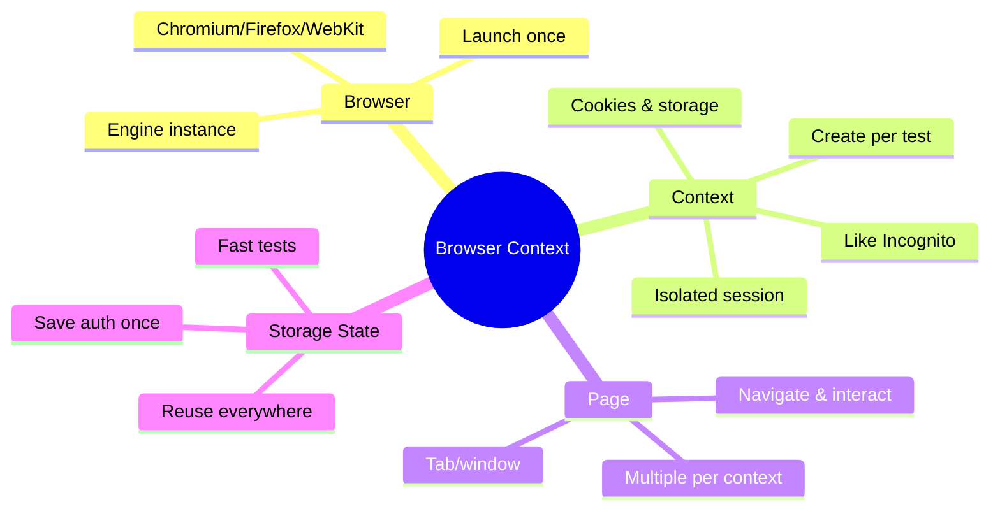

# 🌐 Browser Context - Ngữ Cảnh Trình Duyệt
## Understanding Browser Contexts in Playwright

> Hiểu sâu về Browser, Context, và Page - 3 khái niệm cốt lõi của Playwright

---

## 🎯 Mục Tiêu | Objectives

Sau bài học này, bạn sẽ:
- ✅ Phân biệt Browser, Browser Context, và Page
- ✅ Hiểu isolation (cô lập) giữa các contexts
- ✅ Tạo và quản lý multiple contexts
- ✅ Sử dụng storage state (cookies, localStorage)
- ✅ Biết khi nào nên dùng context riêng

---

## 📊 Hierarchy - Phân Cấp



---

## 🔍 So Sánh: Browser vs Context vs Page

### Analogy (Ẩn dụ):



| Khái niệm | Giải thích | Ví dụ thực tế |
|-----------|------------|---------------|
| **Browser** | Browser engine instance | Chrome app trên máy bạn |
| **Context** | Isolated browser session | Incognito window |
| **Page** | Single tab/popup | Tab trong browser |

---

## 🌐 Browser - Trình Duyệt

### Định nghĩa:
**Browser** là instance của browser engine (Chromium, Firefox, hoặc WebKit)

### Code Example:

```typescript
import { chromium, firefox, webkit } from 'playwright';

// Launch Chromium
const browser = await chromium.launch();

// Launch Firefox
const browserFF = await firefox.launch();

// Launch WebKit (Safari)
const browserWK = await webkit.launch();

// Close browser
await browser.close();
```

### Launch Options:

```typescript
const browser = await chromium.launch({
  headless: false,        // Hiển thị browser UI
  slowMo: 1000,          // Chậm lại 1s mỗi action (để quan sát)
  devtools: true,        // Mở DevTools
  args: ['--start-maximized'], // Browser arguments
});
```

---

## 🎭 Browser Context - Ngữ Cảnh Trình Duyệt

### Định nghĩa:
**Browser Context** là **isolated browser session** (session cô lập), giống như "Incognito window"

### Đặc điểm quan trọng:



### Code Example:

```typescript
import { chromium } from 'playwright';

const browser = await chromium.launch();

// Tạo context mới
const context = await browser.newContext();

// Tạo page trong context
const page = await context.newPage();

// Navigate
await page.goto('https://example.com');

// Cleanup
await context.close();
await browser.close();
```

### Context Options - Cấu hình Context:

```typescript
const context = await browser.newContext({
  // Viewport size (kích thước màn hình)
  viewport: { width: 1280, height: 720 },

  // User agent
  userAgent: 'Mozilla/5.0...',

  // Geolocation (vị trí địa lý)
  geolocation: { latitude: 48.858455, longitude: 2.294474 },
  permissions: ['geolocation'],

  // Locale & timezone
  locale: 'vi-VN',
  timezoneId: 'Asia/Ho_Chi_Minh',

  // HTTP credentials
  httpCredentials: {
    username: 'user',
    password: 'pass'
  },

  // Device emulation
  isMobile: true,
  hasTouch: true,

  // Color scheme
  colorScheme: 'dark', // hoặc 'light'
});
```

---

## 📄 Page - Trang

### Định nghĩa:
**Page** là single tab hoặc popup window trong context

### Code Example:

```typescript
const context = await browser.newContext();

// Tạo page mới
const page1 = await context.newPage();
const page2 = await context.newPage();

// Navigate
await page1.goto('https://example.com');
await page2.goto('https://google.com');

// Close page
await page1.close();
await page2.close();
```

### Multiple Pages Example:



---

## 🔒 Isolation - Cô Lập Giữa Contexts

### Tại sao cần Isolation?



### Code Example: Multiple Users Testing

```typescript
import { chromium } from 'playwright';

const browser = await chromium.launch();

// User A context
const contextUserA = await browser.newContext();
const pageUserA = await contextUserA.newPage();
await pageUserA.goto('https://example.com/login');
await pageUserA.fill('#username', 'userA');
await pageUserA.fill('#password', 'passA');
await pageUserA.click('button[type="submit"]');
// User A logged in

// User B context (hoàn toàn độc lập)
const contextUserB = await browser.newContext();
const pageUserB = await contextUserB.newPage();
await pageUserB.goto('https://example.com/login');
await pageUserB.fill('#username', 'userB');
await pageUserB.fill('#password', 'passB');
await pageUserB.click('button[type="submit"]');
// User B logged in

// Cả 2 users có thể thao tác song song
await pageUserA.goto('/profile');  // User A's profile
await pageUserB.goto('/settings');  // User B's settings

// Cookies và storage hoàn toàn riêng biệt!
```

---

## 💾 Storage State - Trạng Thái Lưu Trữ

### Lưu và Tái Sử Dụng Authentication State



### Save Storage State:

```typescript
// 1. Login và lưu state
const browser = await chromium.launch();
const context = await browser.newContext();
const page = await context.newPage();

// Login
await page.goto('https://example.com/login');
await page.fill('#username', 'testuser');
await page.fill('#password', 'password123');
await page.click('button[type="submit"]');

// Chờ login thành công
await page.waitForURL('**/dashboard');

// Lưu storage state (cookies, localStorage, etc.)
await context.storageState({ path: 'auth-state.json' });

await browser.close();
```

### Reuse Storage State:

```typescript
// 2. Tái sử dụng state trong tests
const browser = await chromium.launch();

// Load state đã lưu
const context = await browser.newContext({
  storageState: 'auth-state.json'
});

const page = await context.newPage();

// Đã logged in sẵn!
await page.goto('https://example.com/dashboard');
// Không cần login lại!
```

### Storage State trong Playwright Config:

```typescript
// playwright.config.ts
import { defineConfig } from '@playwright/test';

export default defineConfig({
  projects: [
    // Setup project: login và lưu state
    {
      name: 'setup',
      testMatch: /auth\.setup\.ts/,
    },

    // Tests project: dùng state đã lưu
    {
      name: 'chromium',
      use: {
        storageState: 'auth-state.json',
      },
      dependencies: ['setup'], // Chạy sau 'setup'
    },
  ],
});
```

---

## 🎭 Use Cases - Trường Hợp Sử Dụng

### 1. Testing Multi-User Scenarios

```typescript
// E-commerce: Seller và Buyer
const sellerContext = await browser.newContext();
const sellerPage = await sellerContext.newPage();
// Seller tạo product

const buyerContext = await browser.newContext();
const buyerPage = await buyerContext.newPage();
// Buyer mua product

// Cả 2 có thể thao tác đồng thời
```

### 2. Testing Different Permissions

```typescript
// Admin context
const adminContext = await browser.newContext({
  storageState: 'admin-auth.json'
});

// Regular user context
const userContext = await browser.newContext({
  storageState: 'user-auth.json'
});
```

### 3. Testing Different Devices

```typescript
import { devices } from 'playwright';

// Desktop context
const desktopContext = await browser.newContext({
  ...devices['Desktop Chrome']
});

// Mobile context
const mobileContext = await browser.newContext({
  ...devices['iPhone 12']
});
```

### 4. Testing Different Locales

```typescript
// Vietnamese context
const vnContext = await browser.newContext({
  locale: 'vi-VN',
  timezoneId: 'Asia/Ho_Chi_Minh',
});

// English context
const enContext = await browser.newContext({
  locale: 'en-US',
  timezoneId: 'America/New_York',
});
```

---

## 🆚 When to Use What? - Khi nào dùng gì?



### Decision Table:

| Scenario | Browser | Context | Page |
|----------|---------|---------|------|
| Simple test, 1 user | 1 | 1 | 1 |
| Multiple tabs, same user | 1 | 1 | Multiple |
| 2 users simultaneously | 1 | 2 | 2 (1 per context) |
| Different browsers | Multiple | 1+ per browser | 1+ per context |
| Mobile + Desktop | 1 | 2 (different devices) | 1+ per context |

---

## 💡 Best Practices

### 1. Cleanup Resources

```typescript
// ✅ Good: Always close
const context = await browser.newContext();
const page = await context.newPage();

try {
  // test code
} finally {
  await page.close();
  await context.close();
}

// ✅ Better: Use Playwright Test (auto cleanup)
test('my test', async ({ context, page }) => {
  // Playwright tự động cleanup!
});
```

### 2. Reuse Browser, Create New Contexts

```typescript
// ✅ Good: Reuse browser
const browser = await chromium.launch();

for (let i = 0; i < 10; i++) {
  const context = await browser.newContext();
  const page = await context.newPage();
  // Run test
  await context.close();
}

await browser.close();

// ❌ Bad: Launch browser mỗi lần
for (let i = 0; i < 10; i++) {
  const browser = await chromium.launch(); // Slow!
  // ...
  await browser.close();
}
```

### 3. Use Storage State cho Authentication

```typescript
// ✅ Good: Login once, reuse state
// Setup phase
await context.storageState({ path: 'auth.json' });

// All tests
const context = await browser.newContext({
  storageState: 'auth.json'
});

// ❌ Bad: Login in every test
test('test 1', async ({ page }) => {
  await login(page); // Slow!
});
test('test 2', async ({ page }) => {
  await login(page); // Slow!
});
```

---

## 🐛 Common Pitfalls - Lỗi Thường Gặp

### Pitfall 1: Sharing State Accidentally

```typescript
// ❌ Bad: Tests ảnh hưởng nhau
const context = await browser.newContext();

test('test 1', async () => {
  const page = await context.newPage();
  // Set cookie
  await context.addCookies([{ name: 'test', value: '1', url: 'https://example.com' }]);
});

test('test 2', async () => {
  const page = await context.newPage();
  // Cookie từ test 1 vẫn còn! ❌
});

// ✅ Good: Mỗi test có context riêng
test('test 1', async ({ context }) => {
  // Context mới, isolated
});

test('test 2', async ({ context }) => {
  // Context mới khác, isolated
});
```

### Pitfall 2: Not Closing Resources

```typescript
// ❌ Bad: Memory leak!
for (let i = 0; i < 100; i++) {
  const context = await browser.newContext();
  const page = await context.newPage();
  // Không close → memory leak!
}

// ✅ Good: Always close
for (let i = 0; i < 100; i++) {
  const context = await browser.newContext();
  const page = await context.newPage();
  // ... test code ...
  await context.close();
}
```

---

## 📚 Summary - Tóm Tắt

### Key Takeaways:



### Hierarchy Recap:

```
1 Browser
  ├── Context 1 (Isolated)
  │   ├── Page 1 (Tab)
  │   └── Page 2 (Tab)
  └── Context 2 (Isolated)
      ├── Page 3 (Tab)
      └── Page 4 (Tab)
```

---

## ✅ Checklist

Sau bài học này, bạn đã:

- [ ] Phân biệt được Browser, Context, Page
- [ ] Hiểu isolation giữa contexts
- [ ] Tạo được multiple contexts
- [ ] Lưu và tái sử dụng storage state
- [ ] Biết khi nào dùng context riêng
- [ ] Cleanup resources đúng cách

---

## 🎯 Bài Tập Thực Hành

**Exercise**: Tạo 2 contexts để test:
1. User A login và xem profile
2. User B login và xem profile
3. Verify cả 2 users có data riêng biệt

**Solution**: Xem trong `/exercises/exercise-02-browser-setup.spec.ts`

---

## ➡️ Tiếp Theo | Next Steps

Sau khi hiểu Browser Context, bắt đầu học về interactions:

👉 **Week 2: Element Interactions** - Locators, clicks, fills

---

**Chúc mừng! Bạn đã hoàn thành Week 1! 🎉**
