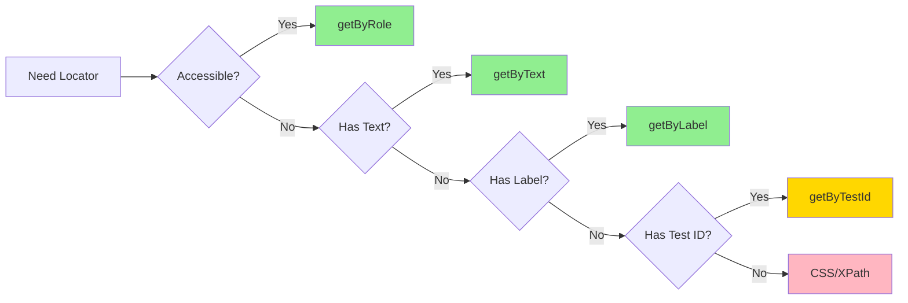

# 📖 Module 1 - Week 2: Interactions & Locators
## Tuần 2: Tương Tác & Bộ Định Vị

> **Thời lượng**: 8-10 giờ học
> **Prerequisite**: Hoàn thành Week 1 - Getting Started
> **Difficulty**: ⭐⭐ Medium

---

## 🎯 Mục Tiêu Học (Learning Objectives)

Sau khi hoàn thành Week 2, bạn sẽ:

1. ✅ **Master Locators** - Thành thạo 7+ loại locators (CSS, XPath, Text, Role-based, etc.)
2. ✅ **Element Interactions** - Tương tác với mọi loại element (input, button, checkbox, dropdown, etc.)
3. ✅ **Keyboard & Mouse** - Sử dụng keyboard shortcuts, mouse hover, drag-drop
4. ✅ **Advanced Selectors** - Chaining selectors, filtering, nth-child, has-text
5. ✅ **File Operations** - Upload files, download files, handle file inputs
6. ✅ **Dynamic Content** - Xử lý elements xuất hiện động, infinite scroll
7. ✅ **Shadow DOM** - Làm việc với Shadow DOM elements

---

## 📚 Nội Dung Chi Tiết (Content Overview)

### Day 1-2: Locators Fundamentals (3-4 hours)
**Theory**: `docs/01-locators-fundamentals-vi.md`

- 📍 7 loại locators chính
- 🎯 Best practices cho selector stability
- 🔗 Chaining và filtering locators
- ⚡ Performance considerations

**Examples**:
- `examples/01-css-selectors.spec.ts` - CSS selectors (ID, class, attribute, combinators)
- `examples/02-text-locators.spec.ts` - Text và role-based locators

**Exercises**:
- `exercises/exercise-01-locators.spec.ts` - Practice all locator types

---

### Day 3-4: Element Interactions (3-4 hours)
**Theory**: `docs/02-element-interactions-vi.md`

- 🖱️ Click, double-click, right-click
- ⌨️ Fill, type, clear inputs
- ☑️ Checkboxes và radio buttons
- 📋 Select dropdowns (single & multiple)
- 🔘 Custom elements (sliders, datepickers)

**Examples**:
- `examples/03-click-interactions.spec.ts` - Click variations
- `examples/04-form-interactions.spec.ts` - Forms, inputs, selects
- `examples/05-checkbox-radio.spec.ts` - Checkboxes & radios

**Exercises**:
- `exercises/exercise-02-interactions.spec.ts` - Complete form flows

---

### Day 5-6: Keyboard & Mouse (2-3 hours)
**Theory**: `docs/03-keyboard-mouse-vi.md`

- ⌨️ Keyboard methods (press, type, keyboard shortcuts)
- 🖱️ Mouse methods (hover, click with modifiers, mouse wheel)
- 🎯 Drag and drop operations
- 🔄 Multi-step interactions

**Examples**:
- `examples/06-keyboard-actions.spec.ts` - Keyboard shortcuts, special keys
- `examples/07-mouse-actions.spec.ts` - Hover, drag-drop, context menu

**Exercises**:
- `exercises/exercise-03-keyboard-mouse.spec.ts` - Interactive scenarios

---

### Day 7: File Operations (2-3 hours)
**Theory**: `docs/04-file-operations-vi.md`

- 📤 Upload files (single & multiple)
- 📥 Download files and verify
- 📂 File input handling
- 🖼️ Image uploads

**Examples**:
- `examples/08-file-upload.spec.ts` - File upload scenarios

**Exercises**:
- `exercises/exercise-04-file-ops.spec.ts` - Upload/download practice

---

## 🗂️ File Structure

```
week-2-interactions/
├── README.md (this file)
├── docs/
│   ├── 01-locators-fundamentals-vi.md (~400 lines)
│   ├── 02-element-interactions-vi.md (~450 lines)
│   ├── 03-keyboard-mouse-vi.md (~380 lines)
│   └── 04-file-operations-vi.md (~350 lines)
├── examples/
│   ├── 01-css-selectors.spec.ts
│   ├── 02-text-locators.spec.ts
│   ├── 03-click-interactions.spec.ts
│   ├── 04-form-interactions.spec.ts
│   ├── 05-checkbox-radio.spec.ts
│   ├── 06-keyboard-actions.spec.ts
│   ├── 07-mouse-actions.spec.ts
│   └── 08-file-upload.spec.ts
├── exercises/
│   ├── exercise-01-locators.spec.ts
│   ├── exercise-02-interactions.spec.ts
│   ├── exercise-03-keyboard-mouse.spec.ts
│   └── exercise-04-file-ops.spec.ts
├── solutions/
│   ├── exercise-01-locators.spec.ts
│   ├── exercise-02-interactions.spec.ts
│   ├── exercise-03-keyboard-mouse.spec.ts
│   └── exercise-04-file-ops.spec.ts
└── test-data/
    ├── sample-upload.txt
    ├── sample-image.png
    └── sample-document.pdf
```

---

## 🚀 Getting Started

### 1️⃣ Đọc Theory
Bắt đầu với từng doc file theo thứ tự (01 → 02 → 03 → 04)

### 2️⃣ Chạy Examples
```bash
# Chạy tất cả examples Week 2
yarn test module-1-basics/week-2-interactions/examples/

# Chạy từng example
yarn test examples/01-css-selectors.spec.ts
yarn test examples/02-text-locators.spec.ts
# ...
```

### 3️⃣ Làm Exercises
```bash
# Chạy exercises (sẽ fail vì còn TODO)
yarn test exercises/exercise-01-locators.spec.ts

# Sau khi hoàn thành, so sánh với solution
yarn test solutions/exercise-01-locators.spec.ts
```

### 4️⃣ Verify Learning
```bash
# Chạy tất cả tests Week 2
yarn test module-1-basics/week-2-interactions/

# Expected: All examples pass, exercises pass after completion
```

---

## 📊 Time Allocation

| Day | Topic | Hours | Activities |
|-----|-------|-------|-----------|
| **Day 1** | Locators Theory | 1.5h | Read docs, understand selector strategies |
| **Day 2** | Locators Practice | 2h | Run examples, complete exercise-01 |
| **Day 3** | Interactions Theory | 1.5h | Learn click, fill, check, select methods |
| **Day 4** | Interactions Practice | 2.5h | Run examples, complete exercise-02 |
| **Day 5** | Keyboard/Mouse Theory | 1h | Learn keyboard shortcuts, drag-drop |
| **Day 6** | Keyboard/Mouse Practice | 2h | Run examples, complete exercise-03 |
| **Day 7** | File Operations | 2.5h | Theory + practice + complete exercise-04 |

**Total**: 8-10 hours (flexible theo tốc độ cá nhân)

---

## 🎯 Success Criteria

Sau Week 2, bạn phải:

- [ ] Hiểu và sử dụng được 7+ loại locators
- [ ] Tương tác được với mọi loại form elements
- [ ] Xử lý được keyboard shortcuts và mouse events
- [ ] Upload và download files thành công
- [ ] Hoàn thành 100% exercises (4/4)
- [ ] Tất cả tests chạy pass trên 3 browsers (chromium, firefox, webkit)

---

## 🔗 Test Sites Used

Week 2 sử dụng các practice sites sau:

1. **[Expand Testing](https://practice.expandtesting.com)**
   - Forms: `/login`, `/form-validation`, `/checkboxes`, `/dropdown`
   - Interactions: `/drag-and-drop`, `/key-presses`, `/hovers`
   - Files: `/upload`, `/download`

2. **[Sauce Demo](https://www.saucedemo.com)**
   - E-commerce interactions
   - Sorting, filtering, cart operations

3. **[The Internet (Herokuapp)](https://the-internet.herokuapp.com)**
   - Dynamic content: `/dynamic_loading`
   - File operations: `/upload`, `/download`
   - Keyboard: `/key_presses`

---

## 💡 Tips & Best Practices

### Locator Selection Priority


### Common Pitfalls
1. ❌ **Avoid fragile selectors** - Don't use dynamic IDs or auto-generated classes
2. ❌ **Don't use XPath unless necessary** - CSS is faster and more readable
3. ❌ **Avoid hardcoded waits** - Use auto-wait instead of `waitForTimeout()`
4. ✅ **Prefer user-facing selectors** - Role, label, text (accessibility-friendly)
5. ✅ **Use data-testid for dynamic content** - When semantic selectors aren't available

---

## 🔍 Debug Commands

```bash
# Run with UI mode (interactive debugging)
yarn test:ui examples/01-css-selectors.spec.ts

# Run with headed browser (see what's happening)
yarn test examples/01-css-selectors.spec.ts --headed

# Run with debug mode (step through)
yarn test examples/01-css-selectors.spec.ts --debug

# Generate test code (Codegen)
yarn playwright codegen https://practice.expandtesting.com/login
```

---

## 📖 Related Documentation

- **Previous**: [Week 1 - Getting Started](../week-1-getting-started/README.md)
- **Next**: [Week 3 - Assertions & Debugging](../week-3-assertions-debugging/README.md)
- **Troubleshooting**: [docs/troubleshooting-vi.md](../../docs/troubleshooting-vi.md)
- **Resources**: [docs/resources.md](../../docs/resources.md)

---

## ❓ FAQ

### Q1: Locator nào là tốt nhất?
**A**: Ưu tiên theo thứ tự: `getByRole` > `getByLabel` > `getByText` > `getByTestId` > CSS/XPath

### Q2: Khi nào dùng XPath?
**A**: Chỉ khi CSS không đủ (ví dụ: select parent element, complex text matching)

### Q3: Làm sao biết element đã clickable?
**A**: Playwright tự động check (visible, enabled, stable) trước khi click

### Q4: Upload file ở local machine có khác CI/CD không?
**A**: Không, Playwright handle file paths automatically

### Q5: Drag-drop có hoạt động trên mọi browsers?
**A**: Có, Playwright emulates drag-drop events trên tất cả browsers

---

## 🎯 Self-Check Questions

Trả lời các câu sau để kiểm tra hiểu biết:

1. ❓ Sự khác biệt giữa `click()` và `dblclick()` là gì?
2. ❓ Khi nào dùng `fill()` vs `type()`?
3. ❓ Làm sao select option trong dropdown bằng 3 cách khác nhau?
4. ❓ Chaining locators (`>>`) hoạt động thế nào?
5. ❓ Làm sao verify file đã download thành công?

**Đáp án trong solutions folder!**

---

## ✅ Completion Checklist

Track your progress:

- [ ] **Day 1-2**: Đọc docs 01, chạy examples 01-02, hoàn thành exercise-01
- [ ] **Day 3-4**: Đọc docs 02, chạy examples 03-05, hoàn thành exercise-02
- [ ] **Day 5-6**: Đọc docs 03, chạy examples 06-07, hoàn thành exercise-03
- [ ] **Day 7**: Đọc docs 04, chạy example 08, hoàn thành exercise-04
- [ ] **All tests pass** on all 3 browsers
- [ ] **Understand** all concepts in theory docs
- [ ] **Ready for Week 3**: Assertions & Debugging

---

**🎉 Chúc bạn học tốt Week 2! Happy Testing! 🚀**
