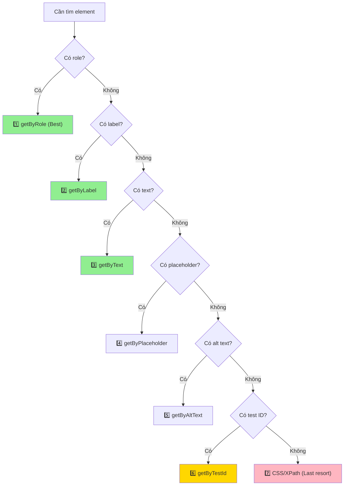
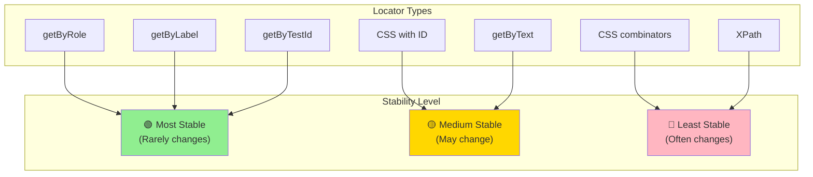

# 🎯 Locators Fundamentals
## Bộ Định Vị Cơ Bản - Nền Tảng Quan Trọng Nhất

> Tài liệu này giới thiệu chi tiết về Locators - khái niệm quan trọng nhất trong automation testing với Playwright.

---

## 📌 Locator Là Gì? | What is a Locator?

**Locator** là cách Playwright **tìm và tương tác** với elements trên trang web.

### Định nghĩa:
> "A Locator is a query that describes how to find an element(s) on the page"
>
> "Locator là một truy vấn mô tả cách tìm element(s) trên trang"

### Analogy (Tương tự):
Think locator như **địa chỉ nhà**:
```
Địa chỉ: "Số 123, Đường Nguyễn Huệ, Quận 1, TP.HCM"
       ↓
Locator: "button.submit#login-btn[type='submit']"
```

Cả hai đều giúp bạn **tìm chính xác** thứ cần tìm trong một không gian lớn!

---

## 🏗️ Locator vs Selector - Sự Khác Biệt

| | **Selector** | **Locator** |
|--|-------------|------------|
| **Là gì?** | String query (chuỗi truy vấn) | Playwright object với methods |
| **Ví dụ** | `'#username'`, `'button.submit'` | `page.locator('#username')` |
| **Auto-wait?** | ❌ No | ✅ Yes |
| **Re-query?** | ❌ No | ✅ Yes (auto re-query) |
| **Lazy?** | ❌ No | ✅ Yes (evaluate when action) |

### Example:
```typescript
// ❌ Selector (just a string)
const selector = '#username';

// ✅ Locator (Playwright object)
const locator = page.locator('#username');

// Locator auto-waits and re-queries
await locator.fill('practice'); // Auto-wait until element ready!
```

---

## 🎯 7 Loại Locators Chính | 7 Main Locator Types

### Locator Priority (Thứ tự ưu tiên)



---

## 1️⃣ getByRole - Role-Based Locators (Best Practice)

**Tại sao tốt nhất?** Vì nó reflect cách **người dùng thực sự** tương tác (accessibility-first)!

### Syntax:
```typescript
page.getByRole(role, options?)
```

### Common Roles:

| Role | HTML Element | Example |
|------|--------------|---------|
| `button` | `<button>`, `<input type="button">` | Login button |
| `textbox` | `<input>`, `<textarea>` | Username field |
| `checkbox` | `<input type="checkbox">` | Remember me |
| `radio` | `<input type="radio">` | Gender selection |
| `link` | `<a href>` | Navigation links |
| `heading` | `<h1>`, `<h2>`, ... | Page titles |
| `img` | `` | Images |
| `table` | `<table>` | Data tables |

### Examples:

```typescript
// ✅ Find button by role and name
await page.getByRole('button', { name: 'Login' }).click();

// ✅ Find textbox by label
await page.getByRole('textbox', { name: 'Username' }).fill('practice');

// ✅ Find checkbox
await page.getByRole('checkbox', { name: 'Remember me' }).check();

// ✅ Find link by name (supports regex)
await page.getByRole('link', { name: /logout/i }).click();

// ✅ Find heading
const heading = page.getByRole('heading', { name: 'Welcome' });
await expect(heading).toBeVisible();
```

### Options:
```typescript
{
  name: string | RegExp,      // Accessible name
  exact: boolean,             // Exact match (default: false)
  disabled: boolean,          // Match disabled state
  checked: boolean,           // Match checked state (checkbox/radio)
  pressed: boolean,           // Match pressed state (button)
  expanded: boolean           // Match expanded state (dropdown)
}
```

---

## 2️⃣ getByLabel - Label Text Locators

Tìm input elements bằng **text của label** (for attribute).

### HTML Example:
```html
<label for="username">Username:</label>
<input id="username" type="text">
```

### Playwright:
```typescript
// ✅ Find by label text
await page.getByLabel('Username:').fill('practice');

// ✅ Case-insensitive with regex
await page.getByLabel(/username/i).fill('practice');

// ✅ Exact match
await page.getByLabel('Email', { exact: true }).fill('test@example.com');
```

**Khi nào dùng?** Form inputs with proper labels (accessible forms).

---

## 3️⃣ getByText - Text Content Locators

Tìm elements bằng **text nội dung**.

### Examples:
```typescript
// ✅ Find by exact text
await page.getByText('Login').click();

// ✅ Find by partial text
await page.getByText('Welcome back').click();

// ✅ Case-insensitive regex
await page.getByText(/login/i).click();

// ✅ Exact match only
await page.getByText('Login', { exact: true }).click();
```

### Use Cases:
- Buttons without accessible names
- Headings
- Paragraph text
- List items

**⚠️ Warning**: Fragile if text changes (use for stable UI text only).

---

## 4️⃣ getByPlaceholder - Placeholder Text Locators

Tìm inputs bằng **placeholder text**.

### HTML Example:
```html
<input type="text" placeholder="Enter your username">
```

### Playwright:
```typescript
// ✅ Find by placeholder
await page.getByPlaceholder('Enter your username').fill('practice');

// ✅ Regex
await page.getByPlaceholder(/username/i).fill('practice');
```

**Khi nào dùng?** Inputs có placeholder rõ ràng, không thay đổi.

---

## 5️⃣ getByAltText - Image Alt Text Locators

Tìm images bằng **alt attribute**.

### HTML Example:
```html

```

### Playwright:
```typescript
// ✅ Find image by alt text
const logo = page.getByAltText('Company Logo');
await expect(logo).toBeVisible();

// ✅ Click clickable image
await page.getByAltText('Profile Picture').click();
```

**Khi nào dùng?** Images, icons with alt text (accessibility best practice).

---

## 6️⃣ getByTestId - Test ID Locators

Tìm elements bằng **data-testid** attribute (dành riêng cho testing).

### HTML Example:
```html
<button data-testid="submit-button">Login</button>
```

### Playwright:
```typescript
// ✅ Find by test ID
await page.getByTestId('submit-button').click();

// Configure custom test ID attribute (trong playwright.config.ts)
use: {
  testIdAttribute: 'data-test-id' // Or 'data-qa', 'data-automation-id'
}
```

### Khi nào dùng?
- ✅ Dynamic elements (text changes, no stable selectors)
- ✅ Elements without semantic meaning
- ✅ When collaborating with developers (ask them to add test IDs)

**Best Practice**: Ask devs to add `data-testid` cho critical elements.

---

## 7️⃣ CSS Selectors - Locator Chaining

Khi các built-in locators không đủ, dùng CSS selectors.

### Syntax:
```typescript
page.locator(selector)
```

### CSS Selector Types:

#### A. ID Selector
```typescript
// #id
await page.locator('#username').fill('practice');
```

#### B. Class Selector
```typescript
// .class
await page.locator('.btn-primary').click();

// Multiple classes
await page.locator('.btn.btn-primary').click();
```

#### C. Attribute Selector
```typescript
// [attribute]
await page.locator('[type="submit"]').click();

// [attribute="value"]
await page.locator('[name="username"]').fill('practice');

// [attribute*="value"] (contains)
await page.locator('[class*="submit"]').click();

// [attribute^="value"] (starts with)
await page.locator('[id^="login"]').click();

// [attribute$="value"] (ends with)
await page.locator('[href$=".pdf"]').click();
```

#### D. Combinators
```typescript
// Descendant (space)
await page.locator('div .username').fill('practice');

// Direct child (>)
await page.locator('form > button').click();

// Adjacent sibling (+)
await page.locator('label + input').fill('practice');

// General sibling (~)
await page.locator('h2 ~ p').textContent();
```

#### E. Pseudo-classes
```typescript
// :nth-child()
await page.locator('tr:nth-child(2)').click();

// :first-child, :last-child
await page.locator('li:first-child').click();

// :has-text()
await page.locator('button:has-text("Login")').click();

// :visible
await page.locator('div:visible').count();
```

---

## 🔗 Chaining Locators - Kết Hợp Locators

Playwright cho phép **chain locators** để tìm elements nested.

### Syntax:
```typescript
// >> operator (strict chain)
parentLocator.locator('>> childSelector')

// .locator() method
parentLocator.locator('childSelector')
```

### Examples:

```typescript
// ✅ Find button inside specific div
await page.locator('.modal').locator('button.submit').click();

// ✅ Find nth item in list
await page.locator('ul.products').locator('li').nth(2).click();

// ✅ Chain role-based locators
await page.getByRole('dialog').getByRole('button', { name: 'Close' }).click();

// ✅ Complex chaining
await page
  .locator('.product-card')
  .filter({ hasText: 'iPhone' })
  .getByRole('button', { name: 'Add to Cart' })
  .click();
```

---

## 🔍 Filtering Locators

### filter() Method
```typescript
// Filter by text
const iphones = page.locator('.product').filter({ hasText: 'iPhone' });

// Filter by another locator
const productsWithButton = page.locator('.product').filter({
  has: page.getByRole('button', { name: 'Buy Now' })
});

// Filter by NOT having text
const notSoldOut = page.locator('.product').filter({ hasNotText: 'Sold Out' });
```

### has() and hasNot()
```typescript
// Has child element
const cardsWithImage = page.locator('.card').filter({
  has: page.locator('img')
});

// Does NOT have child
const cardsWithoutPrice = page.locator('.card').filter({
  hasNot: page.locator('.price')
});
```

---

## 🎯 Best Practices - Lựa Chọn Locator Tốt Nhất

### ✅ DO - Nên làm:

```typescript
// 1️⃣ Prefer role-based locators (accessibility-friendly)
await page.getByRole('button', { name: 'Login' }).click();

// 2️⃣ Use semantic locators
await page.getByLabel('Email').fill('test@example.com');

// 3️⃣ Use test IDs for dynamic content
await page.getByTestId('user-profile-card').click();

// 4️⃣ Chain locators for specificity
await page.locator('.modal').getByRole('button', { name: 'OK' }).click();

// 5️⃣ Use regex for flexible matching
await page.getByText(/welcome/i).isVisible();
```

### ❌ DON'T - Tránh:

```typescript
// ❌ Avoid XPath (slow, hard to read)
await page.locator('xpath=//div[@class="modal"]//button[text()="OK"]').click();

// ❌ Don't use auto-generated IDs
await page.locator('#__next_1234567890').click(); // Changes every build!

// ❌ Don't use position-based selectors
await page.locator('div > div > div > button:nth-child(3)').click(); // Fragile!

// ❌ Avoid overly specific CSS
await page.locator('body > div.container > section.main > div.content > button').click();

// ❌ Don't use text that changes
await page.getByText('Welcome, John!').click(); // Dynamic text!
```

---

## 📊 Locator Stability Comparison



---

## 🧪 Locator Playground - Testing Locators

### 1. Playwright Inspector
```bash
# Launch Inspector
yarn playwright codegen https://practice.expandtesting.com/login

# Click elements → See generated locators!
```

### 2. Browser DevTools
```typescript
// In browser console (after loading Playwright):
playwright.locator('#username') // Test locators directly
```

### 3. Test Locator in Test
```typescript
test('verify locator', async ({ page }) => {
  await page.goto('URL');

  // Count matching elements
  const count = await page.locator('.product').count();
  console.log(`Found ${count} products`);

  // List all matching text
  const allText = await page.locator('.product h3').allTextContents();
  console.log(allText);
});
```

---

## 🎓 Bài Tập Tự Kiểm Tra

### Câu 1: Locator Priority
Website có button:
```html
<button
  id="submit-123"
  class="btn btn-primary"
  data-testid="submit-btn"
  type="submit"
>
  Submit Form
</button>
```

**Hỏi**: Locator nào tốt nhất?

A. `page.locator('#submit-123')`
B. `page.getByRole('button', { name: 'Submit Form' })`
C. `page.getByTestId('submit-btn')`
D. `page.locator('.btn-primary')`

**Đáp án**: **B** - Role-based locator (most stable, accessibility-friendly)

---

### Câu 2: Chaining
HTML:
```html
<div class="modal">
  <button class="close">Close</button>
</div>
<button class="close">Close Popup</button>
```

**Hỏi**: Làm sao click button "Close" trong modal?

**Đáp án**:
```typescript
await page.locator('.modal').locator('button.close').click();
// Or
await page.locator('.modal').getByRole('button', { name: 'Close' }).click();
```

---

### Câu 3: Dynamic Content
Element có text động:
```html
<span id="user-greeting">Welcome, [username]!</span>
```

**Hỏi**: Locator nào reliable nhất?

A. `page.getByText('Welcome, John!')`
B. `page.locator('#user-greeting')`
C. `page.getByText(/Welcome/)`
D. `page.locator('span:has-text("Welcome")')`

**Đáp án**: **B** - ID selector (stable) hoặc **C** - Regex (flexible)

---

## 📚 Thuật Ngữ Quan Trọng | Key Terms

| Tiếng Anh | Tiếng Việt | Giải thích |
|-----------|------------|------------|
| **Locator** | Bộ định vị | Object tìm và tương tác với element |
| **Selector** | Bộ chọn | String query để tìm element |
| **Role** | Vai trò | Accessibility role (button, textbox, etc.) |
| **Chaining** | Kết nối | Ghép nhiều locators lại |
| **Filtering** | Lọc | Filter elements theo điều kiện |
| **Auto-wait** | Tự động chờ | Tự động chờ element sẵn sàng |
| **Re-query** | Truy vấn lại | Tự động tìm lại element mỗi lần action |

---

## 🔗 Tài Liệu Tham Khảo | References

- [Playwright Locators Official Docs](https://playwright.dev/docs/locators)
- [Accessibility Roles (ARIA)](https://www.w3.org/TR/wai-aria-1.2/#role_definitions)
- [CSS Selectors Reference](https://developer.mozilla.org/en-US/docs/Web/CSS/CSS_Selectors)
- [LambdaTest Playwright Locators](https://www.lambdatest.com/learning-hub/playwright-locators)

---

## ➡️ Tiếp Theo | Next Steps

Sau khi nắm vững Locators, tiếp tục với:

👉 **[02-element-interactions-vi.md](02-element-interactions-vi.md)** - Tương tác với elements (click, fill, check, select)

---

**Chúc mừng bạn đã hoàn thành Locators Fundamentals! 🎉**

> **Ghi nhớ**: Locator tốt nhất là locator mà người dùng thực sự dùng để tìm element (role, label, text) - **User-facing selectors first!**
