# 🖱️ Element Interactions
## Tương Tác Với Elements - Click, Fill, Check, Select

> Tài liệu này hướng dẫn chi tiết cách tương tác với mọi loại elements trên trang web.

---

## 📌 Interactions Là Gì? | What are Interactions?

**Interactions** là các **hành động** (actions) mà người dùng thực hiện trên website:
- 🖱️ Click buttons
- ⌨️ Type text
- ☑️ Check checkboxes
- 📋 Select dropdowns
- 📝 Fill forms

Playwright cung cấp **auto-wait mechanism** cho tất cả interactions!

---

## 🎯 Auto-Wait Mechanism - Tự Động Chờ

Trước khi thực hiện action, Playwright **tự động kiểm tra**:

```mermaid
flowchart TD
    A[Action: click, fill, check, etc.] --> B{Element exists?}
    B -->|No| W1[Wait up to timeout]
    W1 --> B
    B -->|Yes| C{Element visible?}
    C -->|No| W2[Wait for visible]
    W2 --> C
    C -->|Yes| D{Element enabled?}
    D -->|No| W3[Wait for enabled]
    W3 --> D
    D -->|Yes| E{Element stable?}
    E -->|No| W4[Wait for stable]
    W4 --> E
    E -->|Yes| F[Perform Action ✅]

    style F fill:#90EE90
    style W1 fill:#FFD700
    style W2 fill:#FFD700
    style W3 fill:#FFD700
    style W4 fill:#FFD700
```



### Actionability Checks:

1. ✅ **Attached** - Element is attached to DOM
2. ✅ **Visible** - Element is visible (not `display: none`)
3. ✅ **Stable** - Element is not animating/moving
4. ✅ **Enabled** - Element is not disabled
5. ✅ **Receives Events** - Element is not covered by another element

**Result**: ❌ Không cần `sleep()` hoặc `waitFor()` thủ công!

---

## 🖱️ Click Interactions

### 1. click() - Single Click

```typescript
// Basic click
await page.locator('#submit').click();

// Click with options
await page.locator('#submit').click({
  button: 'left',        // 'left' | 'right' | 'middle'
  clickCount: 1,         // Number of clicks
  delay: 100,            // Delay between mousedown and mouseup (ms)
  position: { x: 10, y: 10 }, // Click at specific position
  modifiers: ['Control'], // ['Alt', 'Control', 'Meta', 'Shift']
  force: false,          // Skip actionability checks
  noWaitAfter: false,    // Don't wait for navigation
  timeout: 30000         // Custom timeout (ms)
});
```

### 2. dblclick() - Double Click

```typescript
// Double click element
await page.locator('.selectable-text').dblclick();

// Select text by double-clicking
await page.locator('p').dblclick();
```

### 3. click() với Modifiers - Click with Keyboard Modifiers

```typescript
// Ctrl + Click (open in new tab)
await page.locator('a.link').click({ modifiers: ['Control'] });

// Shift + Click (select multiple)
await page.locator('.item').first().click();
await page.locator('.item').nth(2).click({ modifiers: ['Shift'] });
```

### 4. Right Click (Context Menu)

```typescript
// Right click (context menu)
await page.locator('.file').click({ button: 'right' });
```

### 5. Force Click - Bypass Actionability Checks

```typescript
// ⚠️ Use only when necessary!
await page.locator('.hidden-btn').click({ force: true });
```

**⚠️ Warning**: `force: true` bypasses all safety checks - use only for special cases!

---

## ⌨️ Text Input Interactions

### 1. fill() - Fast Fill (Recommended)

**Best for**: Fast, efficient text input

```typescript
// Basic fill
await page.locator('#username').fill('practice');

// Fill clears existing value first
await page.locator('#email').fill('new@example.com');

// Fill with options
await page.locator('#password').fill('SecretPass123', {
  timeout: 10000,
  noWaitAfter: false
});
```

**How `fill()` works**:
1. Clear existing value
2. Type new value (instant, no typing animation)
3. Trigger `input` and `change` events

---

### 2. type() - Character-by-Character Typing

⚠️ **Deprecated** in favor of `fill()` - use `pressSequentially()` instead!

```typescript
// Type with delay (simulates human typing)
await page.locator('#search').pressSequentially('Playwright', { delay: 100 });
```

**When to use**:
- Testing typeahead/autocomplete
- Simulating slow typing
- Trigger `keydown`/`keyup` events for each character

---

### 3. clear() - Clear Input

```typescript
// Clear input field
await page.locator('#username').clear();

// Or use fill with empty string
await page.locator('#username').fill('');
```

---

### 4. inputValue() - Get Input Value

```typescript
// Get current value
const username = await page.locator('#username').inputValue();
console.log('Current username:', username);

// Verify value
expect(await page.locator('#email').inputValue()).toBe('test@example.com');
```

---

## ☑️ Checkbox & Radio Interactions

### 1. check() - Check Checkbox/Radio

```typescript
// Check checkbox
await page.locator('#terms').check();

// Check only if not already checked
await page.locator('#newsletter').check();

// Check with force
await page.locator('#hidden-checkbox').check({ force: true });
```

### 2. uncheck() - Uncheck Checkbox

```typescript
// Uncheck checkbox
await page.locator('#newsletter').uncheck();

// ⚠️ Radio buttons cannot be unchecked!
```

### 3. setChecked() - Set Checked State

```typescript
// Set to checked
await page.locator('#terms').setChecked(true);

// Set to unchecked
await page.locator('#terms').setChecked(false);

// Dynamic state
const shouldCheck = true;
await page.locator('#newsletter').setChecked(shouldCheck);
```

### 4. isChecked() - Get Checked State

```typescript
// Check if checked
const isTermsChecked = await page.locator('#terms').isChecked();

if (!isTermsChecked) {
  await page.locator('#terms').check();
}

// Verify checked
await expect(page.locator('#terms')).toBeChecked();
```

---

## 📋 Select Dropdown Interactions

### 1. selectOption() - Select by Value/Label/Index

```typescript
// Select by value
await page.locator('#country').selectOption('US');

// Select by label
await page.locator('#country').selectOption({ label: 'United States' });

// Select by index
await page.locator('#country').selectOption({ index: 2 });

// Select multiple (for <select multiple>)
await page.locator('#colors').selectOption(['red', 'blue', 'green']);
```

### HTML Example:
```html
<select id="country">
  <option value="">-- Select Country --</option>
  <option value="US">United States</option>
  <option value="VN">Vietnam</option>
  <option value="JP">Japan</option>
</select>
```

### Playwright Examples:
```typescript
// By value
await page.locator('#country').selectOption('VN');

// By label (visible text)
await page.locator('#country').selectOption({ label: 'Vietnam' });

// By position
await page.locator('#country').selectOption({ index: 2 }); // Vietnam (index 2)
```

---

### 2. Multiple Select
```html
<select id="languages" multiple>
  <option value="en">English</option>
  <option value="vi">Vietnamese</option>
  <option value="ja">Japanese</option>
</select>
```

```typescript
// Select multiple values
await page.locator('#languages').selectOption(['en', 'vi']);

// Or by label
await page.locator('#languages').selectOption([
  { label: 'English' },
  { label: 'Vietnamese' }
]);
```

---

### 3. Get Selected Value

```typescript
// Get selected value (single select)
const selectedValue = await page.locator('#country').inputValue();
console.log('Selected country:', selectedValue);

// Get selected text
const selectedText = await page.locator('#country option:checked').textContent();
```

---

## 🎛️ Custom Elements - Sliders, Datepickers

### 1. Sliders (Range Input)

```html
<input type="range" id="volume" min="0" max="100" value="50">
```

```typescript
// Set slider value
await page.locator('#volume').fill('75');

// Get slider value
const volume = await page.locator('#volume').inputValue();
console.log('Volume:', volume);
```

---

### 2. Datepickers (HTML5 Date Input)

```html
<input type="date" id="birthday">
```

```typescript
// Set date (YYYY-MM-DD format)
await page.locator('#birthday').fill('1990-12-25');

// Get date
const birthday = await page.locator('#birthday').inputValue();
console.log('Birthday:', birthday);
```

---

### 3. Custom Datepickers (JavaScript Libraries)

```typescript
// Example: Custom datepicker (click approach)
await page.locator('#datepicker').click(); // Open calendar
await page.locator('.month-selector').selectOption('12'); // Select December
await page.locator('.year-selector').selectOption('1990'); // Select 1990
await page.locator('.day[data-day="25"]').click(); // Select 25th
```

---

## 🔄 Focus & Blur

### 1. focus() - Focus Element

```typescript
// Focus on input
await page.locator('#username').focus();

// Verify focused
await expect(page.locator('#username')).toBeFocused();
```

### 2. blur() - Remove Focus

```typescript
// Blur input (trigger validation)
await page.locator('#email').fill('invalid-email');
await page.locator('#email').blur();

// Check for error message
await expect(page.locator('.error')).toBeVisible();
```

---

## 📝 Form Submission

### Method 1: Click Submit Button
```typescript
await page.locator('button[type="submit"]').click();
```

### Method 2: Press Enter
```typescript
await page.locator('#username').fill('practice');
await page.locator('#password').fill('password');
await page.locator('#password').press('Enter');
```

### Method 3: Form Submit Event
```typescript
// Trigger form submit directly
await page.locator('form#login-form').evaluate(form => form.submit());
```

---

## 🎯 Real-World Examples

### Example 1: Complete Login Form

```typescript
test('should login successfully', async ({ page }) => {
  await page.goto('https://practice.expandtesting.com/login');

  // Fill username
  await page.locator('#username').fill('practice');

  // Fill password
  await page.locator('#password').fill('SuperSecretPassword!');

  // Click login button
  await page.locator('button[type="submit"]').click();

  // Wait for navigation
  await page.waitForURL('**/secure');

  // Verify success message
  await expect(page.locator('.alert-success')).toBeVisible();
});
```

---

### Example 2: Multi-Step Form

```typescript
test('should complete registration form', async ({ page }) => {
  await page.goto('https://example.com/register');

  // Personal Info
  await page.locator('#firstName').fill('John');
  await page.locator('#lastName').fill('Doe');
  await page.locator('#email').fill('john.doe@example.com');

  // Date of Birth
  await page.locator('#dob').fill('1990-05-15');

  // Gender (radio)
  await page.locator('#gender-male').check();

  // Country (dropdown)
  await page.locator('#country').selectOption('US');

  // Interests (checkboxes)
  await page.locator('#interests-sports').check();
  await page.locator('#interests-music').check();

  // Terms & Conditions
  await page.locator('#terms').check();

  // Submit
  await page.locator('button[type="submit"]').click();
});
```

---

### Example 3: Dynamic Form Validation

```typescript
test('should validate email format', async ({ page }) => {
  await page.goto('https://practice.expandtesting.com/form-validation');

  // Fill invalid email
  await page.locator('#email').fill('invalid-email');

  // Trigger validation (blur)
  await page.locator('#email').blur();

  // Verify error message
  const errorMessage = page.locator('.email-error');
  await expect(errorMessage).toBeVisible();
  await expect(errorMessage).toContainText('Invalid email format');

  // Fix email
  await page.locator('#email').fill('valid@example.com');
  await page.locator('#email').blur();

  // Verify error gone
  await expect(errorMessage).toBeHidden();
});
```

---

### Example 4: Shopping Cart

```typescript
test('should add products to cart', async ({ page }) => {
  await page.goto('https://www.saucedemo.com');

  // Login
  await page.locator('#user-name').fill('standard_user');
  await page.locator('#password').fill('secret_sauce');
  await page.locator('#login-button').click();

  // Add first product
  await page.locator('[data-test="add-to-cart-sauce-labs-backpack"]').click();

  // Verify cart badge
  const cartBadge = page.locator('.shopping_cart_badge');
  await expect(cartBadge).toHaveText('1');

  // Add second product
  await page.locator('[data-test="add-to-cart-sauce-labs-bike-light"]').click();

  // Verify cart badge updated
  await expect(cartBadge).toHaveText('2');

  // Go to cart
  await page.locator('.shopping_cart_link').click();

  // Verify 2 items in cart
  const cartItems = page.locator('.cart_item');
  await expect(cartItems).toHaveCount(2);
});
```

---

## 🧪 Interaction Testing Patterns

### Pattern 1: AAA (Arrange-Act-Assert)

```typescript
test('AAA pattern example', async ({ page }) => {
  // ===== ARRANGE =====
  await page.goto('URL');
  const submitButton = page.locator('#submit');

  // ===== ACT =====
  await page.locator('#username').fill('practice');
  await page.locator('#password').fill('password');
  await submitButton.click();

  // ===== ASSERT =====
  await expect(page).toHaveURL(/dashboard/);
});
```

---

### Pattern 2: Page Actions Helper

```typescript
// Create helper class
class LoginActions {
  constructor(private page: Page) {}

  async login(username: string, password: string) {
    await this.page.locator('#username').fill(username);
    await this.page.locator('#password').fill(password);
    await this.page.locator('button[type="submit"]').click();
  }

  async verifyLoginSuccess() {
    await expect(this.page.locator('.alert-success')).toBeVisible();
  }
}

// Use in test
test('login helper example', async ({ page }) => {
  const loginActions = new LoginActions(page);
  await page.goto('https://practice.expandtesting.com/login');
  await loginActions.login('practice', 'SuperSecretPassword!');
  await loginActions.verifyLoginSuccess();
});
```

---

## 🎯 Best Practices - Tương Tác Hiệu Quả

### ✅ DO - Nên làm:

```typescript
// 1️⃣ Use semantic locators
await page.getByRole('button', { name: 'Submit' }).click();
await page.getByLabel('Email').fill('test@example.com');

// 2️⃣ Trust auto-wait (no manual waits)
await page.locator('#submit').click(); // ✅ Auto-waits for actionability

// 3️⃣ Fill forms efficiently
await page.locator('#username').fill('practice'); // ✅ Fast fill

// 4️⃣ Verify state after actions
await page.locator('#terms').check();
await expect(page.locator('#terms')).toBeChecked(); // ✅ Verify

// 5️⃣ Use setChecked for dynamic state
const shouldAccept = true;
await page.locator('#terms').setChecked(shouldAccept);
```

---

### ❌ DON'T - Tránh:

```typescript
// ❌ Manual waits (unnecessary)
await page.waitForTimeout(2000);
await page.locator('#submit').click();

// ❌ Force clicks without reason
await page.locator('#hidden-btn').click({ force: true });

// ❌ Type instead of fill (slow)
await page.locator('#username').pressSequentially('practice', { delay: 100 });

// ❌ Click disabled buttons
await page.locator('#disabled-btn').click(); // Will timeout!

// ❌ Forget to verify
await page.locator('#terms').check();
// Missing: await expect(page.locator('#terms')).toBeChecked();
```

---

## 📊 Interaction Decision Tree

```mermaid
graph TD
    A[Need to interact?] --> B{Element type?}

    B -->|Button| C[click]
    B -->|Link| C
    B -->|Text Input| D[fill]
    B -->|Checkbox| E{Want to check?}
    B -->|Radio| F[check]
    B -->|Select| G[selectOption]

    E -->|Yes| H[check]
    E -->|No| I[uncheck]
    E -->|Dynamic| J[setChecked]

    C --> K[Trust auto-wait ✅]
    D --> K
    F --> K
    G --> K
    H --> K
    I --> K
    J --> K

    style K fill:#90EE90
```



---

## 🎓 Bài Tập Tự Kiểm Tra

### Câu 1: fill() vs pressSequentially()
**Hỏi**: Khi nào dùng `pressSequentially()` thay vì `fill()`?

A. Luôn luôn (type tốt hơn fill)
B. Khi test autocomplete/typeahead
C. Khi fill bị lỗi
D. Không bao giờ (fill luôn tốt hơn)

**Đáp án**: **B** - Use `pressSequentially()` when testing typeahead/autocomplete features that need character-by-character input.

---

### Câu 2: Checkbox State
```typescript
await page.locator('#terms').check();
await page.locator('#terms').check();
```

**Hỏi**: Checkbox state sau 2 lần `check()`?

**Đáp án**: **Checked** - `check()` is idempotent (checking already-checked checkbox does nothing).

---

### Câu 3: Select Dropdown
HTML:
```html
<select id="country">
  <option value="us">United States</option>
  <option value="vn">Vietnam</option>
</select>
```

**Hỏi**: Cách nào SAI?

A. `selectOption('vn')`
B. `selectOption({ label: 'Vietnam' })`
C. `selectOption({ index: 1 })`
D. `selectOption('Vietnam')`

**Đáp án**: **D** - `selectOption('Vietnam')` tries to match **value**, not label. Use `{ label: 'Vietnam' }` instead.

---

## 📚 Thuật Ngữ Quan Trọng | Key Terms

| Tiếng Anh | Tiếng Việt | Giải thích |
|-----------|------------|------------|
| **Interaction** | Tương tác | Hành động trên element (click, fill, etc.) |
| **Actionability** | Khả năng tương tác | Element sẵn sàng nhận action |
| **Fill** | Điền | Nhập text vào input (fast) |
| **Type** | Gõ | Nhập text từng ký tự (slow) |
| **Check** | Đánh dấu | Check checkbox/radio |
| **Select** | Chọn | Chọn option trong dropdown |
| **Blur** | Mất focus | Rời khỏi element (trigger validation) |
| **Force** | Bắt buộc | Bỏ qua actionability checks |

---

## 🔗 Tài Liệu Tham Khảo | References

- [Playwright Actions Official Docs](https://playwright.dev/docs/input)
- [Actionability Checks](https://playwright.dev/docs/actionability)
- [LambdaTest Playwright Actions](https://www.lambdatest.com/learning-hub/playwright-actions)

---

## ➡️ Tiếp Theo | Next Steps

Sau khi nắm vững Element Interactions, tiếp tục với:

👉 **[03-keyboard-mouse-vi.md](03-keyboard-mouse-vi.md)** - Keyboard shortcuts, mouse hover, drag-drop

---

**Chúc mừng bạn đã hoàn thành Element Interactions! 🎉**

> **Ghi nhớ**: Trust Playwright's auto-wait mechanism - không cần `sleep()` hay `waitFor()` thủ công!
