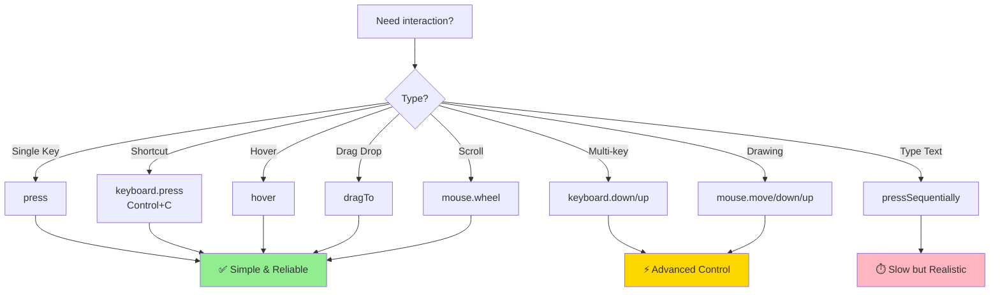

# ⌨️🖱️ Keyboard & Mouse Actions
## Phím Tắt & Thao Tác Chuột Nâng Cao

> Tài liệu này hướng dẫn cách sử dụng keyboard shortcuts, mouse hover, drag-drop, và các thao tác nâng cao khác.

---

## 📌 Tại Sao Cần Keyboard & Mouse Actions?

Nhiều scenarios yêu cầu:
- ⌨️ **Keyboard shortcuts** (Ctrl+C, Ctrl+V, Enter, Escape, etc.)
- 🖱️ **Mouse hover** (show tooltips, dropdown menus)
- 🎯 **Drag and drop** (sortable lists, file uploads)
- 🔄 **Complex interactions** (multi-select với Shift, context menu)

Playwright cung cấp **low-level APIs** để simulate chính xác hành động người dùng!

---

## ⌨️ Keyboard Actions

### 1. press() - Press Single Key

```typescript
// Press Enter
await page.locator('#search').press('Enter');

// Press Escape
await page.press('Escape');

// Press Tab (navigate to next field)
await page.press('Tab');

// Press Arrow keys
await page.press('ArrowDown');
await page.press('ArrowUp');
await page.press('ArrowLeft');
await page.press('ArrowRight');
```

### Supported Key Names:
```
Enter, Escape, Tab, Backspace, Delete
ArrowUp, ArrowDown, ArrowLeft, ArrowRight
Home, End, PageUp, PageDown
F1-F12
Insert, PrintScreen, ScrollLock, Pause
```

---

### 2. Keyboard Shortcuts (Modifiers)

```typescript
// Ctrl+A (Select all)
await page.keyboard.press('Control+A');

// Ctrl+C (Copy)
await page.keyboard.press('Control+C');

// Ctrl+V (Paste)
await page.keyboard.press('Control+V');

// Ctrl+Z (Undo)
await page.keyboard.press('Control+Z');

// Ctrl+Shift+Z (Redo)
await page.keyboard.press('Control+Shift+Z');

// Ctrl+F (Find)
await page.keyboard.press('Control+F');

// ⌘+C on Mac (Meta key)
await page.keyboard.press('Meta+C');
```

### Common Shortcuts:
| Shortcut | Action | Windows/Linux | Mac |
|----------|--------|---------------|-----|
| **Copy** | Sao chép | `Control+C` | `Meta+C` |
| **Paste** | Dán | `Control+V` | `Meta+V` |
| **Cut** | Cắt | `Control+X` | `Meta+X` |
| **Select All** | Chọn tất cả | `Control+A` | `Meta+A` |
| **Save** | Lưu | `Control+S` | `Meta+S` |
| **Undo** | Hoàn tác | `Control+Z` | `Meta+Z` |
| **Find** | Tìm kiếm | `Control+F` | `Meta+F` |

---

### 3. keyboard.down() & keyboard.up() - Hold Keys

```typescript
// Hold Shift and press Arrow Down multiple times (select multiple items)
await page.keyboard.down('Shift');
await page.keyboard.press('ArrowDown');
await page.keyboard.press('ArrowDown');
await page.keyboard.press('ArrowDown');
await page.keyboard.up('Shift');

// Ctrl+Click (multi-select)
await page.keyboard.down('Control');
await page.locator('.item').nth(0).click();
await page.locator('.item').nth(2).click();
await page.locator('.item').nth(4).click();
await page.keyboard.up('Control');
```

---

### 4. keyboard.type() - Type Text (Character-by-Character)

⚠️ **Deprecated** - Use `locator.pressSequentially()` instead!

```typescript
// Type with delay (simulate human typing)
await page.locator('#search').pressSequentially('Playwright', { delay: 100 });

// Type instantly (same as fill)
await page.locator('#search').fill('Playwright');
```

---

### 5. keyboard.insertText() - Insert Text (No Events)

```typescript
// Insert text directly (bypass keydown/keyup events)
await page.locator('#editor').focus();
await page.keyboard.insertText('This text is inserted directly');
```

**Difference**:
- `fill()` - Fast, clears value, triggers `input` event
- `pressSequentially()` - Slow, triggers `keydown`/`keyup` for each char
- `insertText()` - Fast, no events (rare use case)

---

## 🖱️ Mouse Actions

### 1. hover() - Mouse Hover

```typescript
// Hover over element (show tooltip, dropdown)
await page.locator('.menu-item').hover();

// Hover and verify tooltip
await page.locator('.info-icon').hover();
await expect(page.locator('.tooltip')).toBeVisible();

// Hover with position
await page.locator('.canvas').hover({ position: { x: 100, y: 200 } });
```

### Real-World Use Cases:
```typescript
// 1. Dropdown menu
test('should open dropdown on hover', async ({ page }) => {
  await page.goto('https://example.com');

  // Hover over menu
  await page.locator('.menu > .products').hover();

  // Verify submenu visible
  await expect(page.locator('.submenu')).toBeVisible();

  // Click submenu item
  await page.locator('.submenu > .laptops').click();
});

// 2. Tooltip
test('should show tooltip on hover', async ({ page }) => {
  await page.goto('https://practice.expandtesting.com/hovers');

  // Hover over first user
  await page.locator('.figure').first().hover();

  // Verify tooltip
  const tooltip = page.locator('.figcaption').first();
  await expect(tooltip).toBeVisible();
  await expect(tooltip).toContainText('user1');
});
```

---

### 2. mouse.move() - Move Mouse to Position

```typescript
// Move mouse to specific coordinates
await page.mouse.move(100, 200);

// Move to element center
const box = await page.locator('.target').boundingBox();
if (box) {
  await page.mouse.move(box.x + box.width / 2, box.y + box.height / 2);
}
```

---

### 3. mouse.down() & mouse.up() - Mouse Button Press

```typescript
// Press and hold left button
await page.mouse.down();

// Release left button
await page.mouse.up();

// Press right button (context menu)
await page.mouse.down({ button: 'right' });
await page.mouse.up({ button: 'right' });

// Middle button (scroll click)
await page.mouse.down({ button: 'middle' });
await page.mouse.up({ button: 'middle' });
```

---

### 4. mouse.click() - Low-Level Click

```typescript
// Click at specific coordinates
await page.mouse.click(100, 200);

// Double click
await page.mouse.dblclick(100, 200);

// Right click
await page.mouse.click(100, 200, { button: 'right' });

// Click with delay
await page.mouse.click(100, 200, { delay: 100 });
```

**When to use?**
- Custom drawing/painting apps
- Game testing
- Canvas interactions

---

### 5. mouse.wheel() - Scroll with Mouse Wheel

```typescript
// Scroll down 100 pixels
await page.mouse.wheel(0, 100);

// Scroll up
await page.mouse.wheel(0, -100);

// Horizontal scroll
await page.mouse.wheel(100, 0);
```

---

## 🎯 Drag and Drop

### Method 1: dragTo() - Recommended

```typescript
// Drag element A to element B
await page.locator('.draggable').dragTo(page.locator('.dropzone'));

// Drag with options
await page.locator('.item').dragTo(page.locator('.target'), {
  sourcePosition: { x: 10, y: 10 }, // Start position in source
  targetPosition: { x: 50, y: 50 }, // End position in target
  timeout: 10000
});
```

### Real-World Example:
```typescript
test('should drag and drop items', async ({ page }) => {
  await page.goto('https://practice.expandtesting.com/drag-and-drop');

  // Drag column A to column B
  await page.locator('#column-a').dragTo(page.locator('#column-b'));

  // Verify swap
  const columnBText = await page.locator('#column-b header').textContent();
  expect(columnBText).toBe('A');
});
```

---

### Method 2: Low-Level Drag (mouse.down + mouse.move + mouse.up)

```typescript
test('manual drag and drop', async ({ page }) => {
  await page.goto('https://example.com/drag-drop');

  // Get source element position
  const source = page.locator('.draggable');
  const sourceBox = await source.boundingBox();

  // Get target element position
  const target = page.locator('.dropzone');
  const targetBox = await target.boundingBox();

  if (sourceBox && targetBox) {
    // Move to source center
    await page.mouse.move(
      sourceBox.x + sourceBox.width / 2,
      sourceBox.y + sourceBox.height / 2
    );

    // Press mouse button
    await page.mouse.down();

    // Move to target center
    await page.mouse.move(
      targetBox.x + targetBox.width / 2,
      targetBox.y + targetBox.height / 2
    );

    // Release mouse button
    await page.mouse.up();
  }
});
```

---

### Method 3: HTML5 Drag-Drop API (dispatchEvent)

```typescript
test('HTML5 drag and drop', async ({ page }) => {
  await page.goto('URL');

  // Trigger dragstart event
  await page.locator('.draggable').dispatchEvent('dragstart');

  // Trigger drop event
  await page.locator('.dropzone').dispatchEvent('drop');
});
```

---

## 🔄 Complex Interactions - Kết Hợp Actions

### Example 1: Multi-Select with Shift

```typescript
test('multi-select with shift key', async ({ page }) => {
  await page.goto('https://example.com/list');

  // Click first item
  await page.locator('.item').first().click();

  // Hold Shift and click 5th item (select items 1-5)
  await page.keyboard.down('Shift');
  await page.locator('.item').nth(4).click();
  await page.keyboard.up('Shift');

  // Verify 5 items selected
  const selectedItems = page.locator('.item.selected');
  await expect(selectedItems).toHaveCount(5);
});
```

---

### Example 2: Multi-Select with Ctrl

```typescript
test('multi-select with ctrl key', async ({ page }) => {
  await page.goto('https://example.com/list');

  // Ctrl+Click multiple items
  await page.keyboard.down('Control');
  await page.locator('.item').nth(0).click();
  await page.locator('.item').nth(2).click();
  await page.locator('.item').nth(4).click();
  await page.keyboard.up('Control');

  // Verify 3 items selected
  const selectedItems = page.locator('.item.selected');
  await expect(selectedItems).toHaveCount(3);
});
```

---

### Example 3: Context Menu (Right Click)

```typescript
test('should open context menu on right click', async ({ page }) => {
  await page.goto('https://example.com');

  // Right click element
  await page.locator('.file').click({ button: 'right' });

  // Verify context menu visible
  await expect(page.locator('.context-menu')).toBeVisible();

  // Click menu option
  await page.locator('.context-menu .delete').click();

  // Confirm delete
  await page.locator('button:has-text("Confirm")').click();
});
```

---

### Example 4: Drawing on Canvas

```typescript
test('should draw on canvas', async ({ page }) => {
  await page.goto('https://example.com/canvas');

  const canvas = page.locator('canvas');
  const box = await canvas.boundingBox();

  if (box) {
    // Start drawing
    await page.mouse.move(box.x + 50, box.y + 50);
    await page.mouse.down();

    // Draw line
    await page.mouse.move(box.x + 150, box.y + 50);
    await page.mouse.move(box.x + 150, box.y + 150);
    await page.mouse.move(box.x + 50, box.y + 150);
    await page.mouse.move(box.x + 50, box.y + 50);

    // End drawing
    await page.mouse.up();
  }
});
```

---

## 📋 Keyboard & Mouse Cheatsheet

### Keyboard Methods:
```typescript
// Single key press
await page.press('Enter');
await page.keyboard.press('Control+C');

// Character-by-character typing
await page.locator('#input').pressSequentially('text', { delay: 100 });

// Hold and release
await page.keyboard.down('Shift');
await page.keyboard.up('Shift');

// Insert text (no events)
await page.keyboard.insertText('text');
```

### Mouse Methods:
```typescript
// Hover
await page.locator('.element').hover();

// Move
await page.mouse.move(x, y);

// Click
await page.mouse.click(x, y);
await page.mouse.dblclick(x, y);

// Press and release
await page.mouse.down();
await page.mouse.up();

// Scroll
await page.mouse.wheel(deltaX, deltaY);

// Drag and drop
await source.dragTo(target);
```

---

## 🎯 Decision Tree - Chọn Method Nào?



---

## 🎯 Best Practices

### ✅ DO - Nên làm:

```typescript
// 1️⃣ Use high-level methods when possible
await page.locator('#search').press('Enter'); // ✅ Simple

// 2️⃣ Use hover for dropdowns/tooltips
await page.locator('.menu').hover();
await page.locator('.submenu-item').click();

// 3️⃣ Use dragTo for drag-drop
await page.locator('.item').dragTo(page.locator('.target'));

// 4️⃣ Release modifiers after use
await page.keyboard.down('Shift');
// ... actions ...
await page.keyboard.up('Shift'); // ✅ Don't forget!

// 5️⃣ Wait for expected results
await page.locator('.menu').hover();
await expect(page.locator('.submenu')).toBeVisible(); // ✅ Verify
```

---

### ❌ DON'T - Tránh:

```typescript
// ❌ Use low-level mouse when high-level works
await page.mouse.move(100, 200);
await page.mouse.click(100, 200);
// ✅ Use instead:
await page.locator('.button').click();

// ❌ Forget to release modifiers
await page.keyboard.down('Control');
// ... forgot keyboard.up('Control')!

// ❌ Use insertText for normal input
await page.keyboard.insertText('text'); // No events!
// ✅ Use instead:
await page.locator('#input').fill('text');

// ❌ Complex coordinate calculations
const box = await element.boundingBox();
await page.mouse.move(box.x + 10, box.y + 20);
// ✅ Use instead:
await element.click({ position: { x: 10, y: 20 } });
```

---

## 🧪 Real-World Scenarios

### Scenario 1: Autocomplete Search

```typescript
test('should select autocomplete suggestion', async ({ page }) => {
  await page.goto('https://example.com');

  // Type slowly to trigger autocomplete
  await page.locator('#search').pressSequentially('Playwright', { delay: 100 });

  // Wait for suggestions
  await page.waitForSelector('.autocomplete-suggestions');

  // Press ArrowDown to select first suggestion
  await page.press('ArrowDown');

  // Press Enter to confirm
  await page.press('Enter');

  // Verify search performed
  await expect(page).toHaveURL(/search/);
});
```

---

### Scenario 2: Sortable List (Drag-Drop)

```typescript
test('should reorder items by drag-drop', async ({ page }) => {
  await page.goto('https://example.com/sortable-list');

  // Get initial order
  const initialOrder = await page.locator('.item').allTextContents();
  console.log('Before:', initialOrder);

  // Drag item 1 to position 3
  await page.locator('.item').nth(0).dragTo(page.locator('.item').nth(2));

  // Get new order
  const newOrder = await page.locator('.item').allTextContents();
  console.log('After:', newOrder);

  // Verify order changed
  expect(newOrder).not.toEqual(initialOrder);
});
```

---

### Scenario 3: Keyboard Navigation

```typescript
test('should navigate form with Tab key', async ({ page }) => {
  await page.goto('https://practice.expandtesting.com/form-validation');

  // Focus first field
  await page.locator('#firstName').focus();

  // Tab through fields
  await page.press('Tab'); // → lastName
  await page.press('Tab'); // → email
  await page.press('Tab'); // → phone

  // Verify focus on phone field
  await expect(page.locator('#phone')).toBeFocused();

  // Shift+Tab to go back
  await page.keyboard.press('Shift+Tab');

  // Verify focus on email
  await expect(page.locator('#email')).toBeFocused();
});
```

---

## 🎓 Bài Tập Tự Kiểm Tra

### Câu 1: Keyboard Shortcut
**Hỏi**: Làm sao simulate Ctrl+A (Select All)?

A. `page.press('Control+A')`
B. `page.keyboard.press('Control+A')`
C. `page.keyboard.down('Control'); page.press('A'); page.keyboard.up('Control')`
D. Both A and B

**Đáp án**: **D** - Both `page.press()` and `page.keyboard.press()` work for shortcuts.

---

### Câu 2: Hover vs Click
**Hỏi**: Khi nào dùng `hover()` thay vì `click()`?

A. Luôn luôn (hover tốt hơn click)
B. Khi cần show tooltip/dropdown mà không click
C. Khi click không hoạt động
D. Không bao giờ

**Đáp án**: **B** - Use `hover()` for tooltips, dropdown menus that appear on hover (not click).

---

### Câu 3: Drag and Drop
```typescript
await page.locator('.item').dragTo(page.locator('.target'));
```

**Hỏi**: Method này tương đương với gì?

**Đáp án**:
```typescript
// Low-level equivalent
await page.locator('.item').hover();
await page.mouse.down();
await page.locator('.target').hover();
await page.mouse.up();
```

---

## 📚 Thuật Ngữ Quan Trọng | Key Terms

| Tiếng Anh | Tiếng Việt | Giải thích |
|-----------|------------|------------|
| **Keyboard** | Bàn phím | Keyboard input simulation |
| **Mouse** | Chuột | Mouse actions (hover, click, drag) |
| **Hover** | Rê chuột | Di chuyển chuột lên element |
| **Drag-Drop** | Kéo thả | Kéo element và thả vào vị trí khác |
| **Modifier** | Phím bổ trợ | Ctrl, Shift, Alt, Meta |
| **Shortcut** | Phím tắt | Tổ hợp phím (Ctrl+C, Ctrl+V) |
| **Press** | Nhấn phím | Press và release phím |
| **Down/Up** | Nhấn/Nhả | Hold và release phím |

---

## 🔗 Tài Liệu Tham Khảo | References

- [Playwright Keyboard API](https://playwright.dev/docs/api/class-keyboard)
- [Playwright Mouse API](https://playwright.dev/docs/api/class-mouse)
- [Drag and Drop Guide](https://playwright.dev/docs/input#dragging-manually)
- [LambdaTest Playwright Actions](https://www.lambdatest.com/learning-hub/playwright-actions)

---

## ➡️ Tiếp Theo | Next Steps

Sau khi nắm vững Keyboard & Mouse, tiếp tục với:

👉 **[04-file-operations-vi.md](04-file-operations-vi.md)** - Upload files, download files, file input handling

---

**Chúc mừng bạn đã hoàn thành Keyboard & Mouse Actions! 🎉**

> **Ghi nhớ**: Prefer high-level methods (`hover()`, `dragTo()`) over low-level mouse coordinates!
