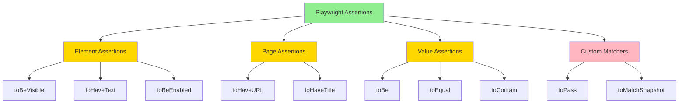
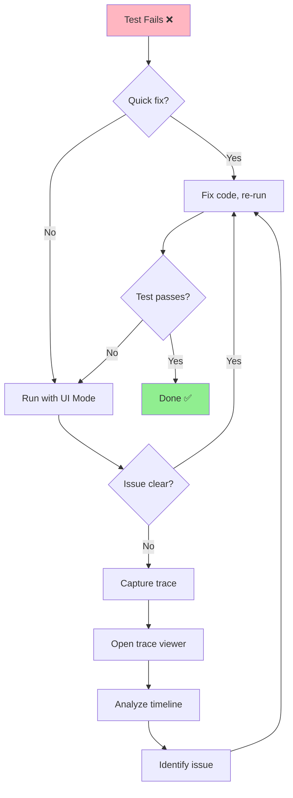

# 🧪 Module 1 - Week 3: Assertions & Debugging
## Tuần 3: Xác Nhận & Gỡ Lỗi

> **Thời lượng**: 8-10 giờ học
> **Prerequisite**: Hoàn thành Week 1-2
> **Difficulty**: ⭐⭐ Medium to Advanced

---

## 🎯 Mục Tiêu Học (Learning Objectives)

Sau khi hoàn thành Week 3, bạn sẽ:

1. ✅ **Master Assertions** - Sử dụng thành thạo expect() và tất cả assertion methods
2. ✅ **Debug Effectively** - Debug tests với UI Mode, Inspector, trace viewer
3. ✅ **Understand Reports** - Đọc và phân tích HTML reports, traces
4. ✅ **Handle Waits** - Auto-wait, explicit waits, custom wait conditions
5. ✅ **Error Handling** - Xử lý errors, retries, timeouts
6. ✅ **Test Organization** - Hooks, fixtures, test isolation
7. ✅ **CI/CD Ready** - Viết tests chạy ổn định trên CI/CD

---

## 📚 Nội Dung Chi Tiết (Content Overview)

### Day 1-2: Assertions Fundamentals (3-4 hours)
**Theory**: `docs/01-assertions-fundamentals-vi.md`

- 🎯 expect() API overview
- ✅ Element assertions (toBeVisible, toHaveText, toHaveValue, etc.)
- 📄 Page assertions (toHaveURL, toHaveTitle)
- 🔢 Value assertions (toBe, toEqual, toContain)
- ⏱️ Async assertions và auto-wait
- 🚫 Negation (not.toBeVisible)

**Examples**:
- `examples/01-basic-assertions.spec.ts` - Element visibility, text, attributes
- `examples/02-advanced-assertions.spec.ts` - Value comparisons, custom matchers

**Exercises**:
- `exercises/exercise-01-assertions.spec.ts` - Practice all assertion types

---

### Day 3-4: Debugging Tools (3-4 hours)
**Theory**: `docs/02-debugging-tools-vi.md`

- 🔍 UI Mode (interactive debugging)
- 🕵️ Playwright Inspector (step-by-step)
- 📹 Trace Viewer (time-travel debugging)
- 🖼️ Screenshots và videos
- 🪵 Console logs và debug logs
- 🐛 VS Code debugging

**Examples**:
- `examples/03-debug-modes.spec.ts` - UI Mode, headed mode
- `examples/04-traces-screenshots.spec.ts` - Capture traces, screenshots

**Exercises**:
- `exercises/exercise-02-debugging.spec.ts` - Debug failing tests

---

### Day 5-6: Waits & Timeouts (2-3 hours)
**Theory**: `docs/03-waits-timeouts-vi.md`

- ⏳ Auto-wait mechanism
- 🕐 waitForSelector, waitForLoadState
- 🎯 waitForFunction, waitForEvent
- ⚙️ Custom wait conditions
- ⏱️ Timeout configuration
- 🔄 Retry logic

**Examples**:
- `examples/05-auto-waits.spec.ts` - Trust auto-wait
- `examples/06-explicit-waits.spec.ts` - Custom waits, conditions

**Exercises**:
- `exercises/exercise-03-waits.spec.ts` - Handle dynamic content

---

### Day 7: Test Reports & CI/CD (2-3 hours)
**Theory**: `docs/04-reports-ci-cd-vi.md`

- 📊 HTML Reporter
- 📋 JUnit/JSON reporters
- 🎭 Test artifacts (screenshots, videos, traces)
- 🔧 CI/CD configuration
- 📈 Test metrics và analytics
- 🚀 Parallelization

**Examples**:
- `examples/07-test-hooks.spec.ts` - beforeEach, afterEach, fixtures
- `examples/08-test-organization.spec.ts` - Test structure, isolation

---

## 🗂️ File Structure

```
week-3-assertions-debugging/
├── README.md (this file)
├── docs/
│   ├── 01-assertions-fundamentals-vi.md (~450 lines)
│   ├── 02-debugging-tools-vi.md (~400 lines)
│   ├── 03-waits-timeouts-vi.md (~380 lines)
│   └── 04-reports-ci-cd-vi.md (~350 lines)
├── examples/
│   ├── 01-basic-assertions.spec.ts
│   ├── 02-advanced-assertions.spec.ts
│   ├── 03-debug-modes.spec.ts
│   ├── 04-traces-screenshots.spec.ts
│   ├── 05-auto-waits.spec.ts
│   ├── 06-explicit-waits.spec.ts
│   ├── 07-test-hooks.spec.ts
│   └── 08-test-organization.spec.ts
├── exercises/
│   ├── exercise-01-assertions.spec.ts
│   ├── exercise-02-debugging.spec.ts
│   └── exercise-03-waits.spec.ts
└── solutions/
    ├── exercise-01-assertions.spec.ts
    ├── exercise-02-debugging.spec.ts
    └── exercise-03-waits.spec.ts
```

---

## 🚀 Getting Started

### 1️⃣ Đọc Theory
Bắt đầu với từng doc file theo thứ tự (01 → 02 → 03 → 04)

### 2️⃣ Chạy Examples
```bash
# Chạy tất cả examples Week 3
yarn test module-1-basics/week-3-assertions-debugging/examples/

# Chạy từng example
yarn test examples/01-basic-assertions.spec.ts

# Run with UI Mode (interactive)
yarn test:ui examples/01-basic-assertions.spec.ts

# Run with trace
yarn test examples/01-basic-assertions.spec.ts --trace on
```

### 3️⃣ Làm Exercises
```bash
# Chạy exercises (sẽ fail vì còn TODO)
yarn test exercises/exercise-01-assertions.spec.ts

# So sánh với solution
yarn test solutions/exercise-01-assertions.spec.ts
```

### 4️⃣ View Reports
```bash
# Open HTML report
yarn report

# View trace
npx playwright show-trace trace.zip
```

---

## 📊 Time Allocation

| Day | Topic | Hours | Activities |
|-----|-------|-------|-----------|
| **Day 1** | Assertions Theory | 1.5h | Read docs, understand expect() API |
| **Day 2** | Assertions Practice | 2h | Run examples, complete exercise-01 |
| **Day 3** | Debugging Tools | 1.5h | Learn UI Mode, Inspector, Trace Viewer |
| **Day 4** | Debug Practice | 2.5h | Debug failing tests, capture traces |
| **Day 5** | Waits Theory | 1h | Understand auto-wait, explicit waits |
| **Day 6** | Waits Practice | 2h | Handle dynamic content, timeouts |
| **Day 7** | Reports & CI/CD | 2.5h | Test organization, hooks, CI setup |

**Total**: 8-10 hours (flexible theo tốc độ cá nhân)

---

## 🎯 Success Criteria

Sau Week 3, bạn phải:

- [ ] Sử dụng được 20+ assertion methods
- [ ] Debug tests bằng UI Mode và Trace Viewer
- [ ] Hiểu auto-wait mechanism (không dùng hardcoded waits)
- [ ] Viết tests với proper error handling
- [ ] Organize tests với hooks và fixtures
- [ ] Generate và đọc HTML reports
- [ ] Hoàn thành 100% exercises (3/3)

---

## 🔗 Test Sites Used

Week 3 sử dụng các practice sites sau:

1. **[Expand Testing](https://practice.expandtesting.com)**
   - Dynamic content: `/dynamic-loading`, `/infinite-scroll`
   - Async: `/slow`, `/notification-message`

2. **[The Internet (Herokuapp)](https://the-internet.herokuapp.com)**
   - Dynamic loading: `/dynamic_loading/1`, `/dynamic_loading/2`
   - Slow resources: `/slow_external_script`

3. **[UI Testing Playground](http://uitestingplayground.com)**
   - AJAX: `/ajax`, `/progressbar`
   - Dynamic ID: `/dynamicid`

---

## 💡 Key Concepts

### Assertion Categories



### Debugging Workflow



---

## 🎓 Common Patterns

### Pattern 1: Assertion Best Practices
```typescript
// ❌ Bad: No assertion
await page.locator('#button').click();

// ✅ Good: Verify action result
await page.locator('#button').click();
await expect(page.locator('.success')).toBeVisible();

// ❌ Bad: Hardcoded wait
await page.waitForTimeout(2000);
await expect(element).toBeVisible();

// ✅ Good: Trust auto-wait
await expect(element).toBeVisible(); // Auto-waits up to timeout
```

### Pattern 2: Debug Workflow
```typescript
// 1. Test fails in normal mode
yarn test my-test.spec.ts // ❌ Fails

// 2. Run with UI Mode (see what's happening)
yarn test:ui my-test.spec.ts

// 3. If still unclear, capture trace
yarn test my-test.spec.ts --trace on

// 4. Open trace viewer (time-travel debugging)
npx playwright show-trace trace.zip
```

### Pattern 3: Test Organization
```typescript
test.describe('Feature: User Login', () => {
  test.beforeEach(async ({ page }) => {
    // Setup: Navigate to page
    await page.goto('/login');
  });

  test('should login with valid credentials', async ({ page }) => {
    // Test logic
  });

  test.afterEach(async ({ page }) => {
    // Cleanup if needed
  });
});
```

---

## 🔍 Debug Commands Cheatsheet

```bash
# Interactive UI Mode
yarn test:ui my-test.spec.ts

# Headed mode (see browser)
yarn test my-test.spec.ts --headed

# Debug mode (pause execution)
yarn test my-test.spec.ts --debug

# With trace (capture everything)
yarn test my-test.spec.ts --trace on

# Open trace viewer
npx playwright show-trace trace.zip

# Show HTML report
yarn report

# Codegen (record actions)
yarn playwright codegen https://example.com
```

---

## 📖 Related Documentation

- **Previous**: [Week 2 - Interactions](../week-2-interactions/README.md)
- **Next**: [Week 4 - Projects](../week-4-projects/README.md)
- **Troubleshooting**: [docs/troubleshooting-vi.md](../../docs/troubleshooting-vi.md)
- **Resources**: [docs/resources.md](../../docs/resources.md)

---

## ❓ FAQ

### Q1: Khi nào dùng toHaveText vs toContainText?
**A**:
- `toHaveText()` - Exact match (toàn bộ text)
- `toContainText()` - Partial match (chứa text)

### Q2: Làm sao debug test chạy trên CI/CD?
**A**: Enable trace on CI, download artifacts, open with `npx playwright show-trace`

### Q3: Tại sao test pass locally nhưng fail trên CI?
**A**: Timing issues, different environment. Use explicit waits, check trace.

### Q4: Auto-wait có đủ không? Khi nào cần explicit wait?
**A**: Auto-wait đủ 95% cases. Explicit wait cho: custom conditions, complex async logic.

### Q5: Làm sao speed up tests?
**A**: Parallelize, reduce waits, use fixtures, avoid unnecessary navigations.

---

## 🎯 Self-Check Questions

Trả lời các câu sau để kiểm tra hiểu biết:

1. ❓ Sự khác biệt giữa `toBe()` và `toEqual()`?
2. ❓ Auto-wait hoạt động thế nào trong assertions?
3. ❓ Khi nào dùng UI Mode vs Trace Viewer?
4. ❓ Làm sao verify element NOT visible?
5. ❓ Test hooks (beforeEach, afterEach) thực thi thứ tự nào?

**Đáp án trong docs và solutions!**

---

## ✅ Completion Checklist

Track your progress:

- [ ] **Day 1-2**: Đọc docs 01, chạy examples 01-02, hoàn thành exercise-01
- [ ] **Day 3-4**: Đọc docs 02, chạy examples 03-04, practice debugging
- [ ] **Day 5-6**: Đọc docs 03, chạy examples 05-06, hoàn thành exercise-03
- [ ] **Day 7**: Đọc docs 04, chạy examples 07-08, understand CI/CD
- [ ] **All tests pass** on all 3 browsers
- [ ] **Can debug** any failing test with UI Mode/Trace
- [ ] **Ready for Week 4**: Real-world projects

---

## 🌟 Week 3 Key Highlights

- 📝 **20+ Assertion Methods** - Comprehensive coverage
- 🔍 **3 Debug Tools** - UI Mode, Inspector, Trace Viewer
- ⏳ **Auto-Wait Mastery** - No more hardcoded waits
- 📊 **Professional Reports** - HTML, JUnit, custom
- 🏗️ **Test Organization** - Hooks, fixtures, isolation
- 🚀 **CI/CD Ready** - Reliable, parallelized tests

---

**🎉 Chúc bạn học tốt Week 3! Happy Testing & Debugging! 🐛🔍**
