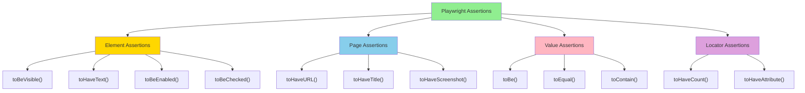
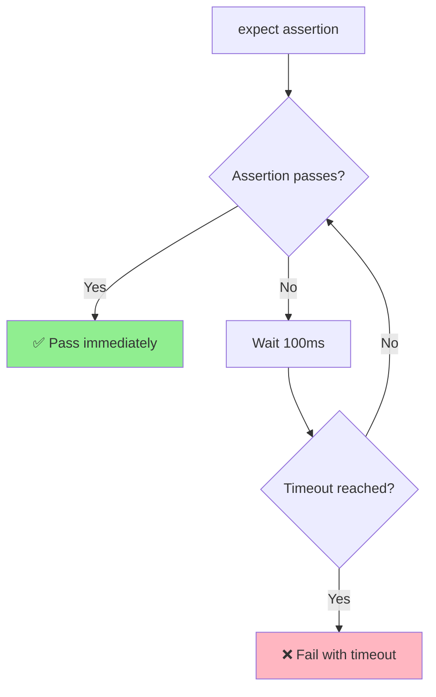

# 🧪 Assertions Fundamentals
## Xác Nhận Cơ Bản - Nền Tảng Testing

> Tài liệu này hướng dẫn chi tiết về Assertions - cách verify kết quả tests trong Playwright.

---

## 📌 Assertion Là Gì? | What is an Assertion?

**Assertion** là câu lệnh **kiểm tra và xác nhận** một điều kiện phải đúng.

### Định nghĩa:
> "An assertion verifies that the actual result matches the expected result"
>
> "Assertion xác minh kết quả thực tế khớp với kết quả mong đợi"

### Analogy (Tương tự):
Think assertion như **quality control** (kiểm tra chất lượng):
```
Product: Website button must be visible
       ↓
Assertion: expect(button).toBeVisible()
       ↓
Result: ✅ Pass or ❌ Fail
```

**Không có assertions = Không biết test pass hay fail!**

---

## 🎯 Playwright Expect API

Playwright sử dụng `expect()` API với **auto-wait** và **retry logic**.

### Basic Syntax:
```typescript
await expect(locator).assertion();
await expect(page).assertion();
await expect(value).assertion();
```

### Key Features:
1. ✅ **Auto-wait** - Tự động chờ cho đến khi assertion pass (hoặc timeout)
2. ✅ **Auto-retry** - Retry assertion cho đến khi thành công
3. ✅ **Readable** - Syntax rõ ràng, dễ đọc
4. ✅ **Async** - Hỗ trợ async/await

---

## 📊 Assertion Categories



---

## 1️⃣ Element Assertions (Locator Assertions)

### toBeVisible() - Element Visible

```typescript
// Verify element is visible
await expect(page.locator('#button')).toBeVisible();

// With timeout
await expect(page.locator('#loading')).toBeVisible({ timeout: 5000 });

// Negation (not visible)
await expect(page.locator('#hidden')).not.toBeVisible();
```

**Auto-wait**: Waits until element is visible or timeout.

---

### toBeHidden() - Element Hidden

```typescript
// Verify element is hidden
await expect(page.locator('#modal')).toBeHidden();

// Or use not.toBeVisible()
await expect(page.locator('#modal')).not.toBeVisible();
```

---

### toHaveText() - Exact Text Match

```typescript
// Exact text match
await expect(page.locator('h1')).toHaveText('Welcome');

// Array of texts (for multiple elements)
await expect(page.locator('li')).toHaveText(['Item 1', 'Item 2', 'Item 3']);

// With regex
await expect(page.locator('h1')).toHaveText(/welcome/i);

// Ignore case
await expect(page.locator('h1')).toHaveText('WELCOME', { ignoreCase: true });
```

**Auto-wait**: Waits until text matches exactly.

---

### toContainText() - Partial Text Match

```typescript
// Contains text (partial match)
await expect(page.locator('.message')).toContainText('Success');

// Multiple texts
await expect(page.locator('p')).toContainText(['Hello', 'World']);

// With regex
await expect(page.locator('.error')).toContainText(/error|warning/i);
```

**When to use**:
- `toHaveText()` - Full text match (exact)
- `toContainText()` - Partial text match (contains)

---

### toHaveValue() - Input Value

```typescript
// Verify input value
await expect(page.locator('#username')).toHaveValue('testuser');

// Empty value
await expect(page.locator('#password')).toHaveValue('');

// With regex
await expect(page.locator('#email')).toHaveValue(/@example\.com$/);
```

**Use case**: Form inputs, textareas.

---

### toBeEnabled() / toBeDisabled()

```typescript
// Verify button enabled
await expect(page.locator('#submit')).toBeEnabled();

// Verify button disabled
await expect(page.locator('#submit')).toBeDisabled();

// Or negation
await expect(page.locator('#submit')).not.toBeEnabled();
```

---

### toBeChecked() - Checkbox/Radio

```typescript
// Verify checkbox checked
await expect(page.locator('#terms')).toBeChecked();

// Verify unchecked
await expect(page.locator('#newsletter')).not.toBeChecked();
```

---

### toBeEditable() - Input Editable

```typescript
// Verify input is editable (not readonly)
await expect(page.locator('#username')).toBeEditable();

// Verify readonly
await expect(page.locator('#readonly-field')).not.toBeEditable();
```

---

### toHaveAttribute() - Element Attributes

```typescript
// Verify attribute exists and value
await expect(page.locator('a')).toHaveAttribute('href', 'https://example.com');

// Verify attribute exists (any value)
await expect(page.locator('button')).toHaveAttribute('disabled');

// With regex
await expect(page.locator('img')).toHaveAttribute('src', /\.png$/);
```

---

### toHaveClass() - CSS Classes

```typescript
// Verify element has class
await expect(page.locator('#button')).toHaveClass('btn-primary');

// Contains class (partial match)
await expect(page.locator('#button')).toHaveClass(/btn/);

// Multiple classes (array)
await expect(page.locator('#button')).toHaveClass(['btn', 'btn-primary']);
```

---

### toHaveCSS() - CSS Properties

```typescript
// Verify CSS property
await expect(page.locator('#text')).toHaveCSS('color', 'rgb(255, 0, 0)');

// Font size
await expect(page.locator('h1')).toHaveCSS('font-size', '24px');

// Display property
await expect(page.locator('#hidden')).toHaveCSS('display', 'none');
```

---

### toHaveCount() - Element Count

```typescript
// Verify number of elements
await expect(page.locator('li')).toHaveCount(5);

// No elements
await expect(page.locator('.error')).toHaveCount(0);

// At least 1 element
const count = await page.locator('li').count();
expect(count).toBeGreaterThan(0);
```

---

### toBeFocused() - Element Focus

```typescript
// Verify element has focus
await expect(page.locator('#username')).toBeFocused();

// Focus and verify
await page.locator('#username').focus();
await expect(page.locator('#username')).toBeFocused();
```

---

## 2️⃣ Page Assertions

### toHaveURL() - Page URL

```typescript
// Exact URL
await expect(page).toHaveURL('https://example.com/login');

// Regex pattern
await expect(page).toHaveURL(/.*login$/);

// Contains
await expect(page).toHaveURL(/example\.com/);

// With timeout
await expect(page).toHaveURL(/dashboard/, { timeout: 10000 });
```

**Auto-wait**: Waits for navigation to complete.

---

### toHaveTitle() - Page Title

```typescript
// Exact title
await expect(page).toHaveTitle('Login Page');

// Regex
await expect(page).toHaveTitle(/Login/);

// Contains
await expect(page).toHaveTitle(/Example/);
```

---

### toHaveScreenshot() - Visual Regression

```typescript
// Compare screenshot
await expect(page).toHaveScreenshot('homepage.png');

// With options
await expect(page).toHaveScreenshot('homepage.png', {
  maxDiffPixels: 100,
  threshold: 0.2
});

// Element screenshot
await expect(page.locator('#header')).toHaveScreenshot('header.png');
```

**Use case**: Visual regression testing.

---

## 3️⃣ Value Assertions (Generic Matchers)

### toBe() - Strict Equality

```typescript
// Strict equality (===)
const count = await page.locator('li').count();
expect(count).toBe(5);

// Boolean
const isVisible = await page.locator('#button').isVisible();
expect(isVisible).toBe(true);

// String
const text = await page.locator('h1').textContent();
expect(text).toBe('Welcome');
```

**Note**: Uses `===` (strict equality).

---

### toEqual() - Deep Equality

```typescript
// Deep equality (objects, arrays)
const data = { name: 'John', age: 30 };
expect(data).toEqual({ name: 'John', age: 30 });

// Array
const items = ['A', 'B', 'C'];
expect(items).toEqual(['A', 'B', 'C']);
```

**Difference**:
- `toBe()` - Strict equality (`===`)
- `toEqual()` - Deep equality (recursive)

---

### toContain() - Array/String Contains

```typescript
// Array contains
const items = ['apple', 'banana', 'orange'];
expect(items).toContain('banana');

// String contains
const text = 'Hello World';
expect(text).toContain('World');
```

---

### toMatch() - Regex Match

```typescript
// String matches regex
const email = 'test@example.com';
expect(email).toMatch(/^[\w-\.]+@([\w-]+\.)+[\w-]{2,4}$/);

// URL pattern
const url = 'https://example.com/page';
expect(url).toMatch(/^https:\/\//);
```

---

### Comparison Assertions

```typescript
// Greater than
const score = 85;
expect(score).toBeGreaterThan(80);

// Greater than or equal
expect(score).toBeGreaterThanOrEqual(85);

// Less than
expect(score).toBeLessThan(100);

// Less than or equal
expect(score).toBeLessThanOrEqual(85);
```

---

### Type Assertions

```typescript
// Truthy
expect('hello').toBeTruthy();
expect(1).toBeTruthy();

// Falsy
expect('').toBeFalsy();
expect(0).toBeFalsy();
expect(null).toBeFalsy();

// Defined
expect(value).toBeDefined();

// Undefined
expect(undefinedVar).toBeUndefined();

// Null
expect(nullVar).toBeNull();
```

---

## 🚫 Negation - not.assertion()

All assertions can be negated with `.not`:

```typescript
// Not visible
await expect(page.locator('#hidden')).not.toBeVisible();

// Not have text
await expect(page.locator('h1')).not.toHaveText('Wrong Title');

// Not checked
await expect(page.locator('#checkbox')).not.toBeChecked();

// Not equal
expect(count).not.toBe(0);

// Not contain
expect(items).not.toContain('xyz');
```

---

## ⏱️ Auto-Wait Mechanism

Playwright assertions **auto-wait** and **auto-retry**:



### Example:
```typescript
// Element not visible yet → waits → becomes visible → pass
await expect(page.locator('#async-content')).toBeVisible();

// Without auto-wait, you would need:
await page.waitForSelector('#async-content');
expect(await page.locator('#async-content').isVisible()).toBe(true);
```

**Auto-wait timeout**: Default 5000ms (configurable).

---

## ⚙️ Assertion Options

### Timeout
```typescript
// Custom timeout (10 seconds)
await expect(page.locator('#slow-element')).toBeVisible({ timeout: 10000 });

// Short timeout (1 second)
await expect(page.locator('#fast')).toBeVisible({ timeout: 1000 });
```

### Other Options
```typescript
// Ignore case (text assertions)
await expect(page.locator('h1')).toHaveText('WELCOME', { ignoreCase: true });

// Screenshot options
await expect(page).toHaveScreenshot('page.png', {
  maxDiffPixels: 100,
  threshold: 0.2,
  animations: 'disabled'
});
```

---

## 🎯 Best Practices

### ✅ DO - Nên làm:

```typescript
// 1️⃣ Use specific assertions
await expect(page.locator('#button')).toBeVisible(); // ✅ Specific
// vs
expect(await page.locator('#button').isVisible()).toBe(true); // ❌ Generic

// 2️⃣ Trust auto-wait
await expect(page.locator('#async')).toBeVisible(); // ✅ Auto-waits

// 3️⃣ Use negation
await expect(page.locator('#error')).not.toBeVisible(); // ✅ Clear

// 4️⃣ Verify results after actions
await page.click('#submit');
await expect(page.locator('.success')).toBeVisible(); // ✅ Verify

// 5️⃣ Use toContainText for partial match
await expect(page.locator('.msg')).toContainText('Success'); // ✅ Flexible
```

---

### ❌ DON'T - Tránh:

```typescript
// ❌ Manual waits before assertions
await page.waitForTimeout(2000);
await expect(element).toBeVisible();
// ✅ Use instead:
await expect(element).toBeVisible(); // Auto-waits

// ❌ Generic assertions
expect(await element.isVisible()).toBe(true);
// ✅ Use specific:
await expect(element).toBeVisible();

// ❌ No assertions (silent failures)
await page.click('#button');
// ✅ Verify action result:
await page.click('#button');
await expect(page).toHaveURL(/success/);

// ❌ Hardcoded full text
await expect(element).toHaveText('Welcome, John! You have 5 new messages.');
// ✅ Use partial or regex:
await expect(element).toContainText('Welcome');
```

---

## 📊 Assertion Cheatsheet

| Assertion | Use Case | Auto-Wait |
|-----------|----------|-----------|
| **toBeVisible()** | Element visible | ✅ Yes |
| **toHaveText()** | Exact text | ✅ Yes |
| **toContainText()** | Partial text | ✅ Yes |
| **toHaveValue()** | Input value | ✅ Yes |
| **toBeEnabled()** | Element enabled | ✅ Yes |
| **toBeChecked()** | Checkbox checked | ✅ Yes |
| **toHaveURL()** | Page URL | ✅ Yes |
| **toHaveTitle()** | Page title | ✅ Yes |
| **toHaveCount()** | Element count | ✅ Yes |
| **toBe()** | Strict equality | ❌ No |
| **toEqual()** | Deep equality | ❌ No |
| **toContain()** | Array/string contains | ❌ No |

---

## 🧪 Complete Examples

### Example 1: Login Flow
```typescript
test('should login successfully', async ({ page }) => {
  await page.goto('/login');

  // Verify page loaded
  await expect(page).toHaveTitle(/Login/);
  await expect(page.locator('h1')).toHaveText('Login');

  // Fill form
  await page.fill('#username', 'testuser');
  await page.fill('#password', 'password123');

  // Verify values
  await expect(page.locator('#username')).toHaveValue('testuser');

  // Submit
  await page.click('#submit');

  // Verify navigation
  await expect(page).toHaveURL(/dashboard/);

  // Verify success message
  await expect(page.locator('.alert-success')).toBeVisible();
  await expect(page.locator('.alert-success')).toContainText('Welcome');
});
```

### Example 2: Form Validation
```typescript
test('should show validation errors', async ({ page }) => {
  await page.goto('/form');

  // Submit without filling
  await page.click('#submit');

  // Verify errors visible
  await expect(page.locator('.error-username')).toBeVisible();
  await expect(page.locator('.error-email')).toBeVisible();

  // Verify error messages
  await expect(page.locator('.error-username')).toContainText('required');
  await expect(page.locator('.error-email')).toContainText('required');

  // Fill invalid email
  await page.fill('#email', 'invalid-email');
  await page.locator('#email').blur();

  // Verify format error
  await expect(page.locator('.error-email')).toContainText('invalid format');
});
```

---

## 📚 Thuật Ngữ Quan Trọng | Key Terms

| Tiếng Anh | Tiếng Việt | Giải thích |
|-----------|------------|------------|
| **Assertion** | Xác nhận | Verify expected result |
| **Auto-wait** | Tự động chờ | Wait until condition true |
| **Auto-retry** | Tự động thử lại | Retry assertion until pass |
| **Timeout** | Hết giờ | Maximum wait time |
| **Negation** | Phủ định | not.assertion() |
| **Matcher** | Bộ so khớp | Comparison function |

---

## 🔗 Tài Liệu Tham Khảo | References

- [Playwright Assertions](https://playwright.dev/docs/test-assertions)
- [Expect API](https://playwright.dev/docs/api/class-expect)
- [Auto-waiting](https://playwright.dev/docs/actionability)

---

## ➡️ Tiếp Theo | Next Steps

Sau khi nắm vững Assertions, tiếp tục với:

👉 **[02-debugging-tools-vi.md](02-debugging-tools-vi.md)** - Debug tests với UI Mode, Trace Viewer

---

**Chúc mừng bạn đã hoàn thành Assertions Fundamentals! 🎉**

> **Ghi nhớ**: Always assert results after actions - no assertions = silent failures!
