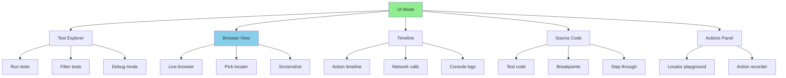
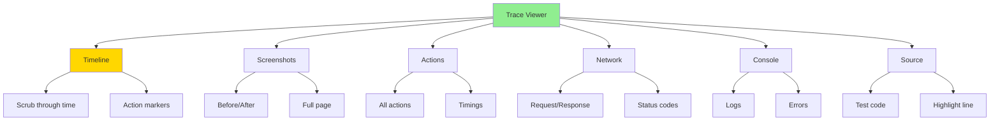
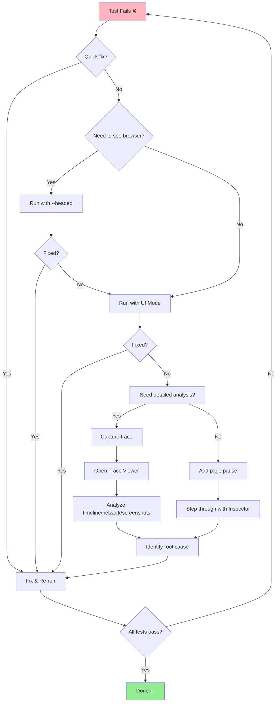

# 🔍 Debugging Tools
## Công Cụ Gỡ Lỗi - Debug Tests Hiệu Quả

> Tài liệu này hướng dẫn cách sử dụng các công cụ debug trong Playwright để tìm và fix bugs nhanh chóng.

---

## 📌 Tại Sao Cần Debug Tools?

Tests fail vì nhiều lý do:
- 🐛 **Bugs trong code** - Logic sai, typos
- ⏱️ **Timing issues** - Elements chưa load xong
- 🎯 **Locator sai** - Selector không match element
- 🌐 **Network problems** - API slow, timeout
- 💻 **Environment differences** - Local vs CI/CD

Playwright cung cấp **3 công cụ debug chính**:
1. 🎮 **UI Mode** - Interactive debugging
2. 🕵️ **Inspector** - Step-by-step execution
3. 📹 **Trace Viewer** - Time-travel debugging

---

## 🎮 UI Mode - Interactive Debugging

### What is UI Mode?

UI Mode là **interactive debugging environment** cho phép:
- ▶️ Run tests step-by-step
- 👁️ Watch browser in real-time
- 🔍 Inspect elements và locators
- 📊 See test timeline
- 🎯 Pick elements visually

### Launch UI Mode

```bash
# Run specific test
yarn test:ui examples/01-basic-assertions.spec.ts

# Or with npx
npx playwright test --ui

# With specific browser
npx playwright test --ui --project=chromium
```

### UI Mode Features



### UI Mode Workflow

```typescript
// 1. Write test
test('debug example', async ({ page }) => {
  await page.goto('https://example.com');
  await page.click('#button'); // May fail here
  await expect(page.locator('.result')).toBeVisible();
});

// 2. Run with UI Mode
// yarn test:ui examples/debug-example.spec.ts

// 3. In UI Mode:
// - Click test to run
// - Watch browser in real-time
// - See which step fails
// - Use "Pick locator" to find correct selector
// - Fix code
// - Re-run immediately
```

### Pick Locator Feature

```bash
# In UI Mode, click "Pick Locator" button
# Then click any element on page
# → Playwright generates best locator automatically!

# Example output:
page.getByRole('button', { name: 'Submit' })
page.locator('#username')
page.getByText('Welcome')
```

---

## 🕵️ Playwright Inspector

### What is Inspector?

Inspector là **step-by-step debugger** với:
- ⏸️ Pause execution at any step
- ➡️ Step through actions one-by-one
- 🔍 Inspect locators và state
- 💻 Execute commands in console

### Launch Inspector

```bash
# Method 1: --debug flag
npx playwright test examples/test.spec.ts --debug

# Method 2: Add await page.pause() in code
test('with pause', async ({ page }) => {
  await page.goto('URL');
  await page.pause(); // ← Inspector opens here
  await page.click('#button');
});

# Method 3: Set breakpoint in VS Code
# Then use "Debug Test" in VS Code
```

### Inspector Interface

```
┌─────────────────────────────────────────┐
│  Playwright Inspector                   │
├─────────────────────────────────────────┤
│  ▶️ Resume (F8)                         │
│  ⏭️ Step over (F10)                     │
│  ⬇️ Step into (F11)                     │
│  ⬆️ Step out (Shift+F11)                │
├─────────────────────────────────────────┤
│  📋 Console                              │
│  > locator('#button')                   │
│  > page.locator('.result').textContent()│
├─────────────────────────────────────────┤
│  🌐 Browser (live view)                 │
└─────────────────────────────────────────┘
```

### Using page.pause()

```typescript
test('debug with pause', async ({ page }) => {
  await page.goto('https://practice.expandtesting.com/login');

  // Pause here to inspect page
  await page.pause();

  // When resumed, continues execution
  await page.fill('#username', 'practice');
  await page.fill('#password', 'SuperSecretPassword!');

  // Pause again before submit
  await page.pause();

  await page.click('button[type="submit"]');
});
```

**When Inspector opens**:
- Browser pauses
- You can inspect elements
- Execute commands in console
- Click Resume to continue

---

## 📹 Trace Viewer - Time-Travel Debugging

### What is Trace Viewer?

Trace Viewer là **time-travel debugger** - ghi lại toàn bộ test execution để xem lại sau:
- 🎬 Record all actions, screenshots, network calls
- ⏮️ Replay test execution frame-by-frame
- 🔍 Inspect any point in time
- 📊 Analyze performance, network, console

### Generate Traces

```bash
# Method 1: CLI flag
npx playwright test --trace on

# Method 2: Config file (playwright.config.ts)
export default defineConfig({
  use: {
    trace: 'on-first-retry', // 'on' | 'off' | 'retain-on-failure' | 'on-first-retry'
  }
});

# Trace options:
# - 'on' - Always record trace
# - 'off' - Never record trace
# - 'retain-on-failure' - Record only failed tests
# - 'on-first-retry' - Record first retry (recommended)
```

### Open Trace Viewer

```bash
# Method 1: From HTML report
yarn report
# Click "View trace" link in failed test

# Method 2: Direct file
npx playwright show-trace trace.zip

# Method 3: From test-results/
npx playwright show-trace test-results/test-name/trace.zip
```

### Trace Viewer Interface



### Trace Features

**Timeline** - Scrub through test execution
```
|─────o─────o─────o─────o─────X
0s   1s    2s    3s    4s   5s (failed)
     ↓     ↓     ↓     ↓     ↓
   goto  fill  click  wait  error
```

**Screenshots** - See page at every action
- Before action
- After action
- Full page snapshot

**Network** - All HTTP requests
- URL, method, status
- Request/response headers
- Response body
- Timing

**Console** - All console logs
- console.log, console.error
- Page errors
- Warnings

**Source** - Test code with highlights
- Current action line
- Stack trace if failed

---

## 🖼️ Screenshots & Videos

### Automatic Screenshots

```typescript
// Configure in playwright.config.ts
export default defineConfig({
  use: {
    screenshot: 'only-on-failure', // 'on' | 'off' | 'only-on-failure'
  }
});
```

### Manual Screenshots

```typescript
test('capture screenshots', async ({ page }) => {
  await page.goto('URL');

  // Full page screenshot
  await page.screenshot({ path: 'screenshot.png', fullPage: true });

  // Element screenshot
  await page.locator('#header').screenshot({ path: 'header.png' });

  // Screenshot to buffer
  const buffer = await page.screenshot();
});
```

### Video Recording

```typescript
// Configure in playwright.config.ts
export default defineConfig({
  use: {
    video: 'retain-on-failure', // 'on' | 'off' | 'retain-on-failure' | 'on-first-retry'
  }
});

// Videos saved to: test-results/test-name/video.webm
```

---

## 🪵 Logging & Console

### Console Logs

```typescript
test('with console logs', async ({ page }) => {
  // Listen to console events
  page.on('console', msg => {
    console.log(`PAGE LOG: ${msg.text()}`);
  });

  await page.goto('URL');

  // Your own logs
  console.log('Test checkpoint 1');
  console.log('Current URL:', page.url());
});
```

### Debug Logs

```bash
# Enable debug logs
DEBUG=pw:api yarn test

# More verbose
DEBUG=pw:* yarn test

# Specific module
DEBUG=pw:browser yarn test
```

### Custom Logging

```typescript
test('with custom logging', async ({ page }) => {
  const log = (message: string) => {
    console.log(`[${new Date().toISOString()}] ${message}`);
  };

  log('Starting test');
  await page.goto('URL');
  log('Page loaded');

  await page.click('#button');
  log('Button clicked');
});
```

---

## 🐛 VS Code Debugging

### Setup

1. Install **Playwright Test for VSCode** extension
2. Click "Show browser" in extension
3. Run test in debug mode

### Debug Test

```typescript
// 1. Set breakpoint (click left of line number)
test('debug in VS Code', async ({ page }) => {
  await page.goto('URL');
  // ← Breakpoint here
  await page.click('#button');
});

// 2. Right-click test → "Debug Test"
// 3. Execution pauses at breakpoint
// 4. Use debug toolbar (Step over, Step into, Continue)
```

### VS Code Debug Features

- 🔴 **Breakpoints** - Pause at specific line
- ▶️ **Step over** - Execute line, move to next
- ⬇️ **Step into** - Enter function
- ⬆️ **Step out** - Exit function
- 🔍 **Inspect variables** - Hover to see values
- 💻 **Debug console** - Execute commands

---

## 🎯 Debugging Workflow



---

## 🎯 Best Practices

### ✅ DO - Nên làm:

```typescript
// 1️⃣ Use UI Mode for quick debugging
yarn test:ui failing-test.spec.ts

// 2️⃣ Use trace for detailed analysis (especially CI failures)
npx playwright test --trace on

// 3️⃣ Add page.pause() for specific breakpoints
await page.pause(); // Inspect here

// 4️⃣ Use console.log for checkpoints
console.log('Checkpoint:', await page.title());

// 5️⃣ Take screenshots of failures
await page.screenshot({ path: 'failure.png', fullPage: true });
```

---

### ❌ DON'T - Tránh:

```typescript
// ❌ Don't leave page.pause() in committed code
await page.pause(); // Remove before commit!

// ❌ Don't rely only on console.log
console.log('clicked button'); // Use proper debugging tools

// ❌ Don't debug without seeing browser
// Run headed: yarn test --headed

// ❌ Don't ignore trace files (analyze them!)

// ❌ Don't hardcode waits for debugging
await page.waitForTimeout(5000); // Use proper wait conditions
```

---

## 📊 Debug Tools Comparison

| Tool | Best For | Pros | Cons |
|------|----------|------|------|
| **UI Mode** | Quick debugging, locator testing | Interactive, fast feedback | Requires running tests |
| **Inspector** | Step-by-step debugging | Precise control, pause anywhere | Manual process |
| **Trace Viewer** | CI failures, detailed analysis | Complete history, time-travel | After-the-fact (post-mortem) |
| **Screenshots** | Visual verification | See exact state | Static snapshots |
| **Videos** | See full test flow | Complete recording | Large files |
| **Console logs** | Quick checkpoints | Easy to add | Limited info |

---

## 🧪 Debugging Examples

### Example 1: Debug Flaky Test

```typescript
test('debug flaky test', async ({ page }) => {
  // Enable trace for this test
  await page.context().tracing.start({
    screenshots: true,
    snapshots: true
  });

  await page.goto('URL');

  // Add logging
  console.log('Page loaded:', page.url());

  // Take screenshot before action
  await page.screenshot({ path: 'before-click.png' });

  await page.click('#button');

  // Take screenshot after action
  await page.screenshot({ path: 'after-click.png' });

  await expect(page.locator('.result')).toBeVisible();

  // Stop trace
  await page.context().tracing.stop({ path: 'trace.zip' });
});
```

### Example 2: Debug Selector Issues

```typescript
test('debug selector with UI Mode', async ({ page }) => {
  await page.goto('URL');

  // Try different selectors
  const selectors = [
    '#button',
    '.btn-primary',
    'button[type="submit"]',
    page.getByRole('button', { name: 'Submit' })
  ];

  for (const selector of selectors) {
    const count = await page.locator(selector).count();
    console.log(`Selector ${selector}: ${count} matches`);
  }

  // Use the one that works
  await page.click(selectors[3]); // Best selector
});
```

---

## 📚 Thuật Ngữ Quan Trọng | Key Terms

| Tiếng Anh | Tiếng Việt | Giải thích |
|-----------|------------|------------|
| **UI Mode** | Chế độ giao diện | Interactive debugging environment |
| **Inspector** | Trình kiểm tra | Step-by-step debugger |
| **Trace Viewer** | Xem trace | Time-travel debugging tool |
| **Breakpoint** | Điểm dừng | Pause execution point |
| **Step over** | Bước qua | Execute current line |
| **Timeline** | Dòng thời gian | Chronological action list |

---

## 🔗 Tài Liệu Tham Khảo | References

- [Playwright Debugging](https://playwright.dev/docs/debug)
- [UI Mode](https://playwright.dev/docs/test-ui-mode)
- [Trace Viewer](https://playwright.dev/docs/trace-viewer)
- [VS Code Extension](https://playwright.dev/docs/getting-started-vscode)

---

## ➡️ Tiếp Theo | Next Steps

Sau khi nắm vững Debugging Tools, tiếp tục với:

👉 **[03-waits-timeouts-vi.md](03-waits-timeouts-vi.md)** - Auto-wait, explicit waits, custom conditions

---

**Chúc mừng bạn đã hoàn thành Debugging Tools! 🎉**

> **Ghi nhớ**: Use UI Mode for quick debugging, Trace Viewer for detailed analysis!
