# ⏳ Waits & Timeouts
## Chờ Đợi & Hết Giờ - Xử Lý Nội Dung Động

> Tài liệu này hướng dẫn cách handle timing issues, dynamic content, và async operations trong Playwright.

---

## 📌 Tại Sao Cần Waits?

Modern web applications are **asynchronous**:
- 🌐 **AJAX requests** - Data loads after page
- 🎨 **Animations** - Elements fade in/out
- ⏱️ **Slow APIs** - Backend processing time
- 🔄 **Dynamic content** - Elements appear/disappear
- 📊 **Lazy loading** - Content loads on scroll

**Without proper waits** → Tests fail randomly (flaky tests)!

---

## 🎯 Auto-Wait Mechanism

Playwright has **built-in auto-wait** for most actions:

```mermaid
flowchart TD
    A[Action: click, fill, etc.] --> B{Element ready?}
    B -->|Yes| C[Execute action ✅]
    B -->|No| D[Wait 100ms]
    D --> E{Timeout?}
    E -->|No| B
    E -->|Yes| F[Throw timeout error ❌]

    style C fill:#90EE90
    style F fill:#FFB6C1
```



### Auto-Wait Conditions

Before executing actions, Playwright waits for:
1. ✅ **Attached** - Element is in DOM
2. ✅ **Visible** - Element is visible (not `display: none`)
3. ✅ **Stable** - Element is not animating
4. ✅ **Enabled** - Element is not disabled
5. ✅ **Receives Events** - Element is not covered

### Actions with Auto-Wait

```typescript
// All these actions have auto-wait:
await page.click('#button');        // ✅ Waits until clickable
await page.fill('#input', 'text');  // ✅ Waits until editable
await page.check('#checkbox');      // ✅ Waits until checkable
await page.selectOption('#select', 'value'); // ✅ Waits

// Assertions also auto-wait:
await expect(page.locator('#result')).toBeVisible(); // ✅ Waits up to timeout
```

**Key Point**: ❌ **NO need for manual waits** in 95% of cases!

---

## 🚫 Avoid Manual Waits

### ❌ BAD - Hardcoded Waits

```typescript
// ❌ Don't do this!
await page.waitForTimeout(3000); // Hardcoded 3 seconds
await page.click('#button');

// Problems:
// - Always waits 3s (even if ready in 100ms)
// - May still fail if takes > 3s
// - Slows down tests unnecessarily
```

### ✅ GOOD - Trust Auto-Wait

```typescript
// ✅ Do this instead!
await page.click('#button'); // Auto-waits until clickable

// Or use explicit wait with condition:
await page.waitForSelector('#button', { state: 'visible' });
await page.click('#button');
```

---

## ⏱️ Timeout Configuration

### Global Timeout (playwright.config.ts)

```typescript
export default defineConfig({
  // Test timeout (entire test)
  timeout: 30 * 1000, // 30 seconds

  // Action timeout (each action)
  use: {
    actionTimeout: 10 * 1000, // 10 seconds
    navigationTimeout: 30 * 1000, // 30 seconds
  },

  // Expect timeout (assertions)
  expect: {
    timeout: 5000, // 5 seconds
  }
});
```

### Per-Test Timeout

```typescript
test('slow test', async ({ page }) => {
  test.setTimeout(60000); // 60 seconds for this test

  await page.goto('URL');
  // ... slow operations
});

test.describe('slow suite', () => {
  test.setTimeout(60000); // Apply to all tests in describe

  test('test 1', async ({ page }) => {
    // 60s timeout
  });

  test('test 2', async ({ page }) => {
    // 60s timeout
  });
});
```

### Per-Action Timeout

```typescript
test('custom timeouts', async ({ page }) => {
  // Short timeout (fast operation)
  await page.click('#fast-button', { timeout: 1000 });

  // Long timeout (slow operation)
  await page.click('#slow-button', { timeout: 30000 });

  // Assertion timeout
  await expect(page.locator('#result')).toBeVisible({ timeout: 10000 });
});
```

---

## 🎯 Explicit Waits

When auto-wait is not enough, use **explicit waits**:

### 1. waitForSelector() - Wait for Element

```typescript
// Wait for element to exist
await page.waitForSelector('#element');

// Wait for specific state
await page.waitForSelector('#element', { state: 'visible' });
await page.waitForSelector('#element', { state: 'hidden' });
await page.waitForSelector('#element', { state: 'attached' });
await page.waitForSelector('#element', { state: 'detached' });

// With timeout
await page.waitForSelector('#slow-element', { timeout: 10000 });
```

**States**:
- `'attached'` - Element in DOM
- `'visible'` - Element visible
- `'hidden'` - Element hidden
- `'detached'` - Element removed from DOM

---

### 2. waitForLoadState() - Wait for Page Load

```typescript
// Wait for page load
await page.goto('URL');
await page.waitForLoadState('load');

// Wait for DOMContentLoaded
await page.waitForLoadState('domcontentloaded');

// Wait for network idle
await page.waitForLoadState('networkidle');
```

**Load States**:
- `'load'` - Page load event fired
- `'domcontentloaded'` - DOM fully parsed
- `'networkidle'` - No network connections for 500ms

---

### 3. waitForURL() - Wait for Navigation

```typescript
// Wait for URL change
await page.click('#link');
await page.waitForURL('**/dashboard');

// With regex
await page.waitForURL(/.*login$/);

// Wait for URL to contain
await page.waitForURL(url => url.includes('success'));
```

---

### 4. waitForFunction() - Custom Condition

```typescript
// Wait for custom JavaScript condition
await page.waitForFunction(() => {
  return document.querySelectorAll('.item').length > 5;
});

// With arguments
await page.waitForFunction(
  (minCount) => document.querySelectorAll('.item').length >= minCount,
  10 // minCount = 10
);

// Wait for window property
await page.waitForFunction(() => window.myData !== undefined);

// Complex condition
await page.waitForFunction(() => {
  const button = document.querySelector('#submit');
  return button && !button.disabled && button.offsetParent !== null;
});
```

---

### 5. waitForEvent() - Wait for Event

```typescript
// Wait for dialog
const dialogPromise = page.waitForEvent('dialog');
await page.click('#show-alert');
const dialog = await dialogPromise;
await dialog.accept();

// Wait for popup
const popupPromise = page.waitForEvent('popup');
await page.click('#open-popup');
const popup = await popupPromise;

// Wait for response
const responsePromise = page.waitForResponse('**/api/users');
await page.click('#load-data');
const response = await responsePromise;
console.log(await response.json());

// Wait for request
const requestPromise = page.waitForRequest('**/api/save');
await page.click('#save');
const request = await requestPromise;
```

---

### 6. waitForResponse() / waitForRequest()

```typescript
// Wait for specific API response
const response = await page.waitForResponse(
  response => response.url().includes('/api/users') && response.status() === 200
);
console.log('API response:', await response.json());

// Wait for multiple responses
const [response1, response2] = await Promise.all([
  page.waitForResponse('**/api/users'),
  page.waitForResponse('**/api/posts'),
  page.click('#load-data')
]);
```

---

## 🔄 Dynamic Content Handling

### Pattern 1: Wait for Element to Appear

```typescript
test('wait for dynamic content', async ({ page }) => {
  await page.goto('https://the-internet.herokuapp.com/dynamic_loading/2');

  // Click start
  await page.click('#start button');

  // Wait for result (auto-wait in assertion)
  await expect(page.locator('#finish')).toBeVisible();
  await expect(page.locator('#finish h4')).toHaveText('Hello World!');
});
```

---

### Pattern 2: Wait for Element to Disappear

```typescript
test('wait for loading spinner', async ({ page }) => {
  await page.goto('URL');

  // Click action that triggers loading
  await page.click('#load-data');

  // Wait for spinner to appear
  await expect(page.locator('.spinner')).toBeVisible();

  // Wait for spinner to disappear
  await expect(page.locator('.spinner')).toBeHidden();
  // Or
  await expect(page.locator('.spinner')).not.toBeVisible();

  // Now verify data loaded
  await expect(page.locator('.data')).toBeVisible();
});
```

---

### Pattern 3: Wait for Count Change

```typescript
test('wait for items to load', async ({ page }) => {
  await page.goto('URL');

  // Initial count
  const initialCount = await page.locator('.item').count();

  // Trigger load more
  await page.click('#load-more');

  // Wait for count to increase
  await expect(page.locator('.item')).not.toHaveCount(initialCount);

  // Or wait for specific count
  await expect(page.locator('.item')).toHaveCount(initialCount + 5);
});
```

---

### Pattern 4: Wait for Text Change

```typescript
test('wait for status update', async ({ page }) => {
  await page.goto('URL');

  const statusElement = page.locator('#status');

  // Initial status
  await expect(statusElement).toHaveText('Pending');

  // Trigger action
  await page.click('#process');

  // Wait for status change
  await expect(statusElement).toHaveText('Processing');

  // Wait for completion
  await expect(statusElement).toHaveText('Complete');
});
```

---

### Pattern 5: Infinite Scroll

```typescript
test('infinite scroll', async ({ page }) => {
  await page.goto('https://practice.expandtesting.com/infinite-scroll');

  // Scroll multiple times
  for (let i = 0; i < 5; i++) {
    // Get current item count
    const beforeCount = await page.locator('.item').count();

    // Scroll to bottom
    await page.evaluate(() => {
      window.scrollTo(0, document.body.scrollHeight);
    });

    // Wait for new items to load
    await page.waitForFunction(
      (prevCount) => document.querySelectorAll('.item').length > prevCount,
      beforeCount
    );

    const afterCount = await page.locator('.item').count();
    console.log(`Scroll ${i + 1}: ${beforeCount} → ${afterCount} items`);
  }
});
```

---

## ⚙️ Advanced Wait Patterns

### Retry Pattern

```typescript
test('retry until success', async ({ page }) => {
  await page.goto('URL');

  // Retry clicking until element appears
  await expect(async () => {
    await page.click('#unstable-button');
    await expect(page.locator('.result')).toBeVisible();
  }).toPass({
    timeout: 10000,
    intervals: [1000, 2000, 3000]
  });
});
```

---

### Poll Pattern

```typescript
test('poll for condition', async ({ page }) => {
  await page.goto('URL');

  // Poll API until ready
  await page.waitForFunction(async () => {
    const response = await fetch('/api/status');
    const data = await response.json();
    return data.ready === true;
  }, { timeout: 30000, polling: 1000 });
});
```

---

### Race Condition Pattern

```typescript
test('handle race conditions', async ({ page }) => {
  await page.goto('URL');

  // Wait for either success or error
  await Promise.race([
    expect(page.locator('.success')).toBeVisible(),
    expect(page.locator('.error')).toBeVisible()
  ]);

  // Check which appeared
  const isSuccess = await page.locator('.success').isVisible();
  if (isSuccess) {
    console.log('Success!');
  } else {
    console.log('Error occurred');
  }
});
```

---

## 🎯 Best Practices

### ✅ DO - Nên làm:

```typescript
// 1️⃣ Trust auto-wait
await page.click('#button'); // ✅ Auto-waits

// 2️⃣ Use assertions for waiting
await expect(page.locator('#result')).toBeVisible(); // ✅ Auto-waits

// 3️⃣ Use explicit waits for custom conditions
await page.waitForFunction(() => window.myData !== undefined); // ✅

// 4️⃣ Wait for network activity
await page.waitForResponse('**/api/data'); // ✅

// 5️⃣ Configure appropriate timeouts
await page.click('#slow-button', { timeout: 30000 }); // ✅
```

---

### ❌ DON'T - Tránh:

```typescript
// ❌ Hardcoded waits
await page.waitForTimeout(5000); // Bad!

// ❌ Unnecessary explicit waits
await page.waitForSelector('#button');
await page.click('#button'); // Auto-wait already does this!

// ❌ Too short timeouts
await page.click('#button', { timeout: 100 }); // May fail!

// ❌ Waiting for fixed time instead of condition
await page.waitForTimeout(2000);
// ✅ Do this instead:
await expect(page.locator('#result')).toBeVisible();
```

---

## 📊 Wait Strategy Decision Tree

```mermaid
flowchart TD
    A[Need to wait?] --> B{Auto-wait sufficient?}
    B -->|Yes| C[Use action/assertion ✅]
    B -->|No| D{What to wait for?}

    D -->|Element state| E[waitForSelector]
    D -->|Page load| F[waitForLoadState]
    D -->|URL change| G[waitForURL]
    D -->|Custom condition| H[waitForFunction]
    D -->|Network request| I[waitForResponse]
    D -->|Event| J[waitForEvent]

    C --> K[Done ✅]
    E --> K
    F --> K
    G --> K
    H --> K
    I --> K
    J --> K

    style C fill:#90EE90
    style K fill:#90EE90
```



---

## 🧪 Complete Examples

### Example 1: AJAX Loading

```typescript
test('handle AJAX content', async ({ page }) => {
  await page.goto('http://uitestingplayground.com/ajax');

  // Click button that triggers AJAX
  await page.click('#ajaxButton');

  // Wait for AJAX response
  const responsePromise = page.waitForResponse(response =>
    response.url().includes('/ajax') && response.status() === 200
  );

  const response = await responsePromise;
  console.log('AJAX completed');

  // Wait for content to appear (auto-wait)
  await expect(page.locator('.bg-success')).toBeVisible();
  await expect(page.locator('.bg-success')).toContainText('Data loaded');
});
```

---

### Example 2: Progress Bar

```typescript
test('wait for progress bar completion', async ({ page }) => {
  await page.goto('http://uitestingplayground.com/progressbar');

  // Start progress
  await page.click('#startButton');

  // Wait for progress to reach 75%
  await page.waitForFunction(() => {
    const progressBar = document.querySelector('#progressBar');
    return progressBar && parseInt(progressBar.textContent || '0') >= 75;
  }, { timeout: 30000 });

  // Stop at 75%
  await page.click('#stopButton');

  // Verify
  const progress = await page.locator('#progressBar').textContent();
  console.log('Stopped at:', progress);
});
```

---

### Example 3: Dynamic ID

```typescript
test('handle dynamic IDs', async ({ page }) => {
  await page.goto('http://uitestingplayground.com/dynamicid');

  // Element has dynamic ID (changes on each load)
  // Use stable locator instead
  const button = page.locator('button:has-text("Button with Dynamic ID")');

  // Click multiple times (ID changes after each navigation)
  for (let i = 0; i < 3; i++) {
    await button.click();
    await page.reload();
    await expect(button).toBeVisible(); // Still works!
  }
});
```

---

## 📚 Thuật Ngữ Quan Trọng | Key Terms

| Tiếng Anh | Tiếng Việt | Giải thích |
|-----------|------------|------------|
| **Auto-wait** | Tự động chờ | Automatic waiting mechanism |
| **Timeout** | Hết giờ | Maximum wait time |
| **Explicit wait** | Chờ tường minh | Manual wait with condition |
| **Hardcoded wait** | Chờ cố định | waitForTimeout (avoid!) |
| **Polling** | Thăm dò | Check condition repeatedly |
| **Race condition** | Điều kiện tranh chấp | Multiple async operations |

---

## 🔗 Tài Liệu Tham Khảo | References

- [Playwright Auto-waiting](https://playwright.dev/docs/actionability)
- [Waiting](https://playwright.dev/docs/api/class-page#page-wait-for-selector)
- [Timeouts](https://playwright.dev/docs/test-timeouts)

---

## ➡️ Tiếp Theo | Next Steps

Sau khi nắm vững Waits & Timeouts, tiếp tục với:

👉 **[04-reports-ci-cd-vi.md](04-reports-ci-cd-vi.md)** - Test reports, CI/CD integration

---

**Chúc mừng bạn đã hoàn thành Waits & Timeouts! 🎉**

> **Ghi nhớ**: Trust auto-wait first, use explicit waits only when needed!
