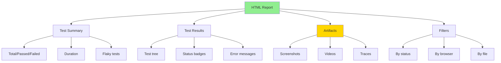
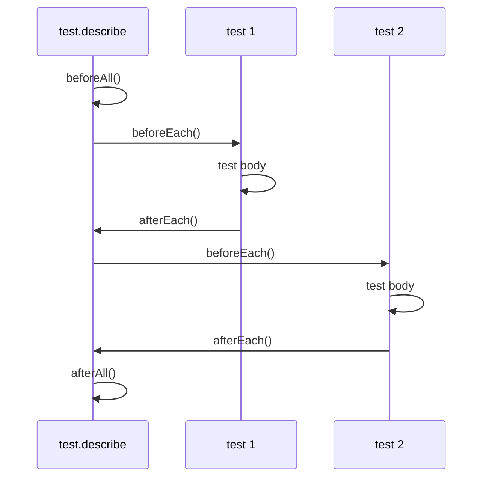

# 📊 Test Reports & CI/CD
## Báo Cáo Tests & Tích Hợp CI/CD

> Tài liệu này hướng dẫn cách generate reports, organize tests, và integrate với CI/CD pipelines.

---

## 📌 Tại Sao Cần Reports?

Test reports giúp:
- 📊 **Track test results** - Pass/Fail/Flaky
- 📈 **Monitor test health** - Success rate over time
- 🔍 **Debug failures** - Screenshots, traces, logs
- 👥 **Share results** - With team, stakeholders
- 📉 **Identify patterns** - Flaky tests, slow tests
- 🎯 **CI/CD integration** - Automated testing

---

## 📊 HTML Reporter (Default)

### Generate HTML Report

```bash
# Run tests (report auto-generated)
yarn test

# Open report
yarn report
# Or
npx playwright show-report
```

### HTML Report Features



### Configure HTML Reporter

```typescript
// playwright.config.ts
export default defineConfig({
  reporter: [
    ['html', {
      outputFolder: 'playwright-report',
      open: 'never', // 'always' | 'never' | 'on-failure'
    }]
  ],
});
```

---

## 📋 Other Reporters

### 1. List Reporter (Terminal)

```typescript
// playwright.config.ts
reporter: [
  ['list'], // Shows test results in terminal
],
```

**Output**:
```
✓ tests/login.spec.ts:5:3 › should login successfully (2.5s)
✗ tests/checkout.spec.ts:10:3 › should complete checkout (5.2s)
  Error: Timeout waiting for element
✓ tests/search.spec.ts:8:3 › should search products (1.8s)

3 passed (9.5s)
1 failed (5.2s)
```

---

### 2. JUnit Reporter (CI/CD)

```typescript
// playwright.config.ts
reporter: [
  ['junit', { outputFile: 'test-results/junit.xml' }]
],
```

**Use case**: Jenkins, GitLab CI, Azure DevOps

**Output**: `junit.xml`
```xml
<?xml version="1.0" encoding="UTF-8"?>
<testsuites>
  <testsuite name="tests/login.spec.ts" tests="2" failures="0" time="5.2">
    <testcase name="should login successfully" time="2.5"/>
    <testcase name="should logout successfully" time="2.7"/>
  </testsuite>
</testsuites>
```

---

### 3. JSON Reporter

```typescript
// playwright.config.ts
reporter: [
  ['json', { outputFile: 'test-results/results.json' }]
],
```

**Use case**: Custom dashboards, analytics

**Output**: Structured JSON data with all test details

---

### 4. Multiple Reporters

```typescript
// playwright.config.ts
reporter: [
  ['html'],                                    // HTML report
  ['list'],                                    // Terminal output
  ['junit', { outputFile: 'junit.xml' }],     // CI/CD
  ['json', { outputFile: 'results.json' }],   // Analytics
],
```

---

## 🎬 Test Artifacts

### Screenshots

```typescript
// playwright.config.ts
export default defineConfig({
  use: {
    screenshot: 'only-on-failure', // 'on' | 'off' | 'only-on-failure'
  }
});

// Manual screenshot in test
test('capture screenshot', async ({ page }) => {
  await page.screenshot({ path: 'screenshot.png', fullPage: true });
});
```

---

### Videos

```typescript
// playwright.config.ts
export default defineConfig({
  use: {
    video: 'retain-on-failure', // 'on' | 'off' | 'retain-on-failure' | 'on-first-retry'
  }
});

// Videos saved to: test-results/test-name/video.webm
```

**Video sizes**: ~1-5MB per test (can be large!)

---

### Traces

```typescript
// playwright.config.ts
export default defineConfig({
  use: {
    trace: 'on-first-retry', // 'on' | 'off' | 'retain-on-failure' | 'on-first-retry'
  }
});

// Or per-test
test('with trace', async ({ page }, testInfo) => {
  await testInfo.attach('trace', {
    path: 'trace.zip',
    contentType: 'application/zip'
  });
});
```

---

## 🏗️ Test Organization

### Test Structure

```typescript
// Good test structure
test.describe('Feature: User Authentication', () => {

  test.describe('Login', () => {
    test('should login with valid credentials', async ({ page }) => {
      // Test logic
    });

    test('should show error with invalid credentials', async ({ page }) => {
      // Test logic
    });
  });

  test.describe('Logout', () => {
    test('should logout successfully', async ({ page }) => {
      // Test logic
    });
  });
});
```

---

### Test Hooks

```typescript
test.describe('User Flow', () => {

  // Runs ONCE before all tests in this describe
  test.beforeAll(async ({ browser }) => {
    console.log('Setup test data');
  });

  // Runs before EACH test
  test.beforeEach(async ({ page }) => {
    await page.goto('/login');
  });

  // Runs after EACH test
  test.afterEach(async ({ page }) => {
    // Cleanup if needed
  });

  // Runs ONCE after all tests
  test.afterAll(async () => {
    console.log('Cleanup test data');
  });

  test('test 1', async ({ page }) => {
    // Test logic
  });

  test('test 2', async ({ page }) => {
    // Test logic
  });
});
```

### Hook Execution Order



---

### Test Fixtures

```typescript
// Custom fixture
import { test as base } from '@playwright/test';

type MyFixtures = {
  loggedInPage: Page;
};

const test = base.extend<MyFixtures>({
  loggedInPage: async ({ page }, use) => {
    // Setup: Login
    await page.goto('/login');
    await page.fill('#username', 'testuser');
    await page.fill('#password', 'password');
    await page.click('#submit');

    // Use logged-in page
    await use(page);

    // Teardown (if needed)
  },
});

// Use custom fixture
test('use logged in page', async ({ loggedInPage }) => {
  // Already logged in!
  await expect(loggedInPage).toHaveURL(/dashboard/);
});
```

---

## 🚀 CI/CD Integration

### GitHub Actions

```yaml
# .github/workflows/playwright.yml
name: Playwright Tests

on:
  push:
    branches: [main]
  pull_request:
    branches: [main]

jobs:
  test:
    runs-on: ubuntu-latest

    steps:
      - uses: actions/checkout@v3

      - name: Setup Node.js
        uses: actions/setup-node@v3
        with:
          node-version: '18'

      - name: Install dependencies
        run: yarn install

      - name: Install Playwright browsers
        run: yarn playwright install --with-deps

      - name: Run tests
        run: yarn test

      - name: Upload report
        if: always()
        uses: actions/upload-artifact@v3
        with:
          name: playwright-report
          path: playwright-report/
          retention-days: 30

      - name: Upload test results
        if: always()
        uses: actions/upload-artifact@v3
        with:
          name: test-results
          path: test-results/
          retention-days: 30
```

---

### GitLab CI

```yaml
# .gitlab-ci.yml
stages:
  - test

playwright_tests:
  stage: test
  image: mcr.microsoft.com/playwright:v1.40.0-focal

  script:
    - yarn install
    - yarn playwright install
    - yarn test

  artifacts:
    when: always
    paths:
      - playwright-report/
      - test-results/
    expire_in: 30 days

  only:
    - main
    - merge_requests
```

---

### Jenkins

```groovy
// Jenkinsfile
pipeline {
  agent any

  stages {
    stage('Install') {
      steps {
        sh 'yarn install'
        sh 'yarn playwright install --with-deps'
      }
    }

    stage('Test') {
      steps {
        sh 'yarn test'
      }
    }
  }

  post {
    always {
      publishHTML([
        reportDir: 'playwright-report',
        reportFiles: 'index.html',
        reportName: 'Playwright Report'
      ])

      junit 'test-results/junit.xml'
    }
  }
}
```

---

## 🔄 Parallelization

### Enable Parallel Execution

```typescript
// playwright.config.ts
export default defineConfig({
  fullyParallel: true, // Run tests in parallel
  workers: process.env.CI ? 2 : undefined, // 2 workers on CI, auto locally
});
```

### Per-File Parallelization

```typescript
// Run all tests in this file in parallel
test.describe.configure({ mode: 'parallel' });

test.describe('Parallel tests', () => {
  test('test 1', async ({ page }) => { });
  test('test 2', async ({ page }) => { });
  test('test 3', async ({ page }) => { });
});
```

### Serial Execution (When Needed)

```typescript
// Run tests in this describe serially (one-by-one)
test.describe.configure({ mode: 'serial' });

test.describe('Serial tests', () => {
  test('test 1 - must run first', async ({ page }) => { });
  test('test 2 - depends on test 1', async ({ page }) => { });
});
```

---

## 🎯 Retries & Flaky Tests

### Configure Retries

```typescript
// playwright.config.ts
export default defineConfig({
  retries: process.env.CI ? 2 : 0, // Retry twice on CI, no retry locally
});
```

### Per-Test Retries

```typescript
test('flaky test', async ({ page }) => {
  test.info().annotations.push({ type: 'issue', description: 'Known flaky' });
  // Test logic
});

// Or configure for specific test
test('custom retries', async ({ page }) => {
  test.info().retry = 3; // Retry 3 times
  // Test logic
});
```

---

## 📈 Test Metrics

### Execution Time

```typescript
test('measure performance', async ({ page }, testInfo) => {
  const startTime = Date.now();

  await page.goto('URL');
  // ... test actions

  const duration = Date.now() - startTime;
  console.log(`Test duration: ${duration}ms`);

  // Attach to report
  testInfo.annotations.push({
    type: 'performance',
    description: `${duration}ms`
  });
});
```

---

### Test Annotations

```typescript
test('annotated test', async ({ page }) => {
  test.info().annotations.push({ type: 'issue', description: 'BUG-123' });
  test.info().annotations.push({ type: 'slow', description: 'Takes 30s' });

  // Test logic
});
```

---

## 🎯 Best Practices

### ✅ DO - Nên làm:

```typescript
// 1️⃣ Use descriptive test names
test('should display error message when login fails', async ({ page }) => {
  // Clear what this tests
});

// 2️⃣ Organize tests logically
test.describe('Feature: Cart', () => {
  test.describe('Add to cart', () => { });
  test.describe('Remove from cart', () => { });
});

// 3️⃣ Use hooks for setup/teardown
test.beforeEach(async ({ page }) => {
  await page.goto('/');
});

// 4️⃣ Generate multiple reports
reporter: [['html'], ['junit'], ['json']],

// 5️⃣ Upload artifacts on CI
# GitHub Actions
- uses: actions/upload-artifact@v3
```

---

### ❌ DON'T - Tránh:

```typescript
// ❌ Vague test names
test('test 1', async ({ page }) => { });

// ❌ No test organization
// All tests in one big file

// ❌ Shared state between tests
let sharedData; // ← Don't do this!

// ❌ Hardcoded credentials in tests
await page.fill('#password', 'MyRealPassword123'); // Use env vars!

// ❌ Not retrying on CI
retries: 0, // May fail due to network issues
```

---

## 📊 Report Comparison

| Reporter | Use Case | Format | CI/CD |
|----------|----------|--------|-------|
| **HTML** | Local debugging | Interactive web page | ✅ |
| **List** | Terminal output | Console text | ✅ |
| **JUnit** | CI/CD integration | XML | ✅✅✅ |
| **JSON** | Custom dashboards | JSON | ✅✅ |
| **Dot** | Minimal output | Console dots | ✅ |

---

## 🧪 Complete CI/CD Example

```typescript
// playwright.config.ts - Production ready
export default defineConfig({
  testDir: './tests',

  // Timeout
  timeout: 30 * 1000,

  // Retries
  retries: process.env.CI ? 2 : 0,

  // Parallel
  fullyParallel: true,
  workers: process.env.CI ? 2 : undefined,

  // Reporters
  reporter: [
    ['html', { outputFolder: 'playwright-report' }],
    ['junit', { outputFile: 'test-results/junit.xml' }],
    ['json', { outputFile: 'test-results/results.json' }],
    ['list']
  ],

  // Artifacts
  use: {
    trace: 'on-first-retry',
    screenshot: 'only-on-failure',
    video: 'retain-on-failure',
  },

  // Projects (browsers)
  projects: [
    {
      name: 'chromium',
      use: { ...devices['Desktop Chrome'] },
    },
    {
      name: 'firefox',
      use: { ...devices['Desktop Firefox'] },
    },
    {
      name: 'webkit',
      use: { ...devices['Desktop Safari'] },
    },
  ],
});
```

---

## 📚 Thuật Ngữ Quan Trọng | Key Terms

| Tiếng Anh | Tiếng Việt | Giải thích |
|-----------|------------|------------|
| **Reporter** | Trình báo cáo | Generate test reports |
| **Artifact** | Sản phẩm | Screenshots, videos, traces |
| **Hook** | Móc | beforeEach, afterEach, etc. |
| **Fixture** | Cố định | Reusable test setup |
| **Parallelization** | Song song hóa | Run tests concurrently |
| **Retry** | Thử lại | Re-run failed tests |
| **Flaky** | Không ổn định | Tests that sometimes fail |

---

## 🔗 Tài Liệu Tham Khảo | References

- [Playwright Reporters](https://playwright.dev/docs/test-reporters)
- [Test Fixtures](https://playwright.dev/docs/test-fixtures)
- [CI/CD](https://playwright.dev/docs/ci)
- [Parallelization](https://playwright.dev/docs/test-parallel)

---

## ➡️ Tiếp Theo | Next Steps

Sau khi hoàn thành Week 3 theory, tiếp tục với:

👉 **Examples** - 8 file examples về assertions, debugging, waits

👉 **Exercises** - 3 bài tập thực hành

---

**Chúc mừng bạn đã hoàn thành Week 3 Theory Docs! 🎉**

> **Ghi nhớ**: Good reports + CI/CD = Reliable, maintainable test suite!
