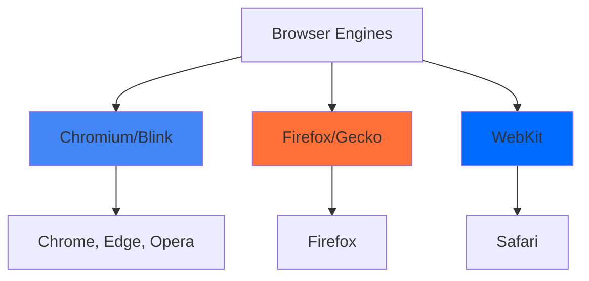
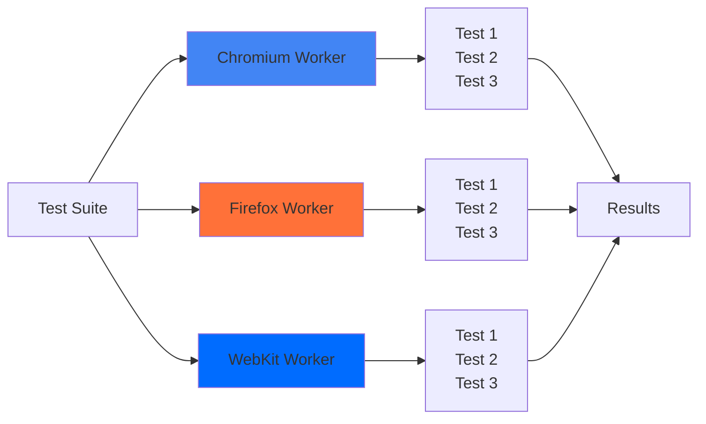

# Multi-browser Testing (Kiểm Thử Đa Trình Duyệt)

## Giới Thiệu (Introduction)

**Cross-browser testing** là việc chạy automated tests trên nhiều browsers khác nhau để đảm bảo ứng dụng hoạt động nhất quán trên các platforms. Playwright hỗ trợ 3 browser engines chính: **Chromium**, **Firefox**, và **WebKit**.

## Tại Sao Cần Multi-browser Testing?

### Browser Differences (Sự Khác Biệt Giữa Các Browsers)



Mỗi browser engine có:
- **Rendering differences**: Cách hiển thị CSS, fonts, layouts khác nhau
- **JavaScript engine**: V8 (Chrome), SpiderMonkey (Firefox), JavaScriptCore (Safari)
- **API support**: Một số Web APIs chỉ có trên specific browsers
- **Performance characteristics**: Tốc độ execution khác nhau

### Real-world Example

```typescript
// Một feature có thể hoạt động khác nhau trên browsers:

// ✅ Works in Chrome/Chromium
await page.locator('input[type="date"]').fill('2024-01-15');

// ❌ Có thể fail trên Firefox/Safari vì date picker rendering khác
// Cần test trên cả 3 browsers để catch issues này
```

## Playwright Projects Configuration

### Basic Multi-browser Setup

```typescript
// playwright.config.ts
import { defineConfig, devices } from '@playwright/test';

export default defineConfig({
  testDir: './tests',
  fullyParallel: true,

  // Định nghĩa projects cho mỗi browser
  projects: [
    {
      name: 'chromium',
      use: {
        ...devices['Desktop Chrome'],
        // Chromium-specific settings
        channel: 'chrome', // Use Google Chrome instead of Chromium
      },
    },
    {
      name: 'firefox',
      use: {
        ...devices['Desktop Firefox'],
        // Firefox-specific settings
      },
    },
    {
      name: 'webkit',
      use: {
        ...devices['Desktop Safari'],
        // WebKit-specific settings
      },
    },
  ],
});
```

### Running Tests on Specific Browsers

```bash
# Chạy trên tất cả browsers (default)
npx playwright test

# Chạy chỉ trên Chromium
npx playwright test --project=chromium

# Chạy trên Firefox và WebKit
npx playwright test --project=firefox --project=webkit

# Chạy specific test file trên all browsers
npx playwright test tests/login.spec.ts

# Chạy và show browsers (headed mode)
npx playwright test --headed --project=firefox
```

## Advanced Configuration

### Browser-specific Timeouts

```typescript
// playwright.config.ts
export default defineConfig({
  projects: [
    {
      name: 'chromium',
      use: {
        ...devices['Desktop Chrome'],
      },
      timeout: 30000, // 30 seconds
    },
    {
      name: 'webkit',
      use: {
        ...devices['Desktop Safari'],
      },
      timeout: 45000, // 45 seconds - Safari có thể chậm hơn
    },
  ],
});
```

### Browser-specific Retries

```typescript
// playwright.config.ts
export default defineConfig({
  projects: [
    {
      name: 'chromium',
      use: { ...devices['Desktop Chrome'] },
      retries: 1, // Retry 1 lần nếu fail
    },
    {
      name: 'webkit',
      use: { ...devices['Desktop Safari'] },
      retries: 2, // Safari flakier, retry nhiều hơn
    },
  ],
});
```

### Conditional Tests per Browser

```typescript
import { test, expect } from '@playwright/test';

test.describe('Login Tests', () => {
  // Test chạy trên TẤT CẢ browsers
  test('should login successfully', async ({ page }) => {
    await page.goto('https://practice.expandtesting.com/login');
    await page.fill('#username', 'practice');
    await page.fill('#password', 'SuperSecretPassword!');
    await page.click('button[type="submit"]');
    await expect(page).toHaveURL(/secure/);
  });

  // Test chỉ chạy trên Chromium
  test('should use Chrome DevTools Protocol', async ({ page, browserName }) => {
    test.skip(browserName !== 'chromium', 'CDP only available in Chromium');

    // Chromium-specific test using CDP
    const client = await page.context().newCDPSession(page);
    await client.send('Network.enable');
  });

  // Test chỉ chạy trên Firefox
  test('should test Firefox-specific feature', async ({ browserName }) => {
    test.skip(browserName !== 'firefox', 'Firefox-only test');

    // Firefox-specific logic
  });
});
```

## Browser Detection and Conditional Logic

```typescript
import { test, expect } from '@playwright/test';

test('adapts to browser differences', async ({ page, browserName }) => {
  await page.goto('https://practice.expandtesting.com/');

  // Log current browser
  console.log(`🌐 Testing on: ${browserName}`);

  // Conditional logic based on browser
  if (browserName === 'webkit') {
    // Safari-specific workaround
    await page.waitForTimeout(1000); // Extra wait for Safari
  }

  // Common test logic
  await expect(page.locator('h1')).toBeVisible();

  // Browser-specific assertions
  if (browserName === 'chromium') {
    // Check Chrome-specific feature
    const userAgent = await page.evaluate(() => navigator.userAgent);
    expect(userAgent).toContain('Chrome');
  }
});
```

## Parallel Execution

### How Projects Run in Parallel



```typescript
// playwright.config.ts
export default defineConfig({
  // Chạy tất cả tests parallel (mặc định)
  fullyParallel: true,

  // Số workers per project
  workers: process.env.CI ? 1 : undefined, // 1 worker in CI, auto locally

  projects: [
    { name: 'chromium', use: { ...devices['Desktop Chrome'] } },
    { name: 'firefox', use: { ...devices['Desktop Firefox'] } },
    { name: 'webkit', use: { ...devices['Desktop Safari'] } },
  ],
});
```

### Controlling Workers

```bash
# Chạy với 1 worker (sequential)
npx playwright test --workers=1

# Chạy với 4 workers (parallel)
npx playwright test --workers=4

# CI mode (automatically uses 1 worker)
CI=1 npx playwright test
```

## Browser-specific Annotations

```typescript
import { test } from '@playwright/test';

// Skip test trên specific browser
test('datepicker test', async ({ page, browserName }) => {
  test.fixme(browserName === 'webkit', 'Datepicker broken on Safari');

  await page.goto('https://practice.expandtesting.com/');
  // Test logic...
});

// Slow test trên specific browser
test('animation test', async ({ page, browserName }) => {
  test.slow(browserName === 'webkit', 'Animations slower on Safari');

  await page.goto('https://practice.expandtesting.com/');
  // Test logic...
});

// Fail test với specific browser (known issue)
test('file upload', async ({ page, browserName }) => {
  test.fail(browserName === 'firefox', 'File upload bug in Firefox');

  await page.goto('https://practice.expandtesting.com/upload');
  // Test logic...
});
```

## Debugging Multi-browser Tests

### UI Mode with Browser Selection

```bash
# Open UI mode
npx playwright test --ui

# In UI mode, you can:
# 1. Select specific project (browser) from dropdown
# 2. Run tests and see results per browser
# 3. Compare screenshots across browsers
```

### Browser-specific Screenshots

```typescript
import { test, expect } from '@playwright/test';

test('visual comparison across browsers', async ({ page, browserName }) => {
  await page.goto('https://practice.expandtesting.com/');

  // Screenshot với browser name trong filename
  await page.screenshot({
    path: `screenshots/homepage-${browserName}.png`,
    fullPage: true
  });

  // Visual regression testing
  await expect(page).toHaveScreenshot(`homepage-${browserName}.png`);
});
```

## Best Practices

### 1. Test Browser-specific Features Separately

```typescript
// ✅ GOOD: Separate test suites
test.describe('Common Tests @all-browsers', () => {
  test('login works', async ({ page }) => {
    // Runs on all browsers
  });
});

test.describe('Chromium-specific Tests @chromium', () => {
  test.use({ browserName: 'chromium' });

  test('Chrome DevTools', async ({ page }) => {
    // Only runs on Chromium
  });
});
```

### 2. Use Browser Name in Test Data

```typescript
test('create user with browser-specific data', async ({ page, browserName }) => {
  const username = `user_${browserName}_${Date.now()}`;
  const email = `${browserName}@example.com`;

  // Unique data per browser prevents conflicts
  await page.fill('#username', username);
  await page.fill('#email', email);
});
```

### 3. Handle Browser-specific Timing

```typescript
test('wait for element', async ({ page, browserName }) => {
  await page.goto('https://practice.expandtesting.com/');

  // WebKit might need extra time
  const timeout = browserName === 'webkit' ? 10000 : 5000;

  await page.locator('#dynamic-element').waitFor({ timeout });
});
```

## Common Cross-browser Issues

### Issue 1: Date Picker Differences

```typescript
// ❌ PROBLEM: Works differently across browsers
await page.locator('input[type="date"]').fill('2024-01-15');

// ✅ SOLUTION: Use JavaScript to set value
await page.locator('input[type="date"]').evaluate((el, value) => {
  (el as HTMLInputElement).value = value;
}, '2024-01-15');
```

### Issue 2: File Upload Paths

```typescript
// ❌ PROBLEM: Path separators differ (Windows vs Unix)
await page.setInputFiles('input[type="file"]', 'C:\\Users\\test\\file.txt');

// ✅ SOLUTION: Use path.join()
import path from 'path';

const filePath = path.join(__dirname, 'test-data', 'file.txt');
await page.setInputFiles('input[type="file"]', filePath);
```

### Issue 3: WebKit Scrolling

```typescript
// ❌ PROBLEM: WebKit sometimes doesn't auto-scroll to elements
await page.click('#bottom-button');

// ✅ SOLUTION: Explicitly scroll into view
await page.locator('#bottom-button').scrollIntoViewIfNeeded();
await page.click('#bottom-button');
```

## Key Takeaways

1. **Always test on multiple browsers** - Chromium, Firefox, and WebKit have different behaviors
2. **Use Playwright projects** - Clean way to configure multiple browsers
3. **Leverage parallel execution** - Projects run in parallel by default
4. **Browser-specific logic** - Use `browserName` fixture for conditional tests
5. **Handle browser differences** - Be aware of common cross-browser issues
6. **Annotations** - Use `test.skip()`, `test.fixme()`, `test.fail()` for browser-specific issues
7. **Screenshots** - Compare visual differences across browsers
8. **CI/CD optimization** - Use 1 worker in CI, multiple locally

---

**Next Steps:**
- Read `02-playwright-projects-vi.md` to learn advanced projects configuration
- Practice with `examples/01-multi-browser.spec.ts`
