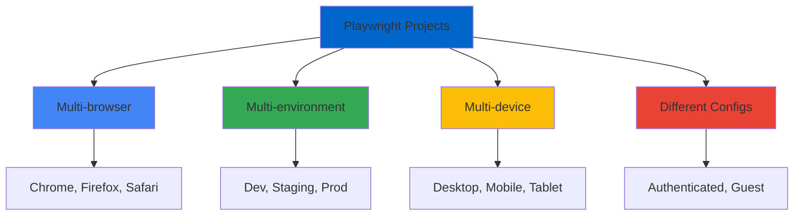
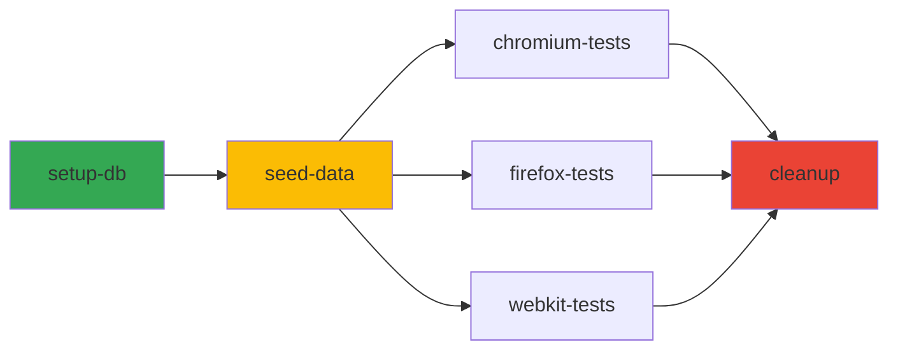

# Playwright Projects (Dự Án Playwright)

## Giới Thiệu (Introduction)

**Projects** trong Playwright cho phép bạn chạy cùng một test suite với các configurations khác nhau. Mỗi project có thể có browser riêng, base URL riêng, và settings riêng biệt.

## Tại Sao Cần Projects?

### Use Cases



Projects giúp bạn:
- ✅ Test trên nhiều browsers với cùng test code
- ✅ Run tests cho different environments (dev/staging/prod)
- ✅ Test với different user states (authenticated/guest)
- ✅ Emulate different devices (desktop/mobile/tablet)
- ✅ Separate test suites (smoke/regression/e2e)

## Basic Projects Configuration

### Example: Multi-browser Projects

```typescript
// playwright.config.ts
import { defineConfig, devices } from '@playwright/test';

export default defineConfig({
  testDir: './tests',

  // Projects cho different browsers
  projects: [
    {
      name: 'chromium',
      use: {
        ...devices['Desktop Chrome'],
      },
    },
    {
      name: 'firefox',
      use: {
        ...devices['Desktop Firefox'],
      },
    },
    {
      name: 'webkit',
      use: {
        ...devices['Desktop Safari'],
      },
    },
  ],
});
```

### Example: Environment-based Projects

```typescript
// playwright.config.ts
export default defineConfig({
  projects: [
    {
      name: 'dev',
      use: {
        baseURL: 'https://dev.example.com',
        storageState: 'auth/dev.json',
      },
    },
    {
      name: 'staging',
      use: {
        baseURL: 'https://staging.example.com',
        storageState: 'auth/staging.json',
      },
    },
    {
      name: 'production',
      use: {
        baseURL: 'https://production.example.com',
        storageState: 'auth/prod.json',
      },
    },
  ],
});
```

## Advanced Projects Configuration

### Device Emulation Projects

```typescript
// playwright.config.ts
import { defineConfig, devices } from '@playwright/test';

export default defineConfig({
  projects: [
    // Desktop browsers
    {
      name: 'Desktop Chrome',
      use: {
        ...devices['Desktop Chrome'],
        viewport: { width: 1920, height: 1080 },
      },
    },

    // Mobile devices
    {
      name: 'Mobile Chrome',
      use: {
        ...devices['Pixel 5'],
      },
    },
    {
      name: 'Mobile Safari',
      use: {
        ...devices['iPhone 13'],
      },
    },

    // Tablet devices
    {
      name: 'iPad',
      use: {
        ...devices['iPad Pro'],
      },
    },
  ],
});
```

### Authentication State Projects

```typescript
// playwright.config.ts
export default defineConfig({
  projects: [
    // Setup project - runs first
    {
      name: 'setup',
      testMatch: /.*\.setup\.ts/,
    },

    // Authenticated user tests
    {
      name: 'authenticated',
      dependencies: ['setup'], // Chạy sau setup
      use: {
        storageState: 'auth/user.json', // Reuse logged-in state
      },
      testMatch: /.*\.auth\.spec\.ts/,
    },

    // Guest user tests
    {
      name: 'guest',
      use: {
        storageState: { cookies: [], origins: [] }, // No auth
      },
      testMatch: /.*\.guest\.spec\.ts/,
    },

    // Admin user tests
    {
      name: 'admin',
      dependencies: ['setup'],
      use: {
        storageState: 'auth/admin.json',
      },
      testMatch: /.*\.admin\.spec\.ts/,
    },
  ],
});
```

## Project-specific Settings

### Timeouts and Retries

```typescript
// playwright.config.ts
export default defineConfig({
  projects: [
    {
      name: 'chromium-fast',
      use: { ...devices['Desktop Chrome'] },
      timeout: 10000, // 10 seconds per test
      retries: 0, // No retries
    },
    {
      name: 'webkit-slow',
      use: { ...devices['Desktop Safari'] },
      timeout: 30000, // 30 seconds per test
      retries: 2, // Retry twice on failure
    },
  ],
});
```

### Screenshots and Videos

```typescript
// playwright.config.ts
export default defineConfig({
  projects: [
    {
      name: 'debug',
      use: {
        screenshot: 'on', // Always take screenshots
        video: 'on', // Always record video
        trace: 'on', // Always record trace
      },
    },
    {
      name: 'ci',
      use: {
        screenshot: 'only-on-failure',
        video: 'retain-on-failure',
        trace: 'on-first-retry',
      },
    },
  ],
});
```

### Test Filtering by Projects

```typescript
// playwright.config.ts
export default defineConfig({
  projects: [
    {
      name: 'smoke-tests',
      testMatch: /.*\.smoke\.spec\.ts/, // Only run smoke tests
      grep: /@smoke/, // Or tests tagged with @smoke
    },
    {
      name: 'regression-tests',
      testMatch: /.*\.regression\.spec\.ts/,
      grep: /@regression/,
    },
    {
      name: 'e2e-tests',
      testIgnore: /.*\.smoke\.spec\.ts/, // Exclude smoke tests
    },
  ],
});
```

## Running Specific Projects

### Command Line Usage

```bash
# List all projects
npx playwright test --list

# Run specific project
npx playwright test --project=chromium

# Run multiple projects
npx playwright test --project=chromium --project=firefox

# Run all projects except one
npx playwright test --project=!webkit

# Run with grep (tag filtering)
npx playwright test --grep @smoke --project=chromium

# Run specific test file with specific project
npx playwright test tests/login.spec.ts --project=firefox
```

### Running Projects in Sequence

```typescript
// playwright.config.ts
export default defineConfig({
  projects: [
    // Setup runs first
    {
      name: 'setup-database',
      testMatch: /global\.setup\.ts/,
    },

    // Tests run after setup
    {
      name: 'tests',
      dependencies: ['setup-database'],
      testMatch: /.*\.spec\.ts/,
    },

    // Cleanup runs last
    {
      name: 'cleanup',
      dependencies: ['tests'],
      testMatch: /global\.teardown\.ts/,
    },
  ],
});
```

## Project Dependencies

### Setup Project Pattern

```typescript
// auth.setup.ts
import { test as setup } from '@playwright/test';

setup('authenticate', async ({ page }) => {
  await page.goto('https://practice.expandtesting.com/login');
  await page.fill('#username', 'practice');
  await page.fill('#password', 'SuperSecretPassword!');
  await page.click('button[type="submit"]');

  // Save authentication state
  await page.context().storageState({ path: 'auth/user.json' });
});
```

```typescript
// playwright.config.ts
export default defineConfig({
  projects: [
    {
      name: 'setup',
      testMatch: /.*\.setup\.ts/,
    },
    {
      name: 'chromium',
      dependencies: ['setup'],
      use: {
        ...devices['Desktop Chrome'],
        storageState: 'auth/user.json',
      },
    },
  ],
});
```

### Dependency Chain



```typescript
// playwright.config.ts
export default defineConfig({
  projects: [
    { name: 'setup-db', testMatch: /db\.setup\.ts/ },
    {
      name: 'seed-data',
      dependencies: ['setup-db'],
      testMatch: /seed\.setup\.ts/,
    },
    {
      name: 'chromium-tests',
      dependencies: ['seed-data'],
      use: { ...devices['Desktop Chrome'] },
    },
    {
      name: 'cleanup',
      dependencies: ['chromium-tests'],
      testMatch: /cleanup\.ts/,
    },
  ],
});
```

## Environment Variables in Projects

### Using .env Files

```typescript
// playwright.config.ts
import dotenv from 'dotenv';

// Load environment-specific .env file
const envFile = process.env.TEST_ENV === 'prod' ? '.env.prod' : '.env.dev';
dotenv.config({ path: envFile });

export default defineConfig({
  projects: [
    {
      name: 'dev',
      use: {
        baseURL: process.env.DEV_BASE_URL,
      },
    },
    {
      name: 'staging',
      use: {
        baseURL: process.env.STAGING_BASE_URL,
      },
    },
  ],
});
```

```bash
# .env.dev
DEV_BASE_URL=https://dev.example.com
DEV_API_KEY=dev_key_123

# .env.staging
STAGING_BASE_URL=https://staging.example.com
STAGING_API_KEY=staging_key_456
```

### Runtime Environment Selection

```bash
# Run on dev environment
TEST_ENV=dev npx playwright test --project=dev

# Run on staging
TEST_ENV=staging npx playwright test --project=staging
```

## Real-world Example: Complete Setup

```typescript
// playwright.config.ts
import { defineConfig, devices } from '@playwright/test';

export default defineConfig({
  testDir: './tests',
  fullyParallel: true,
  forbidOnly: !!process.env.CI,
  retries: process.env.CI ? 2 : 0,
  workers: process.env.CI ? 1 : undefined,

  reporter: [
    ['html'],
    ['json', { outputFile: 'test-results/results.json' }],
  ],

  use: {
    trace: 'on-first-retry',
    screenshot: 'only-on-failure',
  },

  projects: [
    // Setup
    {
      name: 'setup',
      testMatch: /.*\.setup\.ts/,
    },

    // Desktop browsers - authenticated
    {
      name: 'chromium-auth',
      dependencies: ['setup'],
      use: {
        ...devices['Desktop Chrome'],
        storageState: 'auth/user.json',
      },
      testMatch: /.*\.auth\.spec\.ts/,
    },
    {
      name: 'firefox-auth',
      dependencies: ['setup'],
      use: {
        ...devices['Desktop Firefox'],
        storageState: 'auth/user.json',
      },
      testMatch: /.*\.auth\.spec\.ts/,
    },

    // Guest tests (no auth)
    {
      name: 'chromium-guest',
      use: {
        ...devices['Desktop Chrome'],
      },
      testMatch: /.*\.guest\.spec\.ts/,
    },

    // Mobile tests
    {
      name: 'mobile-chrome',
      dependencies: ['setup'],
      use: {
        ...devices['Pixel 5'],
        storageState: 'auth/user.json',
      },
      testMatch: /.*\.mobile\.spec\.ts/,
    },

    // Smoke tests - run first
    {
      name: 'smoke',
      use: {
        ...devices['Desktop Chrome'],
      },
      grep: /@smoke/,
    },
  ],
});
```

## Best Practices

### 1. Name Projects Clearly

```typescript
// ✅ GOOD: Descriptive names
{ name: 'chromium-desktop-authenticated' }
{ name: 'firefox-mobile-guest' }
{ name: 'webkit-tablet-admin' }

// ❌ BAD: Vague names
{ name: 'test1' }
{ name: 'config2' }
```

### 2. Use Dependencies for Setup/Teardown

```typescript
// ✅ GOOD: Explicit dependencies
{
  name: 'tests',
  dependencies: ['setup'],
}

// ❌ BAD: Manual coordination
// Tests might run before setup completes
```

### 3. Separate Test Files by Project

```
tests/
├── auth/
│   ├── login.auth.spec.ts       # Requires authentication
│   └── profile.auth.spec.ts
├── guest/
│   ├── homepage.guest.spec.ts   # No authentication
│   └── search.guest.spec.ts
└── setup/
    └── auth.setup.ts            # Setup project
```

### 4. Use testMatch for Organization

```typescript
// ✅ GOOD: Pattern-based matching
{
  name: 'authenticated',
  testMatch: /.*\.auth\.spec\.ts/,
}

// ❌ BAD: Mixing authenticated and guest tests
{
  name: 'all-tests',
  testMatch: /.*\.spec\.ts/, // Too broad
}
```

## Key Takeaways

1. **Projects = Configurations** - Each project is a different test configuration
2. **Use for multi-browser, multi-environment, multi-device** - Maximize reuse
3. **Dependencies** - Control execution order with dependencies
4. **testMatch** - Filter tests per project with patterns
5. **Setup projects** - Use for authentication, database seeding
6. **Environment variables** - Different configs for dev/staging/prod
7. **Parallel by default** - Projects run in parallel unless dependencies exist
8. **Command line control** - Select projects at runtime with `--project`

---

**Next Steps:**
- Read `03-environment-management-vi.md` for environment-specific configurations
- Practice with `examples/02-projects-config.spec.ts`
