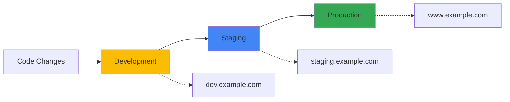

# Environment Management (Quản Lý Môi Trường)

## Giới Thiệu (Introduction)

**Environment management** là việc quản lý configurations cho các environments khác nhau như **Development**, **Staging**, và **Production**. Mỗi environment có base URL, credentials, và settings riêng.

## Tại Sao Cần Environment Management?

### Typical Application Environments



Mỗi environment có:
- **Different URLs**: dev.example.com vs staging.example.com vs example.com
- **Different data**: Test data vs staging data vs production data
- **Different credentials**: Different API keys, passwords
- **Different behaviors**: Feature flags, debug modes

## Environment Configuration Strategies

### Strategy 1: Environment Variables

```bash
# .env.dev
BASE_URL=https://dev.practice.expandtesting.com
API_KEY=dev_key_12345
DB_NAME=test_db_dev
TIMEOUT=30000

# .env.staging
BASE_URL=https://staging.practice.expandtesting.com
API_KEY=staging_key_67890
DB_NAME=test_db_staging
TIMEOUT=45000

# .env.prod
BASE_URL=https://practice.expandtesting.com
API_KEY=prod_key_abcde
DB_NAME=test_db_prod
TIMEOUT=60000
```

```typescript
// playwright.config.ts
import { defineConfig } from '@playwright/test';
import dotenv from 'dotenv';
import path from 'path';

// Load environment-specific .env file
const environment = process.env.TEST_ENV || 'dev';
const envFile = path.join(__dirname, `.env.${environment}`);
dotenv.config({ path: envFile });

export default defineConfig({
  use: {
    baseURL: process.env.BASE_URL,
    extraHTTPHeaders: {
      'X-API-Key': process.env.API_KEY || '',
    },
  },
  timeout: parseInt(process.env.TIMEOUT || '30000'),
});
```

### Strategy 2: Separate Config Files

```typescript
// configs/playwright.config.dev.ts
import { defineConfig, devices } from '@playwright/test';

export default defineConfig({
  testDir: '../tests',
  use: {
    baseURL: 'https://dev.practice.expandtesting.com',
    trace: 'on', // Always trace in dev
    video: 'on', // Always record video in dev
  },
  workers: 5, // More workers in dev
  retries: 0, // No retries in dev
  projects: [
    { name: 'chromium', use: { ...devices['Desktop Chrome'] } },
  ],
});
```

```typescript
// configs/playwright.config.staging.ts
import { defineConfig, devices } from '@playwright/test';

export default defineConfig({
  testDir: '../tests',
  use: {
    baseURL: 'https://staging.practice.expandtesting.com',
    trace: 'on-first-retry',
    video: 'retain-on-failure',
  },
  workers: 3,
  retries: 1,
  projects: [
    { name: 'chromium', use: { ...devices['Desktop Chrome'] } },
    { name: 'firefox', use: { ...devices['Desktop Firefox'] } },
  ],
});
```

```typescript
// configs/playwright.config.prod.ts
import { defineConfig, devices } from '@playwright/test';

export default defineConfig({
  testDir: '../tests',
  use: {
    baseURL: 'https://practice.expandtesting.com',
    trace: 'on-first-retry',
    video: 'retain-on-failure',
    screenshot: 'only-on-failure',
  },
  workers: 1, // Careful in production
  retries: 2, // More retries for production
  projects: [
    { name: 'chromium', use: { ...devices['Desktop Chrome'] } },
    { name: 'firefox', use: { ...devices['Desktop Firefox'] } },
    { name: 'webkit', use: { ...devices['Desktop Safari'] } },
  ],
});
```

### Strategy 3: Projects-based Environments

```typescript
// playwright.config.ts
import { defineConfig, devices } from '@playwright/test';

export default defineConfig({
  projects: [
    // Development environment
    {
      name: 'dev-chromium',
      use: {
        ...devices['Desktop Chrome'],
        baseURL: 'https://dev.practice.expandtesting.com',
      },
      grep: /@dev/,
    },

    // Staging environment
    {
      name: 'staging-chromium',
      use: {
        ...devices['Desktop Chrome'],
        baseURL: 'https://staging.practice.expandtesting.com',
      },
      grep: /@staging/,
    },

    // Production environment
    {
      name: 'prod-chromium',
      use: {
        ...devices['Desktop Chrome'],
        baseURL: 'https://practice.expandtesting.com',
      },
      grep: /@prod|@smoke/, // Only smoke tests in prod
    },
  ],
});
```

## Running Tests on Different Environments

### Using Environment Variables

```bash
# Run on dev environment
TEST_ENV=dev npx playwright test

# Run on staging
TEST_ENV=staging npx playwright test

# Run on production
TEST_ENV=prod npx playwright test
```

### Using Config Files

```bash
# Run with dev config
npx playwright test --config=configs/playwright.config.dev.ts

# Run with staging config
npx playwright test --config=configs/playwright.config.staging.ts

# Run with production config
npx playwright test --config=configs/playwright.config.prod.ts
```

### Using Projects

```bash
# Run on dev project
npx playwright test --project=dev-chromium

# Run on staging project
npx playwright test --project=staging-chromium

# Run on production (smoke tests only)
npx playwright test --project=prod-chromium --grep @smoke
```

## Environment-specific Test Data

### Test Data Files per Environment

```
test-data/
├── dev/
│   ├── users.json
│   └── products.json
├── staging/
│   ├── users.json
│   └── products.json
└── prod/
    ├── users.json
    └── products.json
```

```json
// test-data/dev/users.json
{
  "validUser": {
    "username": "dev_testuser",
    "password": "DevPass123!",
    "email": "dev@example.com"
  }
}
```

```json
// test-data/prod/users.json
{
  "validUser": {
    "username": "prod_testuser",
    "password": "ProdSecurePass456!",
    "email": "prod@example.com"
  }
}
```

### Loading Environment-specific Data

```typescript
// helpers/data-loader.ts
import fs from 'fs';
import path from 'path';

export function loadTestData<T>(filename: string): T {
  const environment = process.env.TEST_ENV || 'dev';
  const dataPath = path.join(__dirname, '..', 'test-data', environment, filename);
  const data = fs.readFileSync(dataPath, 'utf-8');
  return JSON.parse(data) as T;
}
```

```typescript
// tests/login.spec.ts
import { test, expect } from '@playwright/test';
import { loadTestData } from '../helpers/data-loader';

interface UserData {
  validUser: {
    username: string;
    password: string;
    email: string;
  };
}

test('login with environment-specific user', async ({ page }) => {
  const userData = loadTestData<UserData>('users.json');

  await page.goto('/login');
  await page.fill('#username', userData.validUser.username);
  await page.fill('#password', userData.validUser.password);
  await page.click('button[type="submit"]');

  await expect(page).toHaveURL(/secure/);
});
```

## Environment-specific Behaviors

### Feature Flags

```typescript
// helpers/feature-flags.ts
export const getFeatureFlags = () => {
  const environment = process.env.TEST_ENV || 'dev';

  return {
    dev: {
      debugMode: true,
      skipPayment: true,
      mockExternalAPIs: true,
    },
    staging: {
      debugMode: false,
      skipPayment: true,
      mockExternalAPIs: false,
    },
    prod: {
      debugMode: false,
      skipPayment: false,
      mockExternalAPIs: false,
    },
  }[environment];
};
```

```typescript
// tests/checkout.spec.ts
import { test, expect } from '@playwright/test';
import { getFeatureFlags } from '../helpers/feature-flags';

test('complete checkout flow', async ({ page }) => {
  const flags = getFeatureFlags();

  await page.goto('/cart');
  await page.click('#checkout-button');

  if (flags.skipPayment) {
    // In dev/staging, skip actual payment
    console.log('Skipping payment in test environment');
    await page.click('#skip-payment-button');
  } else {
    // In production, use real payment flow
    await page.fill('#card-number', '4111111111111111');
    await page.fill('#expiry', '12/25');
    await page.click('#pay-button');
  }

  await expect(page.locator('.order-confirmation')).toBeVisible();
});
```

### Environment-specific Timeouts

```typescript
// helpers/timeouts.ts
export const getTimeouts = () => {
  const environment = process.env.TEST_ENV || 'dev';

  return {
    dev: {
      navigation: 10000,
      action: 5000,
      assertion: 3000,
    },
    staging: {
      navigation: 20000,
      action: 10000,
      assertion: 5000,
    },
    prod: {
      navigation: 30000,
      action: 15000,
      assertion: 10000,
    },
  }[environment];
};
```

```typescript
// tests/slow-page.spec.ts
import { test, expect } from '@playwright/test';
import { getTimeouts } from '../helpers/timeouts';

test('load slow page', async ({ page }) => {
  const timeouts = getTimeouts();

  await page.goto('/slow-page', {
    timeout: timeouts.navigation,
  });

  await expect(page.locator('#content')).toBeVisible({
    timeout: timeouts.assertion,
  });
});
```

## Environment Validation

### Pre-flight Checks

```typescript
// tests/environment.setup.ts
import { test as setup } from '@playwright/test';

setup('validate environment', async ({ request }) => {
  const baseURL = process.env.BASE_URL;

  // Check if environment is reachable
  const response = await request.get(`${baseURL}/health`);
  if (!response.ok()) {
    throw new Error(`Environment ${baseURL} is not healthy`);
  }

  console.log(`✅ Environment ${baseURL} is ready`);
});
```

### Environment Detection in Tests

```typescript
import { test, expect } from '@playwright/test';

test.describe('Environment-aware tests', () => {
  test('should skip in production', async ({ page, baseURL }) => {
    // Skip destructive tests in production
    test.skip(
      baseURL?.includes('practice.expandtesting.com') && !baseURL.includes('dev'),
      'Skipping destructive test in production'
    );

    // Destructive operation
    await page.goto('/admin/delete-all');
    await page.click('#confirm-delete');
  });

  test('should only run in dev', async ({ baseURL }) => {
    test.skip(
      !baseURL?.includes('dev'),
      'Debug test only runs in dev'
    );

    // Dev-only test
    console.log('Running debug checks...');
  });
});
```

## Best Practices

### 1. Never Hard-code Environment Values

```typescript
// ❌ BAD: Hard-coded URL
await page.goto('https://dev.example.com/login');

// ✅ GOOD: Use baseURL from config
await page.goto('/login'); // Uses baseURL from playwright.config.ts
```

### 2. Use Different Credentials per Environment

```bash
# .env.dev
USERNAME=dev_user
PASSWORD=dev_pass

# .env.prod (from CI secrets)
USERNAME=prod_user
PASSWORD=${{ secrets.PROD_PASSWORD }}
```

### 3. Separate Sensitive Data

```typescript
// ❌ BAD: Credentials in code
await page.fill('#password', 'MyPassword123!');

// ✅ GOOD: Credentials from environment
await page.fill('#password', process.env.PASSWORD || '');
```

### 4. Validate Environment Before Tests

```typescript
// playwright.config.ts
export default defineConfig({
  globalSetup: require.resolve('./global-setup'),
  use: {
    baseURL: process.env.BASE_URL,
  },
});
```

```typescript
// global-setup.ts
async function globalSetup() {
  if (!process.env.BASE_URL) {
    throw new Error('BASE_URL environment variable is required');
  }

  console.log(`Running tests against: ${process.env.BASE_URL}`);
}

export default globalSetup;
```

## CI/CD Integration

### GitHub Actions Example

```yaml
# .github/workflows/playwright.yml
name: Playwright Tests

on: [push, pull_request]

jobs:
  test-dev:
    runs-on: ubuntu-latest
    steps:
      - uses: actions/checkout@v3
      - uses: actions/setup-node@v3
      - run: npm ci
      - run: npx playwright install --with-deps
      - run: TEST_ENV=dev npx playwright test
        env:
          BASE_URL: ${{ secrets.DEV_BASE_URL }}

  test-staging:
    runs-on: ubuntu-latest
    steps:
      - uses: actions/checkout@v3
      - uses: actions/setup-node@v3
      - run: npm ci
      - run: npx playwright install --with-deps
      - run: TEST_ENV=staging npx playwright test
        env:
          BASE_URL: ${{ secrets.STAGING_BASE_URL }}

  test-prod-smoke:
    runs-on: ubuntu-latest
    if: github.ref == 'refs/heads/main'
    steps:
      - uses: actions/checkout@v3
      - uses: actions/setup-node@v3
      - run: npm ci
      - run: npx playwright install --with-deps
      - run: TEST_ENV=prod npx playwright test --grep @smoke
        env:
          BASE_URL: ${{ secrets.PROD_BASE_URL }}
```

## Key Takeaways

1. **Environment variables** - Use .env files for environment-specific configs
2. **Base URL** - Always use baseURL, never hard-code URLs
3. **Separate configs** - Different playwright.config files per environment
4. **Test data isolation** - Separate test data per environment
5. **Feature flags** - Control test behavior per environment
6. **Validation** - Check environment health before running tests
7. **CI/CD integration** - Environment selection in pipelines
8. **Security** - Never commit credentials, use CI secrets

---

**Next Steps:**
- Read `04-device-emulation-vi.md` for mobile and tablet testing
- Practice with `examples/03-environments.spec.ts`
