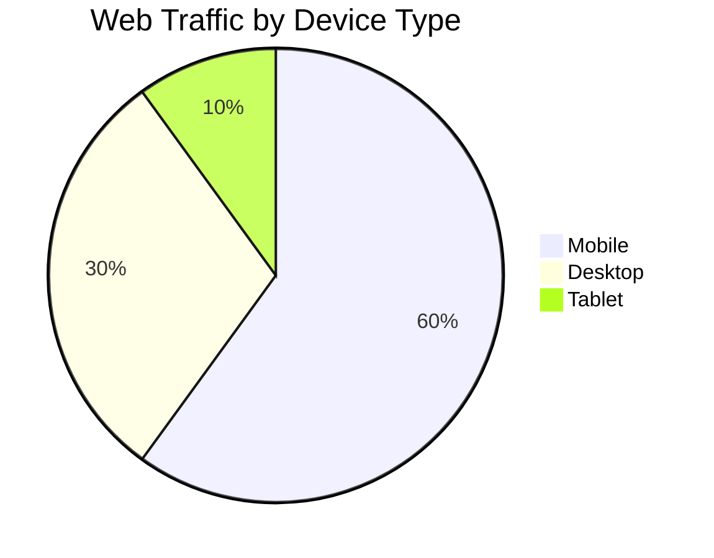

# Device Emulation (Mô Phỏng Thiết Bị)

## Giới Thiệu (Introduction)

**Device emulation** cho phép test trên mobile phones và tablets mà không cần thiết bị thật. Playwright hỗ trợ emulation cho hơn 100+ devices với screen sizes, user agents, và touch capabilities khác nhau.

## Tại Sao Cần Device Emulation?

### Mobile vs Desktop Usage



Lý do test trên mobile devices:
- ✅ **60%+ users** truy cập web từ mobile
- ✅ **Responsive design** cần được test thoroughly
- ✅ **Touch interactions** khác với mouse clicks
- ✅ **Screen sizes** đa dạng (từ 320px đến 1920px+)
- ✅ **Performance** khác trên mobile networks

## Available Devices in Playwright

### Popular Device Presets

```typescript
import { devices } from '@playwright/test';

// Mobile phones
devices['iPhone 13']
devices['iPhone 13 Pro']
devices['iPhone 13 Pro Max']
devices['iPhone SE']
devices['Pixel 5']
devices['Samsung Galaxy S21']
devices['Samsung Galaxy S22']

// Tablets
devices['iPad']
devices['iPad Pro']
devices['iPad Mini']
devices['Samsung Galaxy Tab']

// Desktop
devices['Desktop Chrome']
devices['Desktop Firefox']
devices['Desktop Safari']
```

## Basic Device Emulation

### Single Device Configuration

```typescript
// playwright.config.ts
import { defineConfig, devices } from '@playwright/test';

export default defineConfig({
  projects: [
    {
      name: 'Mobile Chrome',
      use: {
        ...devices['Pixel 5'],
      },
    },
  ],
});
```

### Multiple Device Projects

```typescript
// playwright.config.ts
export default defineConfig({
  projects: [
    // Desktop
    {
      name: 'Desktop Chrome',
      use: {
        ...devices['Desktop Chrome'],
      },
    },

    // Mobile
    {
      name: 'iPhone 13',
      use: {
        ...devices['iPhone 13'],
      },
    },
    {
      name: 'Pixel 5',
      use: {
        ...devices['Pixel 5'],
      },
    },

    // Tablet
    {
      name: 'iPad Pro',
      use: {
        ...devices['iPad Pro'],
      },
    },
  ],
});
```

## Custom Device Configuration

### Creating Custom Device

```typescript
// playwright.config.ts
export default defineConfig({
  projects: [
    {
      name: 'Custom Mobile',
      use: {
        browserName: 'chromium',
        viewport: { width: 375, height: 667 }, // iPhone SE size
        deviceScaleFactor: 2, // Retina display
        isMobile: true,
        hasTouch: true,
        userAgent: 'Mozilla/5.0 (iPhone; CPU iPhone OS 15_0 like Mac OS X)',
      },
    },
  ],
});
```

### Device Properties Explained

```typescript
{
  // Screen dimensions
  viewport: {
    width: 390,   // Screen width in pixels
    height: 844   // Screen height in pixels
  },

  // Display density
  deviceScaleFactor: 3, // 1x, 2x, 3x (Retina displays)

  // Mobile capabilities
  isMobile: true,       // Enables mobile meta viewport
  hasTouch: true,       // Enables touch events

  // Network simulation
  userAgent: 'Mozilla/5.0...', // Browser identification string

  // Geolocation
  geolocation: { latitude: 10.762622, longitude: 106.660172 }, // Ho Chi Minh City
  permissions: ['geolocation'],

  // Locale and timezone
  locale: 'vi-VN',
  timezoneId: 'Asia/Ho_Chi_Minh',
}
```

## Responsive Design Testing

### Testing Different Screen Sizes

```typescript
import { test, expect } from '@playwright/test';

const viewports = [
  { name: 'Mobile Small', width: 320, height: 568 },   // iPhone SE
  { name: 'Mobile Medium', width: 375, height: 667 },  // iPhone 8
  { name: 'Mobile Large', width: 414, height: 896 },   // iPhone 11
  { name: 'Tablet', width: 768, height: 1024 },        // iPad
  { name: 'Desktop', width: 1920, height: 1080 },      // Full HD
];

for (const viewport of viewports) {
  test(`should display correctly on ${viewport.name}`, async ({ page }) => {
    await page.setViewportSize({
      width: viewport.width,
      height: viewport.height,
    });

    await page.goto('https://practice.expandtesting.com/');

    // Take screenshot for visual comparison
    await page.screenshot({
      path: `screenshots/${viewport.name.replace(' ', '-')}.png`,
      fullPage: true,
    });

    // Verify responsive elements
    const menu = page.locator('#mobile-menu');
    if (viewport.width < 768) {
      await expect(menu).toBeVisible(); // Mobile menu visible
    } else {
      await expect(menu).toBeHidden(); // Desktop menu
    }
  });
}
```

### Orientation Testing

```typescript
import { test, expect } from '@playwright/test';

test.describe('Orientation Tests', () => {
  test('should work in portrait mode', async ({ page }) => {
    await page.setViewportSize({ width: 375, height: 667 }); // Portrait
    await page.goto('https://practice.expandtesting.com/');

    await expect(page.locator('.portrait-layout')).toBeVisible();
  });

  test('should work in landscape mode', async ({ page }) => {
    await page.setViewportSize({ width: 667, height: 375 }); // Landscape
    await page.goto('https://practice.expandtesting.com/');

    await expect(page.locator('.landscape-layout')).toBeVisible();
  });
});
```

## Touch Interactions

### Tap vs Click

```typescript
import { test, expect } from '@playwright/test';

test.use({ ...devices['iPhone 13'] });

test('mobile touch interactions', async ({ page }) => {
  await page.goto('https://practice.expandtesting.com/');

  // Tap (touch event) instead of click (mouse event)
  await page.tap('#mobile-button');

  // Long press
  await page.locator('#context-menu').tap({ force: true });

  // Swipe gesture (touch-specific)
  await page.touchscreen.swipe(
    { x: 100, y: 300 }, // Start point
    { x: 100, y: 100 }  // End point
  );
});
```

### Scrolling on Mobile

```typescript
test('mobile scrolling', async ({ page }) => {
  test.use({ ...devices['Pixel 5'] });

  await page.goto('https://practice.expandtesting.com/');

  // Scroll by amount
  await page.mouse.wheel(0, 1000); // Scroll down 1000px

  // Scroll to element
  await page.locator('#footer').scrollIntoViewIfNeeded();

  // Swipe scroll (touch gesture)
  await page.touchscreen.swipe(
    { x: 200, y: 600 },
    { x: 200, y: 100 }
  );
});
```

## Device-specific Features

### Geolocation Testing

```typescript
import { test, expect } from '@playwright/test';

test.use({
  ...devices['iPhone 13'],
  geolocation: { latitude: 10.762622, longitude: 106.660172 }, // HCM City
  permissions: ['geolocation'],
});

test('should detect user location', async ({ page }) => {
  await page.goto('https://practice.expandtesting.com/geolocation');

  // Website requests geolocation
  await page.click('#get-location');

  // Verify location is displayed
  await expect(page.locator('#latitude')).toContainText('10.762622');
  await expect(page.locator('#longitude')).toContainText('106.660172');
});
```

### Mobile Network Simulation

```typescript
import { test } from '@playwright/test';

test('should load on slow mobile network', async ({ page, context }) => {
  test.use({ ...devices['Pixel 5'] });

  // Simulate slow 3G network
  await context.route('**/*', async (route) => {
    await new Promise(resolve => setTimeout(resolve, 1000)); // 1s delay
    await route.continue();
  });

  const startTime = Date.now();
  await page.goto('https://practice.expandtesting.com/');
  const loadTime = Date.now() - startTime;

  console.log(`Page loaded in ${loadTime}ms on slow network`);
});
```

## Mobile-specific Testing Patterns

### Hamburger Menu Testing

```typescript
test('should open mobile menu', async ({ page }) => {
  test.use({ ...devices['iPhone 13'] });

  await page.goto('https://practice.expandtesting.com/');

  // Hamburger menu only visible on mobile
  const hamburger = page.locator('#hamburger-menu');
  await expect(hamburger).toBeVisible();

  // Tap to open menu
  await hamburger.tap();

  // Menu items appear
  await expect(page.locator('.mobile-menu-items')).toBeVisible();

  // Select menu item
  await page.tap('text=Login');
  await expect(page).toHaveURL(/login/);
});
```

### Mobile Form Input

```typescript
test('should handle mobile keyboard', async ({ page }) => {
  test.use({ ...devices['Pixel 5'] });

  await page.goto('https://practice.expandtesting.com/login');

  // Mobile keyboards have different input behaviors
  await page.fill('#username', 'testuser');

  // On mobile, form might scroll to bring input into view
  await expect(page.locator('#username')).toBeInViewport();

  // Virtual keyboard might cover submit button
  await page.locator('#password').scrollIntoViewIfNeeded();
  await page.fill('#password', 'password123');

  await page.tap('button[type="submit"]');
});
```

## Screenshot Comparison Across Devices

```typescript
import { test, expect } from '@playwright/test';

const devices = [
  'iPhone 13',
  'Pixel 5',
  'iPad Pro',
  'Desktop Chrome',
];

for (const deviceName of devices) {
  test(`visual test on ${deviceName}`, async ({ page }) => {
    test.use({ ...devices[deviceName] });

    await page.goto('https://practice.expandtesting.com/');

    // Visual regression test per device
    await expect(page).toHaveScreenshot(`homepage-${deviceName}.png`, {
      fullPage: true,
    });
  });
}
```

## Performance Testing on Mobile

```typescript
import { test } from '@playwright/test';

test('measure performance on mobile', async ({ page }) => {
  test.use({ ...devices['iPhone 13'] });

  await page.goto('https://practice.expandtesting.com/');

  // Measure performance metrics
  const metrics = await page.evaluate(() => {
    const navigation = performance.getEntriesByType('navigation')[0] as PerformanceNavigationTiming;
    return {
      domContentLoaded: navigation.domContentLoadedEventEnd - navigation.fetchStart,
      loadComplete: navigation.loadEventEnd - navigation.fetchStart,
      firstPaint: performance.getEntriesByType('paint')[0]?.startTime || 0,
    };
  });

  console.log('Mobile Performance:', metrics);

  // Assert performance thresholds for mobile
  expect(metrics.domContentLoaded).toBeLessThan(3000); // < 3s
  expect(metrics.loadComplete).toBeLessThan(5000); // < 5s
});
```

## Best Practices

### 1. Test Most Common Devices

```typescript
// ✅ GOOD: Focus on popular devices
projects: [
  { name: 'iPhone 13', use: { ...devices['iPhone 13'] } },      // iOS
  { name: 'Pixel 5', use: { ...devices['Pixel 5'] } },          // Android
  { name: 'iPad Pro', use: { ...devices['iPad Pro'] } },        // Tablet
  { name: 'Desktop', use: { ...devices['Desktop Chrome'] } },   // Desktop
]

// ❌ BAD: Testing too many devices
// Don't test every single device unless necessary
```

### 2. Use Actual Touch Events on Mobile

```typescript
// ✅ GOOD: Use tap() for mobile
test.use({ ...devices['iPhone 13'] });
await page.tap('#button');

// ❌ AVOID: click() works but doesn't simulate real touch
await page.click('#button');
```

### 3. Check Viewport-specific Elements

```typescript
// ✅ GOOD: Conditional assertions based on viewport
test('responsive navigation', async ({ page, viewport }) => {
  await page.goto('https://practice.expandtesting.com/');

  if (viewport && viewport.width < 768) {
    await expect(page.locator('#mobile-menu')).toBeVisible();
  } else {
    await expect(page.locator('#desktop-nav')).toBeVisible();
  }
});
```

### 4. Test Both Orientations

```typescript
// ✅ GOOD: Test portrait and landscape
test.describe('Mobile Orientations', () => {
  test('portrait', async ({ page }) => {
    await page.setViewportSize({ width: 375, height: 667 });
    // Test portrait-specific layout
  });

  test('landscape', async ({ page }) => {
    await page.setViewportSize({ width: 667, height: 375 });
    // Test landscape-specific layout
  });
});
```

## Common Mobile Testing Issues

### Issue 1: Fixed Headers Covering Content

```typescript
// Problem: Fixed headers overlap clickable elements on mobile
await page.click('#button'); // May be covered by header

// Solution: Scroll with offset
await page.locator('#button').scrollIntoViewIfNeeded();
await page.evaluate(() => window.scrollBy(0, -100)); // Scroll up 100px
await page.click('#button');
```

### Issue 2: Touch Events Not Firing

```typescript
// Problem: click() doesn't trigger touch events
await page.click('#swipe-area'); // Doesn't work

// Solution: Use touchscreen API
await page.touchscreen.tap(100, 100);
```

### Issue 3: Viewport Too Small for Content

```typescript
// Problem: Content doesn't fit in mobile viewport
await expect(page.locator('#large-table')).toBeVisible(); // May be cut off

// Solution: Check if scrollable or use horizontal scroll
await page.locator('#large-table').scrollIntoViewIfNeeded();
await page.mouse.wheel(100, 0); // Horizontal scroll
```

## Key Takeaways

1. **Device presets** - Playwright provides 100+ device configurations
2. **Custom devices** - Create custom viewport sizes and properties
3. **Touch interactions** - Use `tap()` and touchscreen APIs for mobile
4. **Responsive testing** - Test multiple screen sizes and orientations
5. **Mobile-specific features** - Geolocation, network simulation, touch gestures
6. **Performance** - Mobile devices are slower, adjust expectations
7. **Visual regression** - Screenshot comparison across devices
8. **Focus on popular devices** - iPhone, Pixel, iPad, Desktop Chrome

---

**Next Steps:**
- Read `05-test-dependencies-vi.md` for execution order control
- Practice with `examples/04-mobile-testing.spec.ts`
