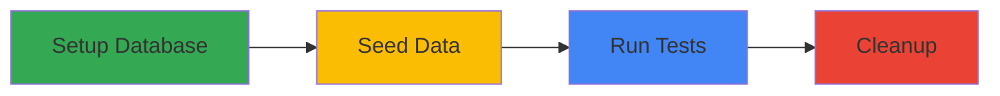
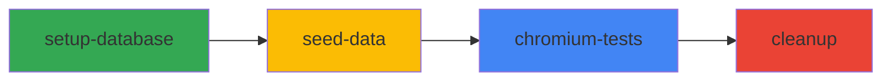
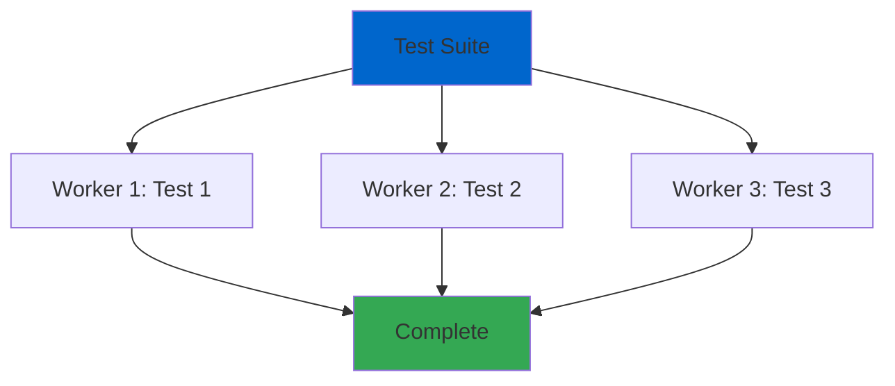
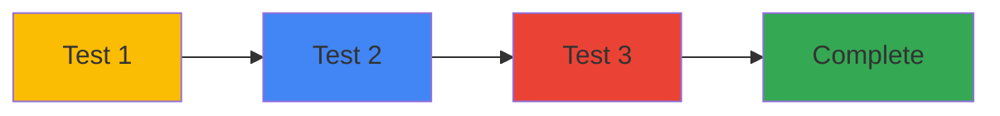

# Test Dependencies (Phụ Thuộc Test)

## Giới Thiệu (Introduction)

**Test dependencies** cho phép kiểm soát thứ tự chạy tests bằng cách định nghĩa tests phải chạy trước/sau tests khác. Điều này hữu ích cho setup/teardown, data seeding, và test workflows phức tạp.

## Tại Sao Cần Test Dependencies?

### Test Execution Flow



Dependencies giúp:
- ✅ Đảm bảo **setup chạy trước** tests
- ✅ **Seed data** before running test suite
- ✅ **Cleanup** sau khi tests complete
- ✅ **Authentication** setup trước authenticated tests
- ✅ **Order-dependent workflows** (create → update → delete)

## Project Dependencies

### Basic Setup Dependency

```typescript
// playwright.config.ts
import { defineConfig } from '@playwright/test';

export default defineConfig({
  projects: [
    // Setup project - runs FIRST
    {
      name: 'setup',
      testMatch: /.*\.setup\.ts/,
    },

    // Test project - runs AFTER setup
    {
      name: 'tests',
      dependencies: ['setup'], // Wait for 'setup' to complete
      testMatch: /.*\.spec\.ts/,
    },
  ],
});
```

```typescript
// tests/auth.setup.ts
import { test as setup } from '@playwright/test';

setup('authenticate', async ({ page }) => {
  console.log('🔐 Setting up authentication...');

  await page.goto('https://practice.expandtesting.com/login');
  await page.fill('#username', 'practice');
  await page.fill('#password', 'SuperSecretPassword!');
  await page.click('button[type="submit"]');

  // Save authenticated state
  await page.context().storageState({ path: 'auth/user.json' });

  console.log('✅ Authentication setup complete');
});
```

```typescript
// tests/dashboard.spec.ts
import { test, expect } from '@playwright/test';

// This test uses the auth state from setup
test.use({ storageState: 'auth/user.json' });

test('access dashboard', async ({ page }) => {
  // Already logged in from setup
  await page.goto('https://practice.expandtesting.com/secure');
  await expect(page.locator('h2')).toContainText('Secure Area');
});
```

### Multiple Dependencies Chain

```typescript
// playwright.config.ts
export default defineConfig({
  projects: [
    // Step 1: Database setup
    {
      name: 'setup-database',
      testMatch: /db\.setup\.ts/,
    },

    // Step 2: Seed data (depends on database)
    {
      name: 'seed-data',
      dependencies: ['setup-database'],
      testMatch: /seed\.setup\.ts/,
    },

    // Step 3: Run tests (depends on seeding)
    {
      name: 'chromium-tests',
      dependencies: ['seed-data'],
      use: { browserName: 'chromium' },
    },

    // Step 4: Cleanup (depends on tests)
    {
      name: 'cleanup',
      dependencies: ['chromium-tests'],
      testMatch: /cleanup\.ts/,
    },
  ],
});
```



## Serial Tests (within a test file)

### Using test.describe.serial()

```typescript
import { test, expect } from '@playwright/test';

// Tests run in ORDER, if one fails, rest are skipped
test.describe.serial('User Workflow', () => {
  let userId: string;

  test('Step 1: Create user', async ({ page }) => {
    await page.goto('https://practice.expandtesting.com/');
    // Create user logic
    userId = '123'; // Save for next test
    console.log('✅ User created:', userId);
  });

  test('Step 2: Update user', async ({ page }) => {
    await page.goto(`https://practice.expandtesting.com/user/${userId}`);
    // Update user logic
    console.log('✅ User updated:', userId);
  });

  test('Step 3: Delete user', async ({ page }) => {
    await page.goto(`https://practice.expandtesting.com/user/${userId}`);
    // Delete user logic
    console.log('✅ User deleted:', userId);
  });
});
```

### Sharing State Between Serial Tests

```typescript
test.describe.serial('Shopping Cart Flow', () => {
  let cartId: string;
  let productId: string;

  test('Add product to cart', async ({ page }) => {
    await page.goto('https://www.saucedemo.com/');
    await page.fill('#user-name', 'standard_user');
    await page.fill('#password', 'secret_sauce');
    await page.click('#login-button');

    // Add product
    await page.click('[data-test="add-to-cart-sauce-labs-backpack"]');

    // Get cart info
    const cartBadge = await page.locator('.shopping_cart_badge').textContent();
    expect(cartBadge).toBe('1');

    console.log('✅ Product added to cart');
  });

  test('Proceed to checkout', async ({ page }) => {
    // Cart state preserved from previous test
    await page.click('.shopping_cart_link');

    const cartItems = await page.locator('.cart_item').count();
    expect(cartItems).toBe(1);

    await page.click('#checkout');

    console.log('✅ Proceeded to checkout');
  });

  test('Complete purchase', async ({ page }) => {
    // Fill checkout form
    await page.fill('#first-name', 'Test');
    await page.fill('#last-name', 'User');
    await page.fill('#postal-code', '12345');
    await page.click('#continue');

    await page.click('#finish');

    await expect(page.locator('.complete-header')).toContainText('Thank you');

    console.log('✅ Purchase completed');
  });
});
```

## Setup and Teardown with Dependencies

### Global Setup/Teardown

```typescript
// global-setup.ts
import { chromium, FullConfig } from '@playwright/test';

async function globalSetup(config: FullConfig) {
  console.log('🚀 Global setup starting...');

  const browser = await chromium.launch();
  const page = await browser.newPage();

  // Setup authentication
  await page.goto('https://practice.expandtesting.com/login');
  await page.fill('#username', 'practice');
  await page.fill('#password', 'SuperSecretPassword!');
  await page.click('button[type="submit"]');
  await page.context().storageState({ path: 'auth/state.json' });

  await browser.close();

  console.log('✅ Global setup complete');
}

export default globalSetup;
```

```typescript
// global-teardown.ts
import { FullConfig } from '@playwright/test';
import fs from 'fs';

async function globalTeardown(config: FullConfig) {
  console.log('🧹 Global teardown starting...');

  // Cleanup auth files
  if (fs.existsSync('auth/state.json')) {
    fs.unlinkSync('auth/state.json');
  }

  console.log('✅ Global teardown complete');
}

export default globalTeardown;
```

```typescript
// playwright.config.ts
export default defineConfig({
  globalSetup: require.resolve('./global-setup'),
  globalTeardown: require.resolve('./global-teardown'),

  use: {
    storageState: 'auth/state.json',
  },
});
```

### Per-Project Setup/Teardown

```typescript
// playwright.config.ts
export default defineConfig({
  projects: [
    {
      name: 'setup-chromium',
      testMatch: /chromium\.setup\.ts/,
    },
    {
      name: 'chromium',
      dependencies: ['setup-chromium'],
      use: {
        browserName: 'chromium',
        storageState: 'auth/chromium.json',
      },
    },

    {
      name: 'setup-firefox',
      testMatch: /firefox\.setup\.ts/,
    },
    {
      name: 'firefox',
      dependencies: ['setup-firefox'],
      use: {
        browserName: 'firefox',
        storageState: 'auth/firefox.json',
      },
    },
  ],
});
```

## Test Fixtures with Dependencies

### Custom Fixture with Setup

```typescript
// fixtures/authenticated-page.ts
import { test as base } from '@playwright/test';
import { Page } from '@playwright/test';

type AuthFixture = {
  authenticatedPage: Page;
};

export const test = base.extend<AuthFixture>({
  authenticatedPage: async ({ page }, use) => {
    // Setup: Login before test
    await page.goto('https://practice.expandtesting.com/login');
    await page.fill('#username', 'practice');
    await page.fill('#password', 'SuperSecretPassword!');
    await page.click('button[type="submit"]');
    await page.waitForURL('**/secure');

    // Provide authenticated page to test
    await use(page);

    // Teardown: Logout after test
    await page.click('a:has-text("Logout")');
  },
});
```

```typescript
// tests/dashboard.spec.ts
import { test, expect } from '../fixtures/authenticated-page';

test('use authenticated page', async ({ authenticatedPage }) => {
  // Page is already logged in
  await expect(authenticatedPage.locator('h2')).toContainText('Secure Area');
});
```

## Conditional Dependencies

### Skip Tests Based on Setup Outcome

```typescript
// tests/conditional.setup.ts
import { test as setup } from '@playwright/test';
import fs from 'fs';

setup('check feature flag', async ({ }) => {
  const featureEnabled = process.env.FEATURE_X_ENABLED === 'true';

  if (featureEnabled) {
    fs.writeFileSync('.feature-flag', 'enabled');
  } else {
    fs.writeFileSync('.feature-flag', 'disabled');
  }
});
```

```typescript
// tests/feature-x.spec.ts
import { test, expect } from '@playwright/test';
import fs from 'fs';

test.beforeAll(() => {
  const flag = fs.readFileSync('.feature-flag', 'utf-8');
  if (flag === 'disabled') {
    test.skip(true, 'Feature X is disabled');
  }
});

test('test Feature X', async ({ page }) => {
  // Only runs if feature is enabled
  await page.goto('https://practice.expandtesting.com/feature-x');
  await expect(page.locator('#feature-x')).toBeVisible();
});
```

## Parallel vs Serial Execution

### Default: Parallel Execution

```typescript
// All tests run in PARALLEL (default)
test.describe('Parallel Tests', () => {
  test('test 1', async ({ page }) => {
    // Runs independently
  });

  test('test 2', async ({ page }) => {
    // Runs independently
  });

  test('test 3', async ({ page }) => {
    // Runs independently
  });
});
```



### Serial Execution

```typescript
// Tests run in ORDER, one after another
test.describe.serial('Serial Tests', () => {
  test('test 1', async ({ page }) => {
    // Runs FIRST
  });

  test('test 2', async ({ page }) => {
    // Runs SECOND (after test 1)
  });

  test('test 3', async ({ page }) => {
    // Runs THIRD (after test 2)
  });
});
```



## Best Practices

### 1. Use Dependencies for Setup, Not Business Logic

```typescript
// ✅ GOOD: Setup dependency
{
  name: 'tests',
  dependencies: ['authentication-setup'],
}

// ❌ BAD: Business logic dependency
// Don't make tests depend on other tests' business logic
{
  name: 'delete-user',
  dependencies: ['create-user'], // Bad: couples tests together
}
```

### 2. Keep Setup Projects Fast

```typescript
// ✅ GOOD: Fast setup
setup('auth', async ({ page }) => {
  await page.goto('/login');
  await page.fill('#username', 'user');
  await page.fill('#password', 'pass');
  await page.click('#submit');
  await page.context().storageState({ path: 'auth.json' });
});

// ❌ BAD: Slow setup
setup('slow setup', async ({ page }) => {
  // Don't do extensive testing in setup
  await runFullRegressionSuite(); // Too slow!
});
```

### 3. Use Serial Only When Necessary

```typescript
// ✅ GOOD: Serial for workflow
test.describe.serial('Create → Update → Delete', () => {
  // These MUST run in order
});

// ❌ BAD: Unnecessary serial
test.describe.serial('Independent Tests', () => {
  test('login test', ...); // Independent
  test('search test', ...); // Independent - should be parallel
});
```

### 4. Clean Up After Tests

```typescript
// ✅ GOOD: Cleanup in teardown
test.afterAll(async ({ }) => {
  // Delete test data
  fs.unlinkSync('test-data.json');
});

// Or use cleanup project
{
  name: 'cleanup',
  dependencies: ['all-tests'],
  testMatch: /cleanup\.ts/,
}
```

## Real-world Example

```typescript
// playwright.config.ts - Complete dependency setup
export default defineConfig({
  projects: [
    // 1. Global setup
    {
      name: 'global-setup',
      testMatch: /global\.setup\.ts/,
    },

    // 2. Authentication (depends on global setup)
    {
      name: 'auth-setup',
      dependencies: ['global-setup'],
      testMatch: /auth\.setup\.ts/,
    },

    // 3. Smoke tests (depends on auth, runs first)
    {
      name: 'smoke',
      dependencies: ['auth-setup'],
      grep: /@smoke/,
      use: { storageState: 'auth/user.json' },
    },

    // 4. Full test suite (depends on smoke passing)
    {
      name: 'chromium',
      dependencies: ['smoke'],
      use: {
        browserName: 'chromium',
        storageState: 'auth/user.json',
      },
    },

    // 5. Cleanup (depends on all tests)
    {
      name: 'cleanup',
      dependencies: ['chromium'],
      testMatch: /cleanup\.ts/,
    },
  ],
});
```

## Key Takeaways

1. **Project dependencies** - Control execution order with `dependencies: ['project-name']`
2. **Setup projects** - Use for authentication, data seeding, configuration
3. **Serial tests** - Use `test.describe.serial()` for order-dependent workflows
4. **Global setup/teardown** - Use for application-wide initialization
5. **Fixtures** - Custom fixtures with setup/teardown logic
6. **Parallel by default** - Tests run in parallel unless explicitly serialized
7. **Fast setup** - Keep setup projects quick to avoid slowing down entire suite
8. **Cleanup** - Always clean up test data and state

---

**Next Steps:**
- Practice with `examples/01-multi-browser.spec.ts` and other Week 7 examples
- Complete exercises in `exercises/` folder
