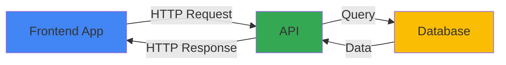

# API Testing Introduction (Giới Thiệu API Testing)

## API là gì?

**API (Application Programming Interface)** là interface cho phép applications communicate với nhau.



## Tại Sao Cần API Testing?

### UI Testing vs API Testing

| Aspect | UI Testing | API Testing |
|--------|-----------|-------------|
| Speed | Slow (renders UI) | Fast (direct HTTP) |
| Reliability | Flaky (UI changes) | Stable (contract-based) |
| Coverage | User flows | Business logic |
| Cost | Expensive | Cheap |

### Benefits

✅ **Faster execution** - No UI rendering
✅ **More reliable** - Less flaky than UI tests
✅ **Earlier testing** - Test before UI is ready
✅ **Better coverage** - Test edge cases easily
✅ **Integration testing** - Verify API contracts

## HTTP Basics

### Request Structure

```
GET /api/users/1 HTTP/1.1
Host: reqres.in
Authorization: Bearer token123
Content-Type: application/json

{
  "name": "John"
}
```

### Response Structure

```
HTTP/1.1 200 OK
Content-Type: application/json

{
  "id": 1,
  "name": "John",
  "email": "john@example.com"
}
```

## Playwright API Testing

```typescript
import { test, expect } from '@playwright/test';

test('GET request', async ({ request }) => {
  const response = await request.get('https://reqres.in/api/users/1');

  expect(response.ok()).toBeTruthy();
  expect(response.status()).toBe(200);

  const data = await response.json();
  expect(data.data.id).toBe(1);
});
```

## Key Takeaways

1. API testing is faster and more reliable than UI testing
2. Tests business logic directly via HTTP
3. Playwright provides APIRequestContext for API testing
4. HTTP methods: GET, POST, PUT, PATCH, DELETE
5. Validate status codes, headers, and response body

---

Next: `02-http-methods-vi.md`
